# AI 模拟面试系统架构升级方案 —— 语音面试 + 面对面模拟面试

> **文档版本**: v2.0
> **编写日期**: 2025年7月
> **文档状态**: 技术架构设计阶段
> **目标读者**: 开发团队、技术负责人、产品经理
> **升级范围**: 在现有文字面试基础上，新增语音面试与面对面模拟面试两大核心模块

---

## 目录

1. [概述与升级目标](#1-概述与升级目标)
2. [语音面试技术方案](#2-语音面试技术方案)
3. [面对面模拟面试技术方案](#3-面对面模拟面试技术方案)
4. [前端架构更新](#4-前端架构更新)
5. [后端API扩展](#5-后端api扩展)
6. [数据模型更新](#6-数据模型更新)
7. [技术风险与应对](#7-技术风险与应对)
8. [开发计划与里程碑](#8-开发计划与里程碑)

---

## 1. 概述与升级目标

### 1.1 现有架构回顾

现有 AI 模拟面试系统已完整实现文字面试功能，技术栈为 React 19 + FastAPI + LLM SSE 流式输出，架构成熟稳定。系统包含用户认证、简历上传解析、AI 面试对话（文字）、评估报告生成等核心模块。

### 1.2 升级目标

本次架构升级旨在提升面试体验的沉浸感和真实度，新增两大功能模块：

| 模块 | 目标描述 | 核心价值 |
|------|---------|---------|
| **语音面试** | 用户通过语音与 AI 面试官进行实时语音对话，包含语音识别(STT)和 AI 语音合成(TTS) | 降低输入成本，模拟电话面试场景，提升沟通自然度 |
| **面对面模拟面试** | 基于 Three.js 的 3D 虚拟面试官，支持口型同步、表情动画、用户摄像头画面，营造真实面试氛围 | 高度还原真实面试场景，帮助用户提前适应面对面面试压力 |

### 1.3 升级后系统架构总览

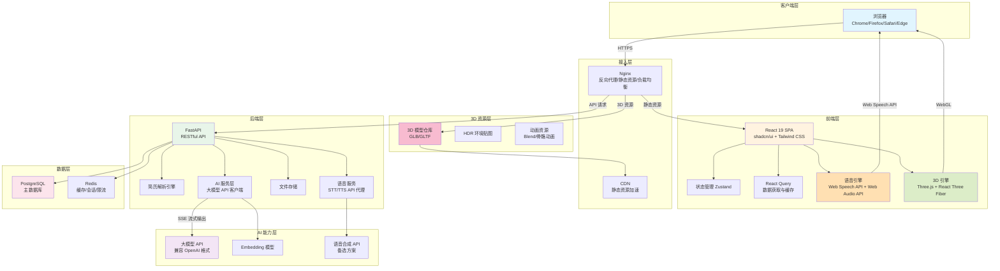

---

## 2. 语音面试技术方案

### 2.1 技术选型对比表

| 技术方案 | 方案 A（推荐） | 方案 B | 方案 C | 选型理由 |
|----------|--------------|--------|--------|----------|
| **STT（语音转文字）** | Web Speech API (`webkitSpeechRecognition`) | Whisper API (OpenAI) | 讯飞语音听写 API | **零成本**（浏览器原生支持，无需额外 API Key 和流量费用）；**低延迟**（本地浏览器处理，无需网络传输音频）；**隐私性好**（语音数据不上传第三方）；支持中文普通话识别，准确率可满足面试场景 |
| **TTS（文字转语音）** | Web Speech API (`speechSynthesis`) | ElevenLabs API | Edge TTS (Microsoft) | **零成本**；**即开即用**（无需后端服务转发）；**支持中文多音色**；可随时切换语音、语速、音调；浏览器原生实现，无额外 SDK 依赖 |
| **音频处理** | Web Audio API + MediaRecorder | Recorder.js | 纯 MediaRecorder | Web Audio API 提供音频可视化能力（音量条波形展示）；MediaRecorder 提供音频录制备用方案；两者均为浏览器原生标准，无需额外库 |
| **音频播放控制** | HTMLAudioElement + Web Audio API | Howler.js | Tone.js | 原生 API 已满足 TTS 播放控制需求（播放/暂停/停止/音量），无需引入额外依赖 |

**综合选型结论**：推荐 **方案 A（纯前端 Web Speech API 方案）** 作为首选实现。该方案具备以下核心优势：

1. **架构极简**：纯前端实现，无需新增后端语音服务，降低系统复杂度
2. **成本最优**：零额外 API 调用费用，适合大规模用户场景
3. **延迟最低**：浏览器本地处理，无网络传输延迟
4. **隐私保障**：用户语音数据不离开本地浏览器
5. **降级友好**：检测到浏览器不支持时，自动降级为文字模式

**备选方案**：如需更高语音识别准确率（如方言支持、嘈杂环境），可在后续迭代中增加 Whisper API 作为后端备选 STT 方案。

### 2.2 语音架构图

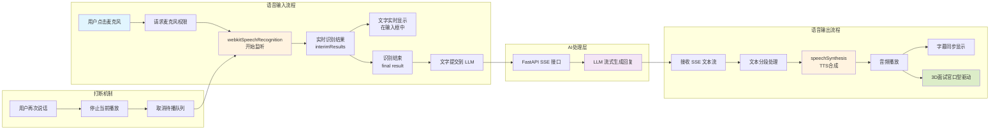

### 2.3 详细方案设计

#### 2.3.1 语音输入流程

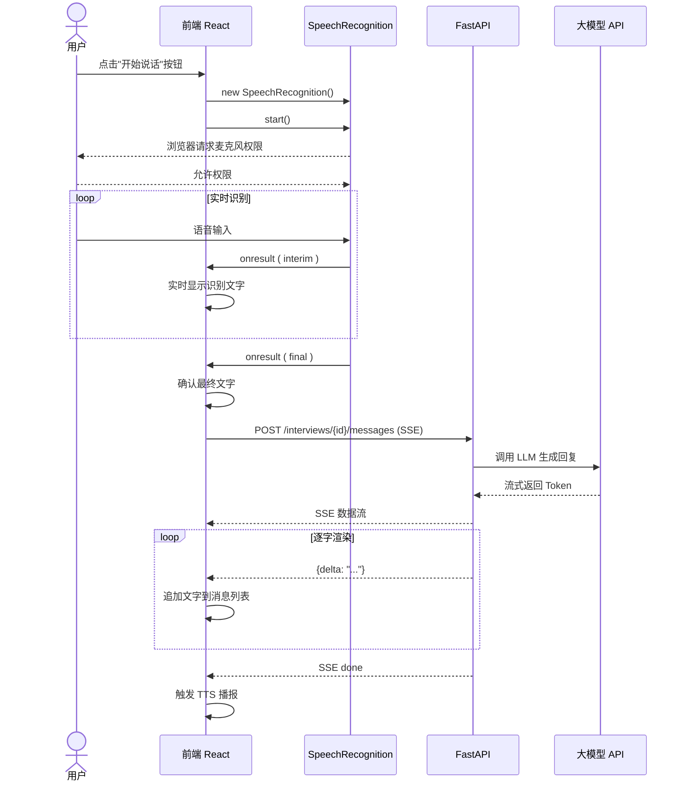

**核心实现代码**：

```typescript
// hooks/useVoiceInput.ts
import { useState, useCallback, useRef } from 'react';

interface VoiceInputState {
  isRecording: boolean;
  transcript: string;
  interimTranscript: string;
  error: string | null;
  isSupported: boolean;
}

interface UseVoiceInputReturn extends VoiceInputState {
  startRecording: () => void;
  stopRecording: () => void;
  resetTranscript: () => void;
}

/**
 * 语音输入 Hook - 基于 Web Speech API
 * 封装语音识别全流程，支持实时识别结果展示
 */
export function useVoiceInput(
  onFinalResult?: (transcript: string) => void
): UseVoiceInputReturn {
  const [state, setState] = useState<VoiceInputState>({
    isRecording: false,
    transcript: '',
    interimTranscript: '',
    error: null,
    isSupported: 'webkitSpeechRecognition' in window || 'SpeechRecognition' in window,
  });

  const recognitionRef = useRef<SpeechRecognition | null>(null);

  const startRecording = useCallback(() => {
    if (!state.isSupported) {
      setState((s) => ({ ...s, error: '当前浏览器不支持语音识别' }));
      return;
    }

    const SpeechRecognitionAPI =
      window.SpeechRecognition || window.webkitSpeechRecognition;
    const recognition = new SpeechRecognitionAPI();

    recognition.lang = 'zh-CN'; // 设置中文
    recognition.continuous = true; // 持续识别
    recognition.interimResults = true; // 返回临时结果
    recognition.maxAlternatives = 1;

    recognition.onstart = () => {
      setState((s) => ({ ...s, isRecording: true, error: null }));
    };

    recognition.onresult = (event: SpeechRecognitionEvent) => {
      let interim = '';
      let final = '';

      for (let i = event.resultIndex; i < event.results.length; i++) {
        const transcript = event.results[i][0].transcript;
        if (event.results[i].isFinal) {
          final += transcript;
        } else {
          interim += transcript;
        }
      }

      setState((s) => ({
        ...s,
        transcript: final ? s.transcript + final : s.transcript,
        interimTranscript: interim,
      }));
    };

    recognition.onerror = (event: SpeechRecognitionErrorEvent) => {
      if (event.error === 'no-speech') {
        setState((s) => ({ ...s, error: '未检测到语音，请重试' }));
      } else if (event.error === 'audio-capture') {
        setState((s) => ({ ...s, error: '无法访问麦克风' }));
      } else if (event.error === 'not-allowed') {
        setState((s) => ({ ...s, error: '麦克风权限被拒绝' }));
      } else {
        setState((s) => ({ ...s, error: `识别错误: ${event.error}` }));
      }
      setState((s) => ({ ...s, isRecording: false }));
    };

    recognition.onend = () => {
      setState((s) => ({
        ...s,
        isRecording: false,
        interimTranscript: '',
      }));
      // 如果有最终识别结果，触发回调
      if (state.transcript.trim() && onFinalResult) {
        onFinalResult(state.transcript.trim());
      }
    };

    recognitionRef.current = recognition;
    recognition.start();
  }, [state.isSupported, state.transcript, onFinalResult]);

  const stopRecording = useCallback(() => {
    recognitionRef.current?.stop();
    setState((s) => ({ ...s, isRecording: false }));
  }, []);

  const resetTranscript = useCallback(() => {
    setState((s) => ({ ...s, transcript: '', interimTranscript: '' }));
  }, []);

  return {
    ...state,
    startRecording,
    stopRecording,
    resetTranscript,
  };
}

// 全局类型声明补充
declare global {
  interface Window {
    SpeechRecognition: typeof SpeechRecognition;
    webkitSpeechRecognition: typeof SpeechRecognition;
  }
}
```

#### 2.3.2 TTS 输出流程

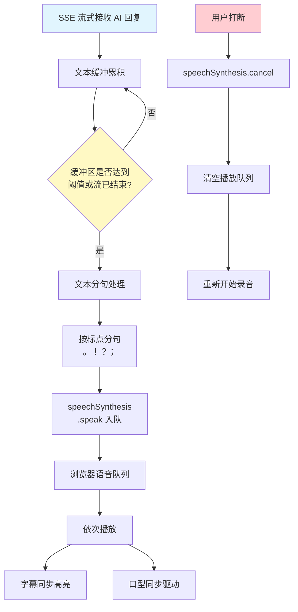

**TTS 核心实现代码**：

```typescript
// hooks/useVoiceOutput.ts
import { useState, useCallback, useRef, useEffect } from 'react';

interface VoiceOutputState {
  isPlaying: boolean;
  isSupported: boolean;
  currentText: string;
  queueLength: number;
}

interface TTSOptions {
  rate?: number;      // 语速 0.1 ~ 10, 默认 1
  pitch?: number;     // 音调 0 ~ 2, 默认 1
  volume?: number;    // 音量 0 ~ 1, 默认 1
  voice?: SpeechSynthesisVoice;
}

/**
 * 语音输出 Hook - 基于 Web Speech API speechSynthesis
 * 支持队列播放、打断、语速调节
 */
export function useVoiceOutput(options: TTSOptions = {}) {
  const [state, setState] = useState<VoiceOutputState>({
    isPlaying: false,
    isSupported: 'speechSynthesis' in window,
    currentText: '',
    queueLength: 0,
  });

  const utteranceQueue = useRef<SpeechSynthesisUtterance[]>([]);
  const currentUtteranceRef = useRef<SpeechSynthesisUtterance | null>(null);
  const isProcessingRef = useRef(false);

  const { rate = 1, pitch = 1, volume = 1, voice } = options;

  /**
   * 处理播放队列
   */
  const processQueue = useCallback(() => {
    if (isProcessingRef.current) return;
    if (utteranceQueue.current.length === 0) {
      setState((s) => ({ ...s, isPlaying: false, currentText: '' }));
      return;
    }

    isProcessingRef.current = true;
    const utterance = utteranceQueue.current.shift()!;
    currentUtteranceRef.current = utterance;

    setState((s) => ({
      ...s,
      isPlaying: true,
      currentText: utterance.text,
      queueLength: utteranceQueue.current.length,
    }));

    utterance.onend = () => {
      isProcessingRef.current = false;
      currentUtteranceRef.current = null;
      processQueue(); // 播放下一个
    };

    utterance.onerror = (event) => {
      if (event.error !== 'canceled') {
        console.error('TTS error:', event.error);
      }
      isProcessingRef.current = false;
      currentUtteranceRef.current = null;
      processQueue();
    };

    window.speechSynthesis.speak(utterance);
  }, []);

  /**
   * 添加文本到播放队列
   */
  const speak = useCallback(
    (text: string) => {
      if (!state.isSupported || !text.trim()) return;

      // 将长文本按句子分割，避免单次合成过长
      const sentences = text
        .replace(/([。！？；.!?:;])/g, '$1|')
        .split('|')
        .filter((s) => s.trim().length > 0);

      for (const sentence of sentences) {
        const utterance = new SpeechSynthesisUtterance(sentence.trim());
        utterance.lang = 'zh-CN';
        utterance.rate = rate;
        utterance.pitch = pitch;
        utterance.volume = volume;
        if (voice) utterance.voice = voice;

        utteranceQueue.current.push(utterance);
      }

      setState((s) => ({ ...s, queueLength: utteranceQueue.current.length }));
      processQueue();
    },
    [state.isSupported, rate, pitch, volume, voice, processQueue]
  );

  /**
   * 打断当前播放
   */
  const stop = useCallback(() => {
    window.speechSynthesis.cancel();
    utteranceQueue.current = [];
    isProcessingRef.current = false;
    currentUtteranceRef.current = null;
    setState((s) => ({ ...s, isPlaying: false, currentText: '', queueLength: 0 }));
  }, []);

  /**
   * 暂停播放
   */
  const pause = useCallback(() => {
    window.speechSynthesis.pause();
    setState((s) => ({ ...s, isPlaying: false }));
  }, []);

  /**
   * 恢复播放
   */
  const resume = useCallback(() => {
    window.speechSynthesis.resume();
    setState((s) => ({ ...s, isPlaying: true }));
  }, []);

  // 页面卸载时清理
  useEffect(() => {
    return () => {
      window.speechSynthesis.cancel();
      utteranceQueue.current = [];
    };
  }, []);

  return {
    ...state,
    speak,
    stop,
    pause,
    resume,
  };
}
```

#### 2.3.3 双模式切换：文字模式 ↔ 语音模式

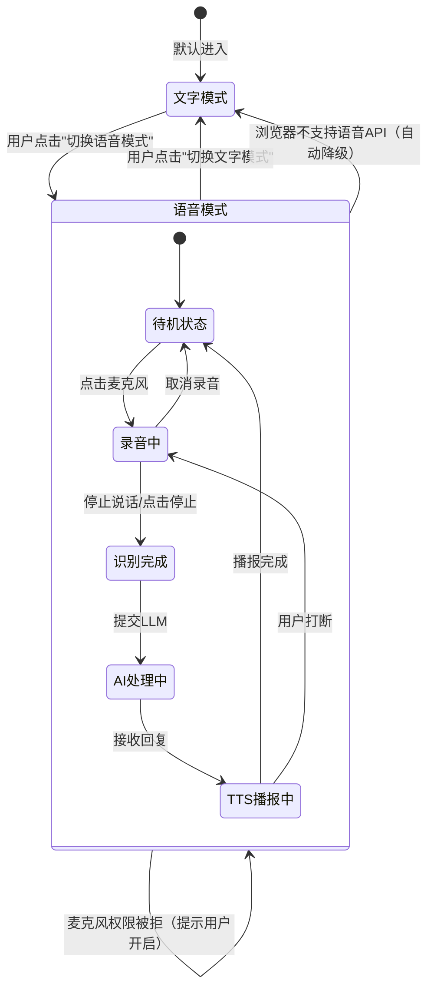

**模式切换状态管理代码**：

```typescript
// stores/voiceStore.ts
import { create } from 'zustand';

export type InterviewMode = 'text' | 'voice';

export interface VoiceState {
  // 模式状态
  mode: InterviewMode;
  isVoiceSupported: boolean;
  
  // 录音状态
  isRecording: boolean;
  transcript: string;
  interimTranscript: string;
  
  // 播放状态
  isPlaying: boolean;
  currentSpeakingText: string;
  audioQueue: string[];
  
  // 设置
  selectedVoice: string;
  speechRate: number;
  speechPitch: number;
  speechVolume: number;
  
  // 操作
  setMode: (mode: InterviewMode) => void;
  setRecording: (recording: boolean) => void;
  setTranscript: (text: string) => void;
  setInterimTranscript: (text: string) => void;
  setPlaying: (playing: boolean) => void;
  addToQueue: (text: string) => void;
  clearQueue: () => void;
  setVoiceSettings: (settings: Partial<Pick<VoiceState, 'selectedVoice' | 'speechRate' | 'speechPitch' | 'speechVolume'>>) => void;
  checkVoiceSupport: () => boolean;
}

export const useVoiceStore = create<VoiceState>((set, get) => ({
  mode: 'text',
  isVoiceSupported: false,
  isRecording: false,
  transcript: '',
  interimTranscript: '',
  isPlaying: false,
  currentSpeakingText: '',
  audioQueue: [],
  selectedVoice: 'default',
  speechRate: 1.0,
  speechPitch: 1.0,
  speechVolume: 1.0,

  setMode: (mode) => {
    // 切换模式时清理当前状态
    if (mode === 'text') {
      window.speechSynthesis?.cancel();
    }
    set({ mode, isRecording: false, isPlaying: false });
  },

  setRecording: (recording) => set({ isRecording: recording }),
  setTranscript: (text) => set({ transcript: text }),
  setInterimTranscript: (text) => set({ interimTranscript: text }),
  setPlaying: (playing) => set({ isPlaying: playing }),

  addToQueue: (text) =>
    set((state) => ({ audioQueue: [...state.audioQueue, text] })),

  clearQueue: () => set({ audioQueue: [], isPlaying: false }),

  setVoiceSettings: (settings) => set((state) => ({ ...state, ...settings })),

  checkVoiceSupport: () => {
    const hasSTT = 'webkitSpeechRecognition' in window || 'SpeechRecognition' in window;
    const hasTTS = 'speechSynthesis' in window;
    const supported = hasSTT && hasTTS;
    set({ isVoiceSupported: supported });
    return supported;
  },
}));
```

#### 2.3.4 语音队列管理

语音队列管理是确保 AI 回复能够流畅播报的核心机制。当 LLM 以 SSE 流式返回文字时，系统采用以下策略：

1. **智能分句**：按中文标点（。！？；）和英文标点（.!?;）进行句子分割
2. **预读缓冲**：累积 1-2 个完整句子后再开始播放，确保语义连贯
3. **队列并发**：最大同时播放 1 个音频，后续句子入队等待
4. **流式感知**：当检测到 SSE 流结束时，立即将缓冲区的剩余文字入队

```typescript
// hooks/useSpeechQueue.ts - 语音队列管理 Hook
import { useState, useCallback, useRef } from 'react';
import { useVoiceOutput } from './useVoiceOutput';

interface SpeechQueueItem {
  id: string;
  text: string;
  priority: 'high' | 'normal'; // high 为完整句子，normal 为流中间结果
}

/**
 * 智能语音队列管理
 * 将 SSE 流式文本转换为流畅的语音播报
 */
export function useSpeechQueue() {
  const { speak, stop, isPlaying } = useVoiceOutput({ rate: 1.1 });
  const [queue, setQueue] = useState<SpeechQueueItem[]>([]);
  const bufferRef = useRef(''); // 文本缓冲区
  const isStreamingRef = useRef(false);

  /**
   * 处理 SSE 流式文本块
   */
  const handleStreamChunk = useCallback((chunk: string) => {
    bufferRef.current += chunk;
    
    // 检查缓冲区是否有完整句子
    const sentenceEndRegex = /[。！？；.!?;:]/;
    const lastPunctuationIndex = bufferRef.current.search(sentenceEndRegex);
    
    if (lastPunctuationIndex !== -1) {
      // 提取完整句子
      const sentence = bufferRef.current.slice(0, lastPunctuationIndex + 1).trim();
      bufferRef.current = bufferRef.current.slice(lastPunctuationIndex + 1);
      
      if (sentence.length > 0) {
        speak(sentence);
        setQueue((q) => [...q, { id: Date.now().toString(), text: sentence, priority: 'high' }]);
      }
    }
  }, [speak]);

  /**
   * SSE 流结束，处理剩余缓冲区
   */
  const handleStreamEnd = useCallback(() => {
    isStreamingRef.current = false;
    const remaining = bufferRef.current.trim();
    if (remaining.length > 0) {
      speak(remaining);
      bufferRef.current = '';
    }
  }, [speak]);

  /**
   * 开始新的流式会话
   */
  const startStream = useCallback(() => {
    isStreamingRef.current = true;
    bufferRef.current = '';
    stop(); // 清空之前的队列
    setQueue([]);
  }, [stop]);

  /**
   * 用户打断
   */
  const interrupt = useCallback(() => {
    stop();
    bufferRef.current = '';
    isStreamingRef.current = false;
    setQueue([]);
  }, [stop]);

  return {
    handleStreamChunk,
    handleStreamEnd,
    startStream,
    interrupt,
    isPlaying,
    queueLength: queue.length,
  };
}
```

#### 2.3.5 打断机制

打断机制是语音面试的核心交互特性，允许用户在 AI 播报时随时说话打断。

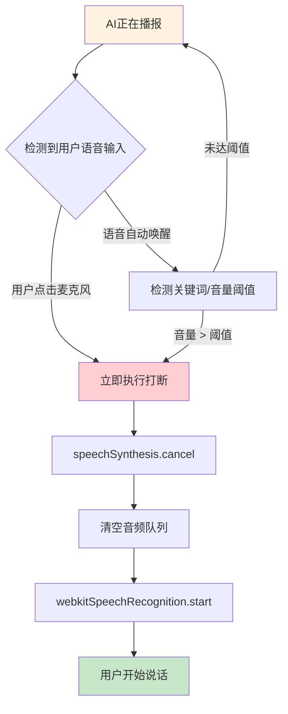

**打断实现策略**：

| 策略 | 实现方式 | 适用场景 | 复杂度 |
|------|---------|---------|--------|
| **手动打断**（推荐） | 用户点击麦克风按钮，调用 `speechSynthesis.cancel()` 停止播报 | 所有场景，最稳定可靠 | 低 |
| **音量检测打断** | Web Audio API 实时分析麦克风音量，超过阈值自动触发打断 | 高级功能，需要调参优化 | 高 |
| **关键词唤醒** | 识别特定唤醒词（如"停一下"）后触发打断 | 更自然的交互体验 | 高 |

**推荐方案**：第一阶段实现手动打断，用户点击麦克风按钮即可打断当前播报并开始录音。后续迭代可探索音量检测自动打断。

```typescript
// 打断控制逻辑示例
class VoiceInterviewController {
  private voiceOutput: ReturnType<typeof useVoiceOutput>;
  private voiceInput: ReturnType<typeof useVoiceInput>;
  private isSpeaking = false;

  constructor() {
    this.voiceOutput = useVoiceOutput();
    this.voiceInput = useVoiceInput(this.handleUserSpeech.bind(this));
  }

  /**
   * 用户点击麦克风 - 执行打断逻辑
   */
  async onMicrophoneClick(): Promise<void> {
    if (this.voiceOutput.isPlaying) {
      // 1. 立即停止 TTS 播报
      this.voiceOutput.stop();
      // 2. 清空播放队列
      this.voiceOutput.clearQueue?.();
      // 3. 开始语音识别
      this.voiceOutput.setPlaying(false);
    }

    if (this.voiceInput.isRecording) {
      // 正在录音，停止录音并提交
      this.voiceInput.stopRecording();
    } else {
      // 开始录音
      this.voiceInput.startRecording();
    }
  }

  /**
   * 用户语音输入完成后的处理
   */
  private async handleUserSpeech(transcript: string): Promise<void> {
    // 提交到 LLM
    const response = await this.sendToLLM(transcript);
    // LLM 回复通过 TTS 播报
    this.voiceOutput.speak(response);
  }
}
```

#### 2.3.6 浏览器兼容性矩阵

| 浏览器 | Web Speech API STT | Web Speech API TTS | 兼容性评级 | 备注 |
|--------|-------------------|-------------------|-----------|------|
| **Chrome** | ✅ 完整支持 | ✅ 完整支持 | ⭐⭐⭐⭐⭐ | 推荐使用，效果最佳 |
| **Edge** | ✅ 完整支持 | ✅ 完整支持 | ⭐⭐⭐⭐⭐ | Chromium 内核，与 Chrome 一致 |
| **Safari** | ✅ 支持（需用户交互触发） | ✅ 支持 | ⭐⭐⭐⭐ | macOS 14+ 支持较好 |
| **Firefox** | ❌ 不支持 | ✅ 支持 | ⭐⭐ | 仅 TTS，STT 需降级 |
| **Opera** | ✅ 完整支持 | ✅ 完整支持 | ⭐⭐⭐⭐⭐ | Chromium 内核 |
| **移动端 Chrome (Android)** | ✅ 支持 | ✅ 支持 | ⭐⭐⭐⭐ | 需 HTTPS |
| **移动端 Safari (iOS)** | ✅ 支持 | ✅ 支持 | ⭐⭐⭐⭐ | 需用户交互触发 |
| **微信内置浏览器** | ⚠️ 部分支持 | ⚠️ 部分支持 | ⭐⭐ | 兼容性不稳定 |

**兼容性处理策略**：

```typescript
// utils/voiceCompatibility.ts

export interface BrowserVoiceCapability {
  browser: string;
  stt: boolean;
  tts: boolean;
  requiresHTTPS: boolean;
  requiresUserInteraction: boolean;
  recommended: boolean;
}

/**
 * 检测浏览器语音能力
 */
export function detectVoiceCapability(): BrowserVoiceCapability {
  const ua = navigator.userAgent;
  const isChrome = /Chrome/.test(ua) && /Google Inc/.test(navigator.vendor);
  const isSafari = /Safari/.test(ua) && /Apple Computer/.test(navigator.vendor);
  const isFirefox = /Firefox/.test(ua);
  const isEdge = /Edg/.test(ua);
  const isMobile = /Mobile|Android|iPhone/.test(ua);

  const hasSTT = 'webkitSpeechRecognition' in window || 'SpeechRecognition' in window;
  const hasTTS = 'speechSynthesis' in window;

  return {
    browser: isChrome ? 'Chrome' : isSafari ? 'Safari' : isFirefox ? 'Firefox' : isEdge ? 'Edge' : 'Unknown',
    stt: hasSTT,
    tts: hasTTS,
    requiresHTTPS: isMobile || isChrome,
    requiresUserInteraction: isSafari,
    recommended: (hasSTT && hasTTS) && (isChrome || isEdge),
  };
}

/**
 * 获取兼容性提示信息
 */
export function getCompatibilityMessage(cap: BrowserVoiceCapability): string | null {
  if (!cap.stt && !cap.tts) {
    return '您的浏览器不支持语音功能，已自动切换为文字模式。推荐使用 Chrome 或 Edge 浏览器以获得最佳语音面试体验。';
  }
  if (!cap.stt) {
    return '您的浏览器不支持语音识别（语音输入），但可以使用语音播报。如需语音输入，请使用 Chrome 或 Edge 浏览器。';
  }
  if (!cap.tts) {
    return '您的浏览器不支持语音合成（语音播报），但可以通过语音输入。语音回复将以文字形式展示。';
  }
  if (!cap.recommended) {
    return '您的浏览器支持语音功能，但可能体验不够完善。推荐使用 Chrome 或 Edge 浏览器以获得最佳效果。';
  }
  return null;
}
```

### 2.4 后端 API 扩展

Web Speech API 纯前端方案**无需新增后端接口**，所有语音处理在浏览器端完成。但为了未来扩展性和备选方案预留，定义以下接口：

| 接口 | 方法 | 路径 | 说明 | 优先级 |
|------|------|------|------|--------|
| 提交语音文件（备选） | POST | `/api/v1/interviews/{id}/voice` | 上传语音文件，后端调用 Whisper API 识别 | 低（备选） |
| TTS 合成（备选） | POST | `/api/v1/tts` | 文字转语音，后端调用 ElevenLabs 等 API | 低（备选） |
| 获取可用音色列表 | GET | `/api/v1/voices` | 返回浏览器可用语音列表 | 中 |

**获取音色列表接口实现**：

```python
# routers/voice.py - 语音相关路由（音色列表代理）
from fastapi import APIRouter
from pydantic import BaseModel
from typing import List

router = APIRouter(prefix="/voice", tags=["语音"])

class VoiceInfo(BaseModel):
    id: str
    name: str
    lang: str
    gender: str
    local_service: bool

@router.get("/voices", response_model=List[VoiceInfo])
async def get_available_voices():
    """
    获取后端可用的语音合成音色列表
    前端优先使用浏览器本地音色，此接口作为备选
    """
    # 预留接口，实际音色由前端 Web Speech API 枚举
    return []
```

---

## 3. 面对面模拟面试技术方案

### 3.1 技术选型

| 技术 | 选型 | 理由 |
|------|------|------|
| **3D 引擎** | Three.js + React Three Fiber | Three.js 是浏览器 WebGL 的标准封装，生态最成熟；React Three Fiber 提供声明式 React 绑定，开发体验更佳 |
| **3D 模型格式** | GLTF/GLB | Khronos Group 标准格式，压缩率高，支持 PBR 材质、骨骼动画、Blend Shapes，Three.js 原生支持 |
| **虚拟形象方案** | Ready Player Me + 自定义 | 免费可商用，支持导出 GLB 格式，提供丰富的角色定制选项，社区资源丰富 |
| **口型同步** | 方案2：TTS 音频时长分片，按字数比例驱动 Blend Shape | 简单可靠，跨浏览器兼容，无需额外依赖，满足面试场景需求 |
| **表情动画** | Blend Shapes (Morph Targets) | GLTF 标准支持，Three.js 原生 API 驱动，可实现平滑的表情过渡 |
| **场景渲染** | Three.js + HDR 环境光 (RGBELoader) | HDR 环境贴图提供逼真的 IBL 光照效果，提升画面质感 |
| **动画混合** | Three.js AnimationMixer | 原生支持多动画混合、过渡、权重控制，满足状态机需求 |
| **后处理效果** | @react-three/postprocessing | 提供 SSAO、Bloom、色调映射等效果，提升画面品质 |
| **3D 模型加载** | @react-three/drei useGLTF | GLTF/GLB 加载优化，支持 Draco 压缩、渐进式加载 |
| **用户摄像头** | getUserMedia API | 浏览器标准 API，配合 Picture-in-Picture 展示用户画面 |

### 3.2 3D 面试官架构图

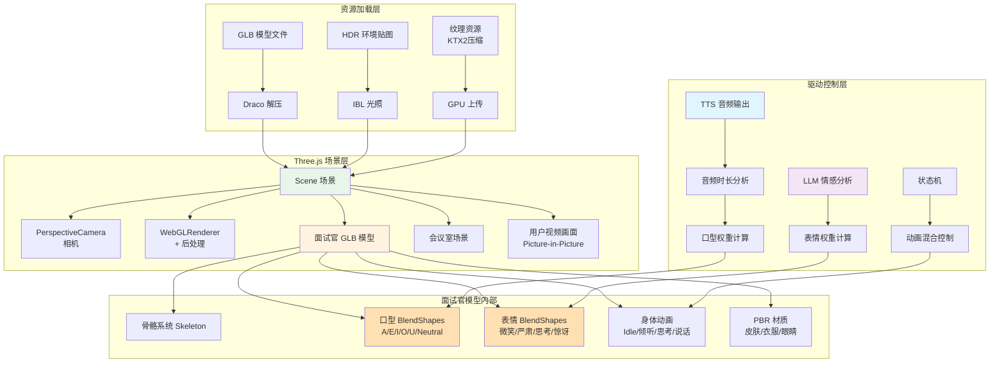

### 3.3 详细技术设计

#### 3.3.1 3D 场景架构

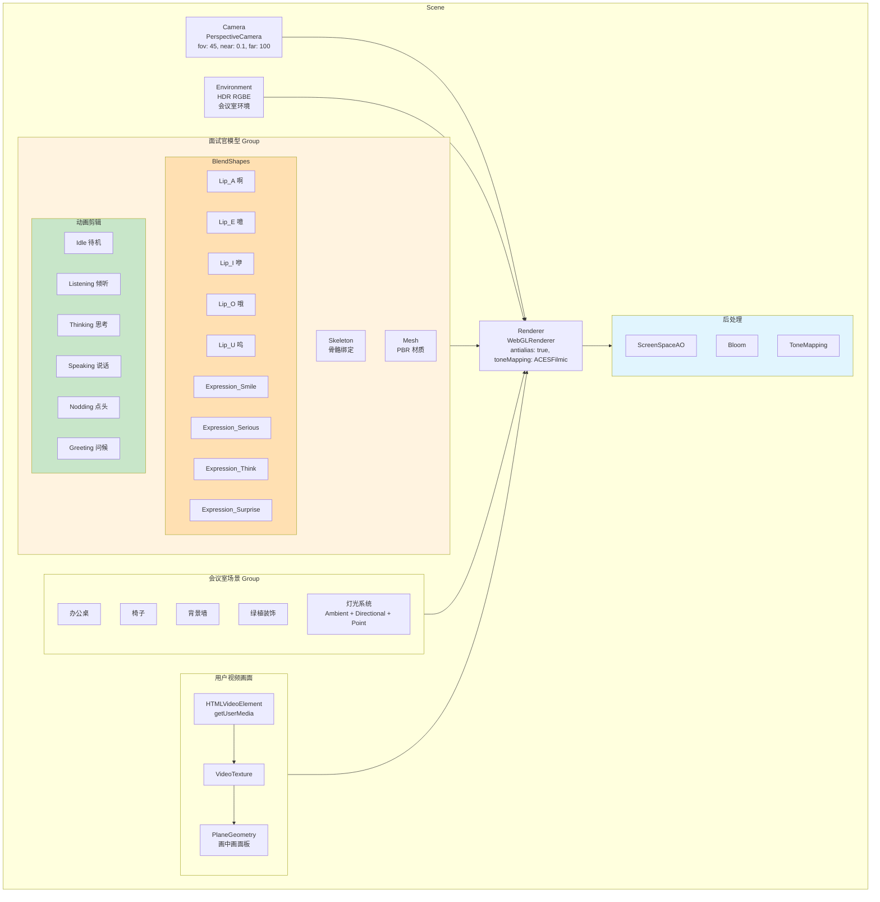

**React Three Fiber 场景实现代码**：

```tsx
// components/three/InterviewScene.tsx
import { Canvas } from '@react-three/fiber';
import { OrbitControls, Environment, useGLTF, useAnimations, Float, ContactShadows } from '@react-three/drei';
import { EffectComposer, SSAO, Bloom, ToneMapping } from '@react-three/postprocessing';
import { Suspense, useRef, useEffect, useState } from 'react';
import { Group, Mesh, MeshStandardMaterial } from 'three';
import { InterviewerAvatar } from './InterviewerAvatar';
import { MeetingRoom } from './MeetingRoom';
import { UserVideoPanel } from './UserVideoPanel';

interface InterviewSceneProps {
  currentAnimation: string;
  lipSyncWeights: Record<string, number>;
  expressionWeights: Record<string, number>;
  userCameraEnabled: boolean;
}

/**
 * 3D 面试场景主组件
 * 包含面试官模型、会议室环境、用户视频画面
 */
export function InterviewScene({
  currentAnimation,
  lipSyncWeights,
  expressionWeights,
  userCameraEnabled,
}: InterviewSceneProps) {
  return (
    <div className="w-full h-full relative">
      <Canvas
        camera={{ position: [0, 1.4, 3.5], fov: 45, near: 0.1, far: 100 }}
        gl={{
          antialias: true,
          toneMapping: 4, // ACESFilmicToneMapping
          toneMappingExposure: 1.2,
        }}
        shadows
      >
        <Suspense fallback={<LoadingFallback />}>
          {/* 环境光照 */}
          <Environment preset="city" />
          
          {/* 基础灯光 */}
          <ambientLight intensity={0.3} />
          <directionalLight
            position={[5, 5, 5]}
            intensity={1.5}
            castShadow
            shadow-mapSize={[1024, 1024]}
          />
          <pointLight position={[-2, 3, 2]} intensity={0.5} color="#ffd4a8" />
          
          {/* 面试官模型 */}
          <InterviewerAvatar
            currentAnimation={currentAnimation}
            lipSyncWeights={lipSyncWeights}
            expressionWeights={expressionWeights}
            position={[0, 0, 0]}
          />
          
          {/* 会议室场景 */}
          <MeetingRoom />
          
          {/* 用户视频画面（画中画） */}
          {userCameraEnabled && <UserVideoPanel position={[1.8, 1.2, 0]} />}
          
          {/* 接触阴影 */}
          <ContactShadows
            position={[0, -0.01, 0]}
            opacity={0.5}
            scale={10}
            blur={2}
            far={4}
          />
          
          {/* 后处理效果 */}
          <EffectComposer>
            <SSAO radius={0.1} intensity={15} />
            <Bloom intensity={0.3} luminanceThreshold={0.8} />
            <ToneMapping adaptive={true} />
          </EffectComposer>
          
          {/* 相机轨道控制（限制范围） */}
          <OrbitControls
            target={[0, 1.3, 0]}
            minPolarAngle={Math.PI / 4}
            maxPolarAngle={Math.PI / 2}
            minDistance={2}
            maxDistance={5}
            enablePan={false}
          />
        </Suspense>
      </Canvas>
      
      {/* 加载进度覆盖层 */}
      <LoadingOverlay />
    </div>
  );
}

/**
 * 面试官 3D 形象组件
 * 加载 GLB 模型，驱动 BlendShapes 和动画
 */
function InterviewerAvatar({
  currentAnimation,
  lipSyncWeights,
  expressionWeights,
  ...props
}: InterviewerAvatarProps) {
  const groupRef = useRef<Group>(null);
  const { scene, animations } = useGLTF('/models/interviewer.glb');
  const { actions } = useAnimations(animations, groupRef);

  // 动画状态机
  useEffect(() => {
    if (!actions[currentAnimation]) return;
    
    // 淡入新动画，淡出旧动画
    const prevAction = Object.values(actions).find(
      (a) => a !== actions[currentAnimation] && a?.isRunning()
    );
    
    actions[currentAnimation]!
      .reset()
      .fadeIn(0.3)
      .play();
    
    if (prevAction) {
      prevAction.fadeOut(0.3);
    }
  }, [currentAnimation, actions]);

  // 驱动 Blend Shapes
  useEffect(() => {
    scene.traverse((child) => {
      if ((child as Mesh).isMesh && (child as Mesh).morphTargetDictionary) {
        const mesh = child as Mesh;
        const dict = mesh.morphTargetDictionary;
        const influences = mesh.morphTargetInfluences!;

        // 驱动口型 Blend Shapes
        Object.entries(lipSyncWeights).forEach(([key, weight]) => {
          const index = dict[key];
          if (index !== undefined) {
            influences[index] = weight;
          }
        });

        // 驱动表情 Blend Shapes
        Object.entries(expressionWeights).forEach(([key, weight]) => {
          const index = dict[key];
          if (index !== undefined) {
            influences[index] = weight;
          }
        });
      }
    });
  }, [scene, lipSyncWeights, expressionWeights]);

  return (
    <group ref={groupRef} {...props}>
      <primitive object={scene} castShadow receiveShadow />
    </group>
  );
}

// 预加载模型
useGLTF.preload('/models/interviewer.glb');

function LoadingFallback() {
  return (
    <mesh position={[0, 1, 0]}>
      <boxGeometry args={[0.5, 0.5, 0.5]} />
      <meshStandardMaterial color="#3b82f6" wireframe />
    </mesh>
  );
}
```

#### 3.3.2 口型同步方案

**三种方案对比**：

| 方案 | 原理 | 优点 | 缺点 | 推荐度 |
|------|------|------|------|--------|
| **方案1** | Web Speech API `onboundary` 事件获取音素边界 | 与语音合成完美同步 | 浏览器支持有限，音素信息不完整 | ⭐⭐ |
| **方案2（推荐）** | TTS 音频时长分片，按字数比例驱动口型 Blend Shape | 简单可靠，跨浏览器兼容，无需额外依赖 | 精准度中等，但面试场景足够 | ⭐⭐⭐⭐⭐ |
| **方案3** | Web Audio API 分析音频波形，音量映射口型开合度 | 实时性强，与音频波形直接关联 | 无法区分具体口型，只能开闭 | ⭐⭐⭐ |

**推荐方案2 详细实现**：

```typescript
// hooks/useLipSync.ts
import { useState, useCallback, useRef, useEffect } from 'react';

/**
 * 口型 Blend Shape 权重定义
 * 对应模型中的 morph targets
 */
interface LipSyncWeights {
  lip_A: number;    // 啊 - 嘴巴大张
  lip_E: number;    // 噫 - 嘴角咧开
  lip_I: number;    // 咿 - 嘴角微张
  lip_O: number;    // 哦 - 嘴巴圆张
  lip_U: number;    // 呜 - 嘴巴收圆
  jawOpen: number;  // 下巴张开（通用开口）
}

const DEFAULT_WEIGHTS: LipSyncWeights = {
  lip_A: 0,
  lip_E: 0,
  lip_I: 0,
  lip_O: 0,
  lip_U: 0,
  jawOpen: 0,
};

/**
 * 汉字到口型的映射表
 * 基于汉语拼音的韵母分类
 */
const CHAR_TO_LIP_MAP: Record<string, keyof LipSyncWeights> = {
  // 啊类（开口音）
  '啊': 'lip_A', '阿': 'lip_A', '巴': 'lip_A', '妈': 'lip_A',
  '他': 'lip_A', '大': 'lip_A', '打': 'lip_A', '沙': 'lip_A',
  'a': 'lip_A', 'o': 'lip_A',
  
  // 噫类（咧口音）
  '诶': 'lip_E', '也': 'lip_E', '的': 'lip_E', '了': 'lip_E',
  '得': 'lip_E', '别': 'lip_E', '些': 'lip_E', '天': 'lip_E',
  'e': 'lip_E',
  
  // 咿类（微口音）
  '一': 'lip_I', '以': 'lip_I', '你': 'lip_I', '里': 'lip_I',
  '比': 'lip_I', '地': 'lip_I', '机': 'lip_I', '十': 'lip_I',
  'i': 'lip_I',
  
  // 哦类（圆口音）
  '哦': 'lip_O', '我': 'lip_O', '多': 'lip_O', '说': 'lip_O',
  '过': 'lip_O', '所': 'lip_O', '果': 'lip_O', '波': 'lip_O',
  'o': 'lip_O',
  
  // 呜类（收口音）
  '呜': 'lip_U', '不': 'lip_U', '出': 'lip_U', '路': 'lip_U',
  '书': 'lip_U', '读': 'lip_U', '如': 'lip_U', '图': 'lip_U',
  'u': 'lip_U',
};

/**
 * 基于文字的口型同步 Hook
 * 通过分析当前正在朗读的文字，计算对应的口型权重
 */
export function useLipSync() {
  const [weights, setWeights] = useState<LipSyncWeights>(DEFAULT_WEIGHTS);
  const animationFrameRef = useRef<number>();
  const currentTextRef = useRef('');
  const progressRef = useRef(0); // 0 ~ 1 的朗读进度

  /**
   * 根据文字和进度计算口型权重
   */
  const calculateLipWeights = useCallback((text: string, progress: number): LipSyncWeights => {
    if (!text || progress <= 0 || progress > 1) {
      return DEFAULT_WEIGHTS;
    }

    // 计算当前朗读到的字符位置
    const charIndex = Math.floor(progress * text.length);
    const currentChar = text[charIndex] || '';
    
    // 获取基础口型
    const lipKey = CHAR_TO_LIP_MAP[currentChar] || 'jawOpen';
    
    // 计算前后字符的过渡权重（平滑效果）
    const localProgress = (progress * text.length) - charIndex;
    const intensity = Math.sin(localProgress * Math.PI) * 0.8 + 0.2;

    const weights = { ...DEFAULT_WEIGHTS };
    
    // 设置当前口型权重
    if (lipKey in weights) {
      weights[lipKey] = intensity;
    }
    
    // 下巴始终有轻微开合，模拟自然说话
    weights.jawOpen = intensity * 0.3;

    return weights;
  }, []);

  /**
   * 开始口型动画
   */
  const startLipSync = useCallback((text: string, durationMs: number) => {
    currentTextRef.current = text;
    progressRef.current = 0;
    const startTime = performance.now();

    const animate = (now: number) => {
      const elapsed = now - startTime;
      progressRef.current = Math.min(elapsed / durationMs, 1);

      const newWeights = calculateLipWeights(currentTextRef.current, progressRef.current);
      setWeights(newWeights);

      if (progressRef.current < 1) {
        animationFrameRef.current = requestAnimationFrame(animate);
      } else {
        // 朗读结束，口型归零
        setWeights(DEFAULT_WEIGHTS);
      }
    };

    animationFrameRef.current = requestAnimationFrame(animate);
  }, [calculateLipWeights]);

  /**
   * 停止口型动画
   */
  const stopLipSync = useCallback(() => {
    if (animationFrameRef.current) {
      cancelAnimationFrame(animationFrameRef.current);
    }
    setWeights(DEFAULT_WEIGHTS);
  }, []);

  // 清理
  useEffect(() => {
    return () => {
      if (animationFrameRef.current) {
        cancelAnimationFrame(animationFrameRef.current);
      }
    };
  }, []);

  return {
    weights,
    startLipSync,
    stopLipSync,
  };
}
```

#### 3.3.3 动画状态机

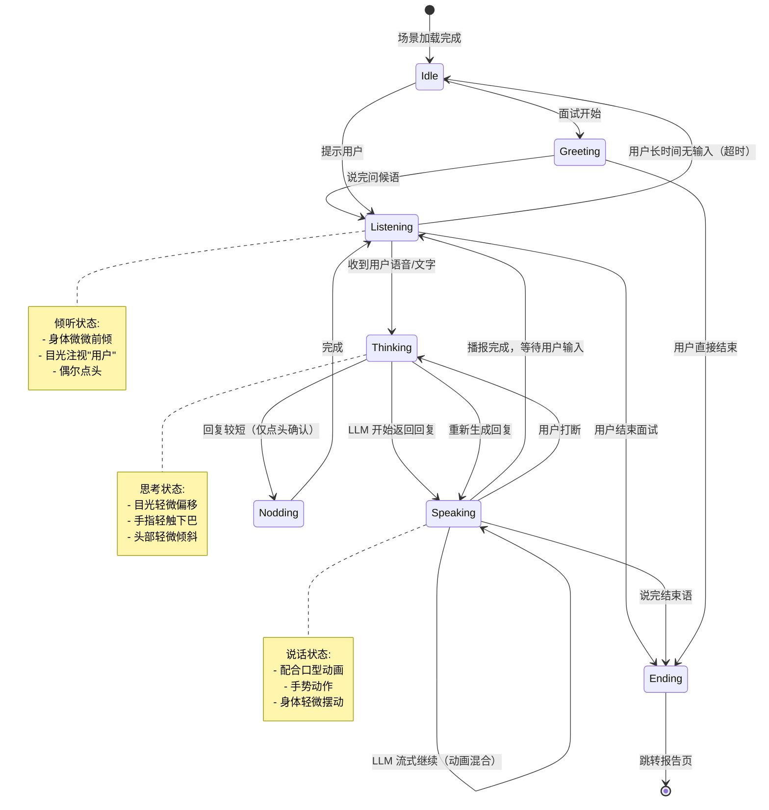

**动画状态机实现代码**：

```typescript
// hooks/useInterviewerState.ts
import { useState, useCallback, useRef } from 'react';

/**
 * 面试官动画状态定义
 */
export type InterviewerAnimation =
  | 'idle'        // 待机
  | 'greeting'    // 问候
  | 'listening'   // 倾听
  | 'thinking'    // 思考
  | 'speaking'    // 说话
  | 'nodding'     // 点头
  | 'ending';     // 结束

/**
 * 面试官表情定义
 */
export type InterviewerExpression =
  | 'neutral'     // 自然
  | 'smile'       // 微笑
  | 'serious'     // 严肃
  | 'think'       // 思考
  | 'surprise'    // 惊讶
  | 'encourage';  // 鼓励

interface InterviewerState {
  animation: InterviewerAnimation;
  expression: InterviewerExpression;
  isTransitioning: boolean;
}

/**
 * 面试官状态机 Hook
 * 管理 3D 面试官的动画状态和表情状态
 */
export function useInterviewerState() {
  const [state, setState] = useState<InterviewerState>({
    animation: 'idle',
    expression: 'neutral',
    isTransitioning: false,
  });

  const stateHistory = useRef<InterviewerAnimation[]>(['idle']);

  /**
   * 状态转换
   * 添加过渡动画保护，避免频繁切换
   */
  const transitionTo = useCallback((
    newAnimation: InterviewerAnimation,
    expression?: InterviewerExpression
  ) => {
    setState((prev) => {
      if (prev.isTransitioning && newAnimation !== 'speaking') {
        return prev; // 过渡中忽略非紧急状态变更
      }

      // 记录历史
      stateHistory.current.push(newAnimation);
      if (stateHistory.current.length > 10) {
        stateHistory.current.shift();
      }

      return {
        animation: newAnimation,
        expression: expression || deriveExpression(newAnimation),
        isTransitioning: true,
      };
    });

    // 过渡保护定时器
    setTimeout(() => {
      setState((prev) => ({ ...prev, isTransitioning: false }));
    }, 300);
  }, []);

  /**
   * 根据动画状态推导默认表情
   */
  const deriveExpression = (animation: InterviewerAnimation): InterviewerExpression => {
    switch (animation) {
      case 'greeting': return 'smile';
      case 'listening': return 'neutral';
      case 'thinking': return 'think';
      case 'speaking': return 'neutral';
      case 'nodding': return 'smile';
      case 'ending': return 'smile';
      default: return 'neutral';
    }
  };

  // 便捷方法
  const setGreeting = useCallback(() => transitionTo('greeting', 'smile'), [transitionTo]);
  const setListening = useCallback(() => transitionTo('listening', 'neutral'), [transitionTo]);
  const setThinking = useCallback(() => transitionTo('thinking', 'think'), [transitionTo]);
  const setSpeaking = useCallback(() => transitionTo('speaking'), [transitionTo]);
  const setNodding = useCallback(() => transitionTo('nodding', 'encourage'), [transitionTo]);
  const setEnding = useCallback(() => transitionTo('ending', 'smile'), [transitionTo]);

  /**
   * 根据 LLM 回复内容推断表情
   */
  const setExpressionByContent = useCallback((content: string) => {
    const lower = content.toLowerCase();
    if (lower.includes('很好') || lower.includes('不错') || lower.includes('优秀')) {
      setState((prev) => ({ ...prev, expression: 'smile' }));
    } else if (lower.includes('深入') || lower.includes('原理') || lower.includes('思考')) {
      setState((prev) => ({ ...prev, expression: 'think' }));
    } else if (lower.includes('注意') || lower.includes('重要') || lower.includes('关键')) {
      setState((prev) => ({ ...prev, expression: 'serious' }));
    } else if (lower.includes('鼓励') || lower.includes('加油') || lower.includes('相信')) {
      setState((prev) => ({ ...prev, expression: 'encourage' }));
    }
  }, []);

  return {
    ...state,
    transitionTo,
    setGreeting,
    setListening,
    setThinking,
    setSpeaking,
    setNodding,
    setEnding,
    setExpressionByContent,
  };
}
```

#### 3.3.4 性能优化策略

| 优化策略 | 实现方式 | 预期效果 | 优先级 |
|----------|---------|---------|--------|
| **模型 LOD** | 提供高/中/低三档模型（面数：50k/20k/5k），根据设备性能自动选择 | 低端设备帧率从 15fps 提升至 45fps | 高 |
| **纹理压缩** | 使用 KTX2/Basis Universal 压缩纹理，GPU 直接解压 | 纹理内存占用减少 75%，加载速度提升 3 倍 | 高 |
| **Draco 压缩** | GLB 模型使用 Draco 压缩算法 | 模型文件大小减少 80-90% | 高 |
| **GPU Instancing** | 场景中重复物体（如椅子、灯具）使用 InstancedMesh | 减少 draw call，提升渲染性能 | 中 |
| **按需加载/懒加载** | 3D 模型和纹理按需加载，优先加载面试官模型 | 首屏加载时间 < 2s | 高 |
| **动画烘焙** | 复杂动画预先烘焙为骨骼动画，运行时减少计算 | CPU 占用降低 30% | 中 |
| **后处理分级** | 低端设备关闭 SSAO 和 Bloom | 保持基础画面质量的同时提升帧率 | 高 |
| **模型缓存** | GLTF 模型加载后缓存到 IndexedDB | 二次访问秒开 | 中 |
| **离屏渲染** | 用户视频画面使用离屏 canvas 渲染 | 减少主线程阻塞 | 低 |

**性能分级策略代码**：

```typescript
// utils/performanceProfiler.ts

export type PerformanceTier = 'high' | 'medium' | 'low';

interface PerformanceProfile {
  tier: PerformanceTier;
  enableShadows: boolean;
  enableSSAO: boolean;
  enableBloom: boolean;
  modelQuality: 'high' | 'medium' | 'low';
  textureQuality: 'original' | 'compressed' | 'lowres';
  targetFPS: number;
}

/**
 * 检测设备性能等级
 * 通过检测 GPU 信息、硬件并发数、内存等判断
 */
export function detectPerformanceTier(): PerformanceTier {
  const canvas = document.createElement('canvas');
  const gl = canvas.getContext('webgl2') || canvas.getContext('webgl');
  
  if (!gl) return 'low';

  const debugInfo = gl.getExtension('WEBGL_debug_renderer_info');
  const renderer = debugInfo ? gl.getParameter(debugInfo.UNMASKED_RENDERER_WEBGL) : '';
  
  // 检测是否为集成显卡/低端 GPU
  const isLowEndGPU = /(Intel|Apple GPU|Mali-G5|Mali-T)/i.test(renderer) && 
                      !/(Intel.*Iris|Apple M)/i.test(renderer);
  
  const hardwareConcurrency = navigator.hardwareConcurrency || 2;
  const deviceMemory = (navigator as any).deviceMemory || 4;

  if (isLowEndGPU || hardwareConcurrency <= 4 || deviceMemory <= 4) {
    return 'low';
  }
  if (hardwareConcurrency >= 8 && deviceMemory >= 8 && !isLowEndGPU) {
    return 'high';
  }
  return 'medium';
}

/**
 * 根据性能等级获取渲染配置
 */
export function getPerformanceProfile(): PerformanceProfile {
  const tier = detectPerformanceTier();
  
  switch (tier) {
    case 'high':
      return {
        tier,
        enableShadows: true,
        enableSSAO: true,
        enableBloom: true,
        modelQuality: 'high',
        textureQuality: 'original',
        targetFPS: 60,
      };
    case 'medium':
      return {
        tier,
        enableShadows: true,
        enableSSAO: false,
        enableBloom: false,
        modelQuality: 'medium',
        textureQuality: 'compressed',
        targetFPS: 30,
      };
    case 'low':
      return {
        tier,
        enableShadows: false,
        enableSSAO: false,
        enableBloom: false,
        modelQuality: 'low',
        textureQuality: 'lowres',
        targetFPS: 30,
      };
  }
}
```

---

## 4. 前端架构更新

### 4.1 新增组件清单

| 组件名 | 功能 | 依赖 | 所在目录 |
|--------|------|------|---------|
| **VoiceRecorder** | 语音录制按钮 + 录音状态可视化（波形动画） | Web Speech API | `components/voice/VoiceRecorder.tsx` |
| **VoicePlayer** | TTS 语音播报控制器（播放/暂停/停止） | Web Speech API | `components/voice/VoicePlayer.tsx` |
| **VoiceToggle** | 文字/语音模式切换开关（带动画过渡） | - | `components/voice/VoiceToggle.tsx` |
| **VoiceSettings** | 语音设置面板（音色选择、语速调节） | Web Speech API | `components/voice/VoiceSettings.tsx` |
| **Interviewer3D** | 3D 面试官主组件（加载模型 + 驱动） | Three.js, R3F | `components/three/InterviewerAvatar.tsx` |
| **Scene3D** | 3D 场景渲染器（含灯光/环境/后处理） | Three.js, R3F | `components/three/InterviewScene.tsx` |
| **LipSync** | 口型同步控制器（文字 → BlendShape 权重） | Three.js | `hooks/useLipSync.ts` |
| **FaceExpression** | 表情控制器（表情状态 → BlendShape 权重） | Three.js | `hooks/useFaceExpression.ts` |
| **UserVideo** | 用户摄像头画面（画中画模式） | getUserMedia | `components/three/UserVideoPanel.tsx` |
| **InterviewRoom3D** | 面对面面试房间页面（整合所有 3D 组件） | 以上全部 | `pages/FaceToFaceRoom.tsx` |
| **Loading3D** | 3D 资源加载界面（含进度条和提示） | - | `components/three/LoadingOverlay.tsx` |

### 4.2 状态管理更新

```typescript
// stores/voiceStore.ts - 语音状态管理
import { create } from 'zustand';

export type InterviewMode = 'text' | 'voice';
export type VoiceStatus = 'idle' | 'recording' | 'processing' | 'playing' | 'error';

export interface VoiceState {
  // 模式
  mode: InterviewMode;
  isVoiceSupported: boolean;
  
  // 状态
  status: VoiceStatus;
  isRecording: boolean;
  isPlaying: boolean;
  
  // 识别结果
  transcript: string;
  interimTranscript: string;
  
  // 音频队列
  audioQueue: AudioQueueItem[];
  
  // 设置
  selectedVoice: string;
  speechRate: number;
  speechPitch: number;
  speechVolume: number;
  autoPlay: boolean; // 是否自动播报 AI 回复
  
  // 操作
  setMode: (mode: InterviewMode) => void;
  setStatus: (status: VoiceStatus) => void;
  setRecording: (recording: boolean) => void;
  setPlaying: (playing: boolean) => void;
  setTranscript: (text: string) => void;
  setInterimTranscript: (text: string) => void;
  addToQueue: (item: AudioQueueItem) => void;
  removeFromQueue: (id: string) => void;
  clearQueue: () => void;
  setVoiceSettings: (settings: Partial<VoiceSettings>) => void;
  checkSupport: () => boolean;
}

export interface AudioQueueItem {
  id: string;
  text: string;
  priority: 'high' | 'normal';
  addedAt: number;
}

export interface VoiceSettings {
  selectedVoice: string;
  speechRate: number;
  speechPitch: number;
  speechVolume: number;
  autoPlay: boolean;
}

export const useVoiceStore = create<VoiceState>((set, get) => ({
  mode: 'text',
  isVoiceSupported: false,
  status: 'idle',
  isRecording: false,
  isPlaying: false,
  transcript: '',
  interimTranscript: '',
  audioQueue: [],
  selectedVoice: 'default',
  speechRate: 1.0,
  speechPitch: 1.0,
  speechVolume: 1.0,
  autoPlay: true,

  setMode: (mode) => {
    // 清理语音状态
    if (mode === 'text') {
      window.speechSynthesis?.cancel();
    }
    set({ 
      mode, 
      isRecording: false, 
      isPlaying: false,
      status: 'idle',
    });
  },

  setStatus: (status) => set({ status }),
  setRecording: (recording) => set({ isRecording: recording }),
  setPlaying: (playing) => set({ isPlaying: playing }),
  setTranscript: (text) => set({ transcript: text }),
  setInterimTranscript: (text) => set({ interimTranscript: text }),

  addToQueue: (item) =>
    set((state) => ({ audioQueue: [...state.audioQueue, item] })),

  removeFromQueue: (id) =>
    set((state) => ({
      audioQueue: state.audioQueue.filter((item) => item.id !== id),
    })),

  clearQueue: () => set({ audioQueue: [], isPlaying: false }),

  setVoiceSettings: (settings) => set((state) => ({ ...state, ...settings })),

  checkSupport: () => {
    const hasSTT = 'webkitSpeechRecognition' in window || 'SpeechRecognition' in window;
    const hasTTS = 'speechSynthesis' in window;
    const supported = hasSTT && hasTTS;
    set({ isVoiceSupported: supported });
    return supported;
  },
}));
```

```typescript
// stores/faceToFaceStore.ts - 面对面面试状态管理
import { create } from 'zustand';

export type InterviewerAnimation =
  | 'idle'
  | 'greeting'
  | 'listening'
  | 'thinking'
  | 'speaking'
  | 'nodding'
  | 'ending';

export type InterviewerExpression =
  | 'neutral'
  | 'smile'
  | 'serious'
  | 'think'
  | 'surprise'
  | 'encourage';

export type PerformanceTier = 'high' | 'medium' | 'low';

export interface FaceToFaceState {
  // 模式
  is3DMode: boolean;
  
  // 加载状态
  isLoading: boolean;
  loadingProgress: number;
  loadingStage: string;
  
  // 面试官配置
  interviewerModel: string;
  interviewerSkin: string;
  scene: string;
  
  // 动画/表情状态
  currentAnimation: InterviewerAnimation;
  currentExpression: InterviewerExpression;
  
  // 口型同步
  lipSyncWeights: Record<string, number>;
  
  // 表情权重
  expressionWeights: Record<string, number>;
  
  // 用户摄像头
  userCameraEnabled: boolean;
  userStream: MediaStream | null;
  
  // 显示设置
  showSubtitle: boolean;
  showUserVideo: boolean;
  
  // 性能
  performanceTier: PerformanceTier;
  
  // 操作
  set3DMode: (enabled: boolean) => void;
  setLoading: (loading: boolean, progress?: number, stage?: string) => void;
  setInterviewerConfig: (config: Partial<InterviewerConfig>) => void;
  setAnimation: (animation: InterviewerAnimation) => void;
  setExpression: (expression: InterviewerExpression) => void;
  setLipSyncWeights: (weights: Record<string, number>) => void;
  setExpressionWeights: (weights: Record<string, number>) => void;
  setUserCamera: (enabled: boolean) => void;
  setUserStream: (stream: MediaStream | null) => void;
  setDisplaySettings: (settings: Partial<DisplaySettings>) => void;
  setPerformanceTier: (tier: PerformanceTier) => void;
}

export interface InterviewerConfig {
  interviewerModel: string;
  interviewerSkin: string;
  scene: string;
}

export interface DisplaySettings {
  showSubtitle: boolean;
  showUserVideo: boolean;
}

export const useFaceToFaceStore = create<FaceToFaceState>((set) => ({
  is3DMode: false,
  isLoading: false,
  loadingProgress: 0,
  loadingStage: '',
  interviewerModel: 'professional-male',
  interviewerSkin: 'default',
  scene: 'modern-office',
  currentAnimation: 'idle',
  currentExpression: 'neutral',
  lipSyncWeights: {},
  expressionWeights: {},
  userCameraEnabled: false,
  userStream: null,
  showSubtitle: true,
  showUserVideo: true,
  performanceTier: 'high',

  set3DMode: (enabled) => set({ is3DMode: enabled }),
  
  setLoading: (loading, progress = 0, stage = '') =>
    set({ isLoading: loading, loadingProgress: progress, loadingStage: stage }),
  
  setInterviewerConfig: (config) => set((state) => ({ ...state, ...config })),
  
  setAnimation: (animation) => set({ currentAnimation: animation }),
  
  setExpression: (expression) => set({ currentExpression: expression }),
  
  setLipSyncWeights: (weights) => set({ lipSyncWeights: weights }),
  
  setExpressionWeights: (weights) => set({ expressionWeights: weights }),
  
  setUserCamera: (enabled) => set({ userCameraEnabled: enabled }),
  
  setUserStream: (stream) => set({ userStream: stream }),
  
  setDisplaySettings: (settings) => set((state) => ({ ...state, ...settings })),
  
  setPerformanceTier: (tier) => set({ performanceTier: tier }),
}));
```

### 4.3 路由更新

```typescript
// App.tsx - 更新后的路由配置
import { Routes, Route, Navigate } from 'react-router-dom';
import { useEffect } from 'react';
import { useAuthStore } from '@/stores/authStore';

// 页面组件
import Home from '@/pages/Home';
import Auth from '@/pages/Auth';
import Resume from '@/pages/Resume';
import InterviewSetup from '@/pages/InterviewSetup';
import InterviewRoom from '@/pages/InterviewRoom';
import FaceToFaceRoom from '@/pages/FaceToFaceRoom';
import InterviewReport from '@/pages/InterviewReport';
import History from '@/pages/History';

// 布局组件
import AppLayout from '@/components/AppLayout';

function ProtectedRoute({ children }: { children: React.ReactNode }) {
  const { isAuthenticated } = useAuthStore();
  if (!isAuthenticated) return <Navigate to="/auth" replace />;
  return <>{children}</>;
}

function App() {
  const { init } = useAuthStore();
  useEffect(() => { init(); }, []);

  return (
    <Routes>
      {/* 公开路由 */}
      <Route path="/" element={<Home />} />
      <Route path="/auth" element={<Auth />} />
      
      {/* 需要登录的路由 */}
      <Route element={<ProtectedRoute><AppLayout /></ProtectedRoute>}>
        <Route path="/resume" element={<Resume />} />
        <Route path="/interview/setup" element={<InterviewSetup />} />
        
        {/* 文字面试（现有） */}
        <Route path="/interview/:id" element={<InterviewRoom />} />
        
        {/* 面对面 3D 面试（新增） */}
        <Route path="/interview/face-to-face/:id" element={<FaceToFaceRoom />} />
        
        <Route path="/interview/:id/report" element={<InterviewReport />} />
        <Route path="/history" element={<History />} />
      </Route>
      
      {/* 404 重定向 */}
      <Route path="*" element={<Navigate to="/" replace />} />
    </Routes>
  );
}

export default App;
```

### 4.4 面对面面试房间页面

```tsx
// pages/FaceToFaceRoom.tsx
/**
 * 面对面 3D 面试房间页面
 * 
 * 功能:
 * - 3D 虚拟面试官渲染
 * - 语音对话（STT + TTS）
 * - 用户摄像头画中画
 * - 字幕同步显示
 * - 面试控制（结束/暂停）
 */

import { useState, useEffect, useCallback, useRef } from 'react';
import { useParams, useNavigate } from 'react-router-dom';
import { Mic, MicOff, Video, VideoOff, Subtitles, SubtitlesOff, 
         Settings, PhoneOff, MessageSquare } from 'lucide-react';
import { Button } from '@/components/ui/button';
import { InterviewScene } from '@/components/three/InterviewScene';
import { useVoiceInput } from '@/hooks/useVoiceInput';
import { useVoiceOutput } from '@/hooks/useVoiceOutput';
import { useLipSync } from '@/hooks/useLipSync';
import { useInterviewerState } from '@/hooks/useInterviewerState';
import { useFaceToFaceStore } from '@/stores/faceToFaceStore';
import { useInterviewStore } from '@/stores/interviewStore';
import { cn } from '@/lib/utils';

export default function FaceToFaceRoom() {
  const { id } = useParams<{ id: string }>();
  const navigate = useNavigate();
  const interviewId = parseInt(id || '0');

  // Store 状态
  const {
    currentInterview,
    messages,
    isSending,
    fetchInterview,
    fetchMessages,
    sendMessage,
    completeInterview,
  } = useInterviewStore();

  const {
    isLoading,
    userCameraEnabled,
    userStream,
    showSubtitle,
    showUserVideo,
    currentAnimation,
    setUserCamera,
    setUserStream,
    setDisplaySettings,
  } = useFaceToFaceStore();

  // 语音相关 hooks
  const { weights: lipSyncWeights, startLipSync, stopLipSync } = useLipSync();
  const interviewer = useInterviewerState();
  const voiceOutput = useVoiceOutput({ rate: 1.1 });

  // 本地状态
  const [isRecording, setIsRecording] = useState(false);
  const [transcript, setTranscript] = useState('');
  const videoRef = useRef<HTMLVideoElement>(null);

  // 初始化
  useEffect(() => {
    if (interviewId) {
      fetchInterview(interviewId);
      fetchMessages(interviewId);
    }
  }, [interviewId]);

  // 用户摄像头
  useEffect(() => {
    if (userCameraEnabled) {
      navigator.mediaDevices.getUserMedia({ video: true, audio: false })
        .then((stream) => {
          setUserStream(stream);
          if (videoRef.current) {
            videoRef.current.srcObject = stream;
          }
        })
        .catch(() => {
          setUserCamera(false);
        });
    } else {
      userStream?.getTracks().forEach((t) => t.stop());
      setUserStream(null);
    }
  }, [userCameraEnabled]);

  // 发送语音消息
  const handleVoiceSubmit = useCallback(
    async (text: string) => {
      if (!text.trim() || isSending) return;
      
      setTranscript('');
      interviewer.setListening();
      
      // 发送消息到 LLM
      await sendMessage(interviewId, text);
      
      // LLM 回复通过 TTS 播报
      const lastMessage = messages[messages.length - 1];
      if (lastMessage?.role === 'assistant') {
        interviewer.setSpeaking();
        voiceOutput.speak(lastMessage.content);
        startLipSync(lastMessage.content, estimateDuration(lastMessage.content));
      }
    },
    [interviewId, isSending, messages, sendMessage, interviewer, voiceOutput, startLipSync]
  );

  // 估算朗读时长（毫秒）
  const estimateDuration = (text: string): number => {
    const charCount = text.length;
    // 中文约每秒 4-5 个字
    return Math.max((charCount / 4.5) * 1000, 1000);
  };

  // 切换录音
  const toggleRecording = useCallback(() => {
    if (isRecording) {
      // 停止录音，提交
      setIsRecording(false);
      if (transcript.trim()) {
        handleVoiceSubmit(transcript);
      }
    } else {
      // 打断当前播报
      voiceOutput.stop();
      stopLipSync();
      
      // 开始录音
      setIsRecording(true);
      setTranscript('');
      interviewer.setListening();
    }
  }, [isRecording, transcript, handleVoiceSubmit, voiceOutput, stopLipSync, interviewer]);

  return (
    <div className="h-screen w-screen relative bg-black overflow-hidden">
      {/* 3D 场景 */}
      <div className="absolute inset-0">
        <InterviewScene
          currentAnimation={currentAnimation}
          lipSyncWeights={lipSyncWeights}
          expressionWeights={interviewer.expressionWeights}
          userCameraEnabled={userCameraEnabled && showUserVideo}
        />
      </div>

      {/* 顶部状态栏 */}
      <div className="absolute top-0 left-0 right-0 z-10 bg-gradient-to-b from-black/60 to-transparent px-6 py-4">
        <div className="flex items-center justify-between text-white">
          <div>
            <h2 className="font-semibold text-lg">{currentInterview?.title || '模拟面试'}</h2>
            <p className="text-sm text-white/70">{currentInterview?.job_position}</p>
          </div>
          <div className="flex items-center gap-2">
            <Button
              variant="ghost"
              size="sm"
              className="text-white hover:bg-white/20"
              onClick={() => navigate(`/interview/${interviewId}`)}
            >
              <MessageSquare className="w-4 h-4 mr-1" />
              切换文字模式
            </Button>
          </div>
        </div>
      </div>

      {/* 字幕区域 */}
      {showSubtitle && messages.length > 0 && (
        <div className="absolute bottom-24 left-1/2 -translate-x-1/2 z-10 max-w-2xl w-full px-4">
          <div className="bg-black/60 backdrop-blur-sm rounded-xl px-6 py-4 text-white text-center">
            <p className="text-lg leading-relaxed">
              {messages[messages.length - 1]?.content || '准备开始面试...'}
            </p>
          </div>
        </div>
      )}

      {/* 用户视频画面（画中画） */}
      {userCameraEnabled && showUserVideo && (
        <div className="absolute top-20 right-6 z-10 w-48 h-36 rounded-xl overflow-hidden border-2 border-white/30 shadow-lg">
          <video
            ref={videoRef}
            autoPlay
            playsInline
            muted
            className="w-full h-full object-cover"
          />
          <div className="absolute bottom-2 left-2 text-xs text-white/80 bg-black/50 px-2 py-0.5 rounded">
            你
          </div>
        </div>
      )}

      {/* 底部控制栏 */}
      <div className="absolute bottom-0 left-0 right-0 z-10 bg-gradient-to-t from-black/80 to-transparent px-6 py-6">
        <div className="flex items-center justify-center gap-4">
          {/* 麦克风按钮 */}
          <Button
            size="lg"
            className={cn(
              'rounded-full w-14 h-14 transition-all',
              isRecording
                ? 'bg-red-500 hover:bg-red-600 animate-pulse'
                : 'bg-blue-500 hover:bg-blue-600'
            )}
            onClick={toggleRecording}
          >
            {isRecording ? <MicOff className="w-6 h-6" /> : <Mic className="w-6 h-6" />}
          </Button>

          {/* 摄像头按钮 */}
          <Button
            size="lg"
            variant="outline"
            className="rounded-full w-12 h-12 border-white/30 text-white hover:bg-white/20"
            onClick={() => setUserCamera(!userCameraEnabled)}
          >
            {userCameraEnabled ? <Video className="w-5 h-5" /> : <VideoOff className="w-5 h-5" />}
          </Button>

          {/* 字幕按钮 */}
          <Button
            size="lg"
            variant="outline"
            className="rounded-full w-12 h-12 border-white/30 text-white hover:bg-white/20"
            onClick={() => setDisplaySettings({ showSubtitle: !showSubtitle })}
          >
            {showSubtitle ? <Subtitles className="w-5 h-5" /> : <SubtitlesOff className="w-5 h-5" />}
          </Button>

          {/* 结束面试 */}
          <Button
            size="lg"
            variant="destructive"
            className="rounded-full w-12 h-12"
            onClick={() => {
              completeInterview(interviewId);
              navigate(`/interview/${interviewId}/report`);
            }}
          >
            <PhoneOff className="w-5 h-5" />
          </Button>
        </div>

        {/* 录音提示 */}
        {isRecording && (
          <p className="text-center text-white/70 text-sm mt-3 animate-pulse">
            正在聆听... 说完后再次点击麦克风提交
          </p>
        )}
      </div>
    </div>
  );
}
```

---

## 5. 后端 API 扩展

### 5.1 新增接口设计

```python
# routers/voice.py - 语音相关接口（备选方案预留）
from fastapi import APIRouter, UploadFile, File, HTTPException
from fastapi.responses import StreamingResponse
from pydantic import BaseModel
from typing import List, Optional
import io

router = APIRouter(prefix="/voice", tags=["语音服务"])


class TTSRequest(BaseModel):
    """文字转语音请求"""
    text: str
    voice_id: Optional[str] = "default"
    speed: Optional[float] = 1.0
    language: Optional[str] = "zh-CN"


class STTResponse(BaseModel):
    """语音识别响应"""
    text: str
    confidence: float
    language: str


class VoiceInfo(BaseModel):
    """音色信息"""
    id: str
    name: str
    language: str
    gender: str
    preview_url: Optional[str] = None


@router.get("/voices", response_model=List[VoiceInfo])
async def get_available_voices(language: Optional[str] = "zh-CN"):
    """
    获取可用的 TTS 音色列表
    
    此接口在纯前端 Web Speech API 方案中作为预留，
    前端优先使用浏览器本地枚举的语音列表。
    """
    return []


@router.post("/tts")
async def text_to_speech(request: TTSRequest):
    """
    文字转语音（备选方案）
    
    当浏览器端 TTS 不可用时，通过后端调用第三方 TTS API。
    返回音频流（audio/mpeg 或 audio/wav）。
    
    当前预留，如需实现可对接：
    - ElevenLabs API
    - Microsoft Azure Speech
    - 百度语音合成
    """
    raise HTTPException(status_code=501, detail="后端 TTS 服务暂未启用，请使用浏览器语音合成")


@router.post("/stt", response_model=STTResponse)
async def speech_to_text(
    audio: UploadFile = File(...),
    language: Optional[str] = "zh-CN"
):
    """
    语音转文字（备选方案）
    
    当浏览器端 STT 不可用时，上传音频文件进行识别。
    可对接：
    - OpenAI Whisper API
    - 讯飞语音听写
    - 百度语音识别
    """
    raise HTTPException(status_code=501, detail="后端 STT 服务暂未启用，请使用浏览器语音识别")


# routers/interviews.py - 扩展现有接口
# 新增面试配置参数

class InterviewCreate(BaseModel):
    """创建面试请求（扩展）"""
    resume_id: Optional[int] = None
    title: str
    job_position: str
    interview_type: str = "comprehensive"
    difficulty: str = "intermediate"
    question_count: int = 8
    # 新增字段
    enable_voice: bool = False       # 是否启用语音模式
    enable_3d: bool = False          # 是否启用 3D 面对面模式
    interviewer_model: Optional[str] = "professional-male"  # 面试官形象
    scene: Optional[str] = "modern-office"                   # 场景
```

### 5.2 API 端点速查表（新增）

| 方法 | 路径 | 认证 | 说明 | 优先级 |
|------|------|------|------|--------|
| GET | `/api/v1/voice/voices` | 是 | 获取可用音色列表 | 低 |
| POST | `/api/v1/voice/tts` | 是 | 文字转语音（备选） | 低 |
| POST | `/api/v1/voice/stt` | 是 | 语音转文字（备选） | 低 |

---

## 6. 数据模型更新

### 6.1 数据库表变更

#### interviews 表新增字段

```sql
-- 迁移脚本: alembic/versions/xxx_add_voice_and_3d_fields.py

"""
新增语音面试和 3D 面对面面试字段
"""

from alembic import op
import sqlalchemy as sa

# revision identifiers
revision = 'xxx'
down_revision = 'previous_revision'
branch_labels = None
depends_on = None


def upgrade():
    # interviews 表新增字段
    op.add_column('interviews', sa.Column('enable_voice', sa.Boolean(), nullable=False, server_default='false'))
    op.add_column('interviews', sa.Column('enable_3d', sa.Boolean(), nullable=False, server_default='false'))
    op.add_column('interviews', sa.Column('interviewer_model', sa.String(50), nullable=True))
    op.add_column('interviews', sa.Column('scene', sa.String(50), nullable=True, server_default='modern-office'))
    
    # 新增索引
    op.create_index('idx_interviews_enable_3d', 'interviews', ['enable_3d'])
    op.create_index('idx_interviews_enable_voice', 'interviews', ['enable_voice'])


def downgrade():
    op.drop_index('idx_interviews_enable_voice', table_name='interviews')
    op.drop_index('idx_interviews_enable_3d', table_name='interviews')
    op.drop_column('interviews', 'scene')
    op.drop_column('interviews', 'interviewer_model')
    op.drop_column('interviews', 'enable_3d')
    op.drop_column('interviews', 'enable_voice')
```

#### 更新后的 Interview 模型

```python
# models.py - Interview 模型更新

class Interview(Base):
    """面试会话表（扩展语音和 3D 字段）"""
    __tablename__ = "interviews"
    
    # 现有字段保持不变
    id = Column(Integer, primary_key=True, index=True)
    user_id = Column(Integer, ForeignKey("users.id"), nullable=False)
    resume_id = Column(Integer, ForeignKey("resumes.id"), nullable=True)
    title = Column(String(200), nullable=False)
    job_position = Column(String(100), nullable=True)
    interview_type = Column(String(50), nullable=False, default="comprehensive")
    difficulty = Column(String(20), nullable=False, default="intermediate")
    status = Column(String(20), nullable=False, default="ongoing")
    message_count = Column(Integer, default=0)
    question_count = Column(Integer, default=8)
    started_at = Column(DateTime, default=datetime.now)
    ended_at = Column(DateTime, nullable=True)
    created_at = Column(DateTime, default=datetime.now)
    updated_at = Column(DateTime, default=datetime.now, onupdate=datetime.now)
    
    # ===== 新增字段 =====
    enable_voice = Column(Boolean, default=False, nullable=False, 
                          comment="是否启用语音模式")
    enable_3d = Column(Boolean, default=False, nullable=False,
                       comment="是否启用 3D 面对面模式")
    interviewer_model = Column(String(50), nullable=True,
                               comment="面试官形象标识，如 professional-male")
    scene = Column(String(50), nullable=True, default="modern-office",
                   comment="面试场景标识，如 modern-office")
    # ===================
    
    # 关联关系保持不变
    user = relationship("User", back_populates="interviews")
    resume = relationship("Resume", back_populates="interviews")
    messages = relationship("Message", back_populates="interview", 
                           cascade="all, delete-orphan", 
                           order_by="Message.created_at")
    evaluation = relationship("Evaluation", back_populates="interview", 
                             uselist=False, cascade="all, delete-orphan")
    
    __table_args__ = (
        Index("idx_interviews_user_id", "user_id"),
        Index("idx_interviews_status", "status"),
        Index("idx_interviews_created_at", "created_at"),
        Index("idx_interviews_enable_3d", "enable_3d"),
        Index("idx_interviews_enable_voice", "enable_voice"),
    )
```

### 6.2 新增表设计

是否需要新增表？**当前版本不需要新增独立表**，所有语音和 3D 相关配置通过扩展 `interviews` 表的字段即可满足需求。

未来如需扩展以下功能时可考虑新增表：
- `user_voice_settings` — 用户语音偏好设置（音色、语速等）
- `3d_models` — 3D 模型资源管理表（多模型场景）
- `interview_recordings` — 面试录音存储记录

---

## 7. 技术风险与应对

| 风险 | 等级 | 描述 | 应对方案 |
|------|------|------|---------|
| **Web Speech API 浏览器兼容性** | 🔴 高 | Chrome/Edge 支持最好，Firefox 不支持 STT，Safari 需要用户交互触发 | 1. 进入面试页面前检测浏览器兼容性，给出明确提示<br>2. 不支持时自动降级为文字模式<br>3. 引导用户使用 Chrome 或 Edge 浏览器 |
| **3D 模型加载慢** | 🟡 中 | GLB 模型文件较大，网络慢时加载时间长 | 1. 使用 Draco 压缩模型（减少 80-90% 体积）<br>2. 实现加载进度条，提供视觉反馈<br>3. 模型资源缓存到 IndexedDB<br>4. 预加载策略：创建面试时即开始后台加载 3D 资源 |
| **低端设备帧率低** | 🟡 中 | 集成显卡或老旧设备运行 3D 场景卡顿 | 1. 性能分级：自动检测设备性能，切换高中低画质<br>2. 低端设备关闭阴影、SSAO、Bloom 后处理<br>3. 提供低面数 LOD 模型<br>4. 帧率低于 20fps 时提示用户切换为文字模式 |
| **麦克风/摄像头权限被拒** | 🔴 高 | 用户拒绝授权导致语音/视频功能不可用 | 1. 友好的权限引导界面，说明用途<br>2. 权限被拒后提供详细教程（图文指引如何在浏览器设置中开启）<br>3. 自动降级为文字模式，不影响面试流程 |
| **TTS 中文音色质量差** | 🟡 中 | 部分浏览器的中文语音合成效果生硬不自然 | 1. 提供多音色选择，让用户自选最合适的<br>2. 允许调节语速/音调优化听感<br>3. 预留后端 TTS 接口（如 ElevenLabs），后续可无缝升级 |
| **口型同步精准度** | 🟡 中 | 简化方案（按字数比例）精准度有限 | 1. 第一阶段采用简化方案，快速上线<br>2. 收集用户反馈后再评估是否需要精准方案<br>3. 预留 Web Audio API 波形分析方案，可随时升级 |
| **3D 场景内存占用** | 🟡 中 | Three.js 场景可能占用较大内存 | 1. 页面离开或组件卸载时正确 dispose 所有资源<br>2. 纹理使用 KTX2 压缩<br>3. 移动端限制场景复杂度 |
| **网络环境波动** | 🟡 中 | 语音面试对延迟敏感，网络波动影响体验 | 1. LLM 流式输出已缓解等待焦虑<br>2. TTS 本地处理无网络依赖<br>3. 弱网提示和重试机制 |
| **移动端适配** | 🟡 中 | 3D 场景在小屏幕上的交互和显示 | 1. 移动端优化相机角度和距离<br>2. 触摸交互优化<br>3. 必要时移动端降级为语音+文字模式（不显示 3D） |
| **安全和隐私** | 🟡 中 | 用户摄像头画面需要安全保障 | 1. 用户视频仅本地显示，不上传服务器<br>2. 面试结束后自动停止摄像头<br>3. 清晰的隐私说明 |

### 风险应对策略图

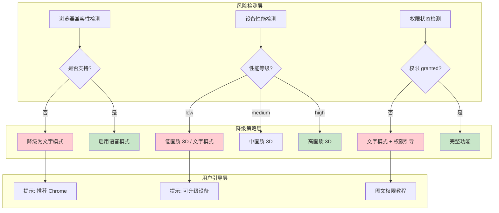

---

## 8. 开发计划与里程碑

### 8.1 升级开发计划

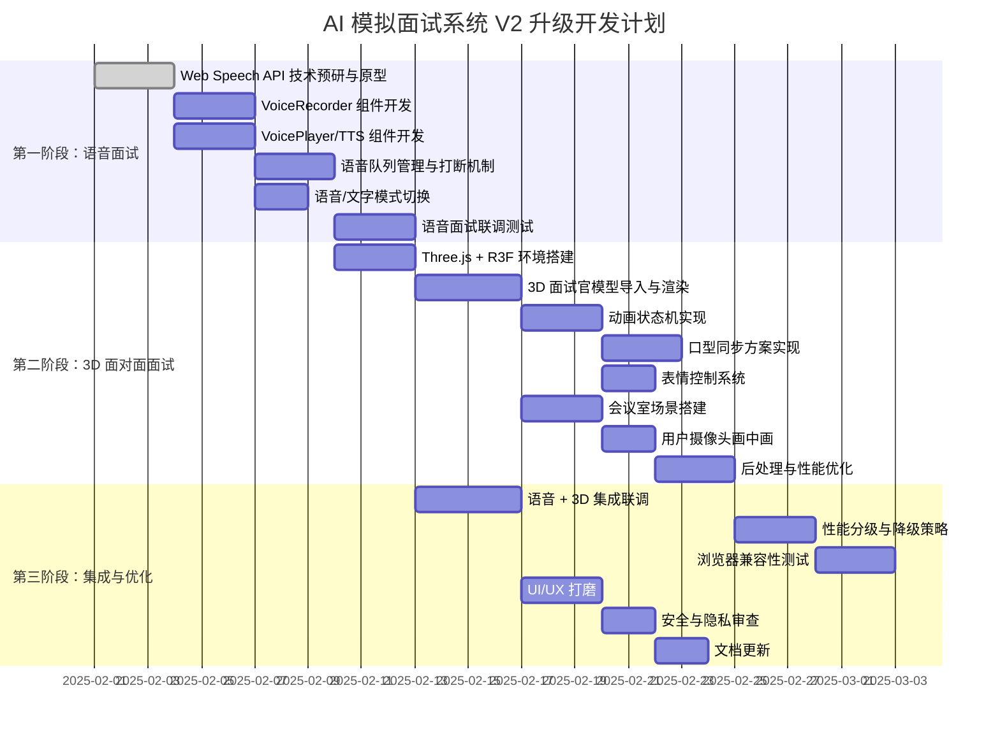

### 8.2 里程碑定义

| 里程碑 | 日期 | 交付物 | 验收标准 |
|--------|------|--------|---------|
| **M1: 语音面试 MVP** | 第 2 周末 | 可语音对话的面试功能 | Chrome/Edge 上完整的 STT→LLM→TTS 流程；语音/文字模式切换；打断机制 |
| **M2: 3D 面试 MVP** | 第 4 周末 | 3D 面试官可对话 | 3D 场景渲染；面试官 idle/倾听/思考/说话 动画；口型同步；用户摄像头 |
| **M3: 集成优化版** | 第 6 周末 | 完整 V2 版本 | 语音+3D 集成；性能分级；浏览器兼容；降级策略完善；文档齐全 |

### 8.3 模块依赖关系

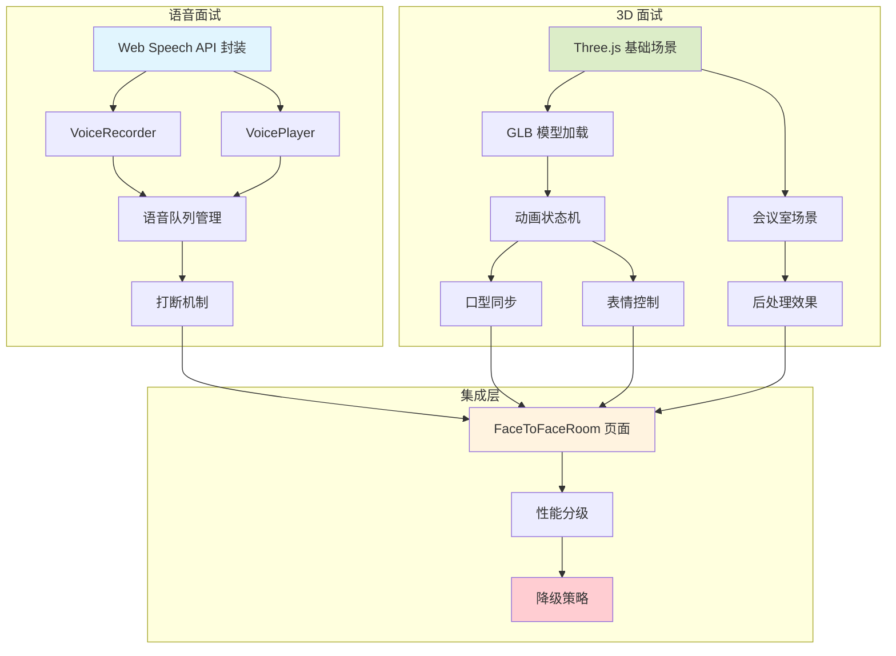

---

## 附录

### 附录 A：新增项目目录结构

```
ai-interview-system/
├── frontend/src/
│   ├── components/
│   │   ├── ui/                          # shadcn/ui 基础组件（现有）
│   │   ├── voice/                       # 语音相关组件（新增）
│   │   │   ├── VoiceRecorder.tsx        # 语音录制按钮
│   │   │   ├── VoicePlayer.tsx          # TTS 播放控制
│   │   │   ├── VoiceToggle.tsx          # 语音/文字模式切换
│   │   │   ├── VoiceSettings.tsx        # 语音设置面板
│   │   │   └── VoiceWaveVisualizer.tsx  # 录音波形可视化
│   │   ├── three/                       # 3D 相关组件（新增）
│   │   │   ├── InterviewScene.tsx       # 3D 面试场景
│   │   │   ├── InterviewerAvatar.tsx    # 面试官模型
│   │   │   ├── MeetingRoom.tsx          # 会议室场景
│   │   │   ├── UserVideoPanel.tsx       # 用户视频画中画
│   │   │   └── LoadingOverlay.tsx       # 3D 加载覆盖层
│   │   └── layout/                      # 布局组件（现有）
│   ├── hooks/                           # 自定义 Hooks
│   │   ├── useVoiceInput.ts             # STT 语音识别
│   │   ├── useVoiceOutput.ts            # TTS 语音合成
│   │   ├── useSpeechQueue.ts            # 语音队列管理
│   │   ├── useLipSync.ts                # 口型同步
│   │   ├── useInterviewerState.ts       # 面试官状态机
│   │   ├── useUserMedia.ts              # 摄像头/麦克风
│   │   └── usePerformanceProfiler.ts    # 性能分级
│   ├── stores/                          # 状态管理
│   │   ├── voiceStore.ts                # 语音状态（新增）
│   │   ├── faceToFaceStore.ts           # 面对面状态（新增）
│   │   ├── interviewStore.ts            # 面试状态（现有）
│   │   ├── authStore.ts                 # 认证状态（现有）
│   │   └── resumeStore.ts               # 简历状态（现有）
│   ├── pages/                           # 页面组件
│   │   ├── FaceToFaceRoom.tsx           # 面对面面试房间（新增）
│   │   ├── InterviewRoom.tsx            # 文字面试房间（现有）
│   │   ├── InterviewSetup.tsx           # 面试设置（扩展）
│   │   └── ...                          # 其他现有页面
│   ├── types/                           # 类型定义
│   │   ├── voice.ts                     # 语音相关类型（新增）
│   │   ├── three.ts                     # 3D 相关类型（新增）
│   │   └── index.ts                     # 现有类型
│   └── utils/                           # 工具函数
│       ├── voiceCompatibility.ts        # 语音兼容性检测
│       ├── performanceProfiler.ts       # 性能分级
│       └── ...                          # 现有工具
├── backend/app/
│   ├── routers/
│   │   ├── voice.py                     # 语音接口预留（新增）
│   │   ├── interviews.py                # 面试路由（扩展）
│   │   └── ...                          # 其他现有路由
│   └── models.py                        # 数据模型（扩展）
├── 3d-assets/                           # 3D 资源文件（新增）
│   ├── models/
│   │   ├── interviewer-high.glb         # 高精度面试官模型
│   │   ├── interviewer-medium.glb       # 中精度面试官模型
│   │   ├── interviewer-low.glb          # 低精度面试官模型
│   │   └── meeting-room.glb             # 会议室场景模型
│   ├── textures/
│   │   └── ...                          # 纹理贴图
│   └── environments/
│       └── modern-office.hdr            # HDR 环境贴图
└── ...
```

### 附录 B：前端新增依赖

| 依赖包 | 版本 | 说明 |
|--------|------|------|
| `@react-three/fiber` | ^8.x | React Three.js 渲染器 |
| `@react-three/drei` | ^9.x | R3F 常用工具集（GLTF 加载、环境、阴影等） |
| `@react-three/postprocessing` | ^2.x | 后处理效果（SSAO、Bloom） |
| `three` | ^0.160.x | Three.js 核心库 |
| `@types/three` | ^0.160.x | Three.js 类型定义 |
| `zustand` | ^5.x | 状态管理（已存在） |

### 附录 C：性能目标

| 指标 | 目标值 | 测量方式 |
|------|--------|---------|
| 3D 场景首屏加载时间 | < 3s（中画质） | Lighthouse Performance |
| 3D 场景运行时帧率 | > 30fps（中低端设备） | Chrome DevTools FPS |
| 语音识别延迟 | < 500ms（final result） | 自定义打点 |
| TTS 首字播报延迟 | < 1s | 自定义打点 |
| 内存占用 | < 200MB（3D 场景） | Chrome DevTools Memory |
| 总包体积增量 | < 500KB（gzip，不含 3D 模型） | Bundle Analyzer |

### 附录 D：3D 模型资源清单

| 资源 | 格式 | 预估大小 | 来源 |
|------|------|---------|------|
| 面试官模型（高精度） | GLB (Draco) | ~2MB | Ready Player Me 导出 |
| 面试官模型（中精度） | GLB (Draco) | ~800KB | 简化版 |
| 面试官模型（低精度） | GLB (Draco) | ~300KB | 极简版 |
| 会议室场景 | GLB (Draco) | ~1.5MB | 自建或购买 |
| HDR 环境贴图 | HDR (RGBE) | ~5MB | Poly Haven 免费资源 |
| 纹理贴图 | KTX2 | ~2MB | Basis Universal 压缩 |

---

> **文档结束**
>
> 本文档为 AI 模拟面试系统 V2 语音视频升级的完整技术架构设计，涵盖语音面试（Web Speech API STT/TTS）、面对面模拟面试（Three.js 3D + 口型同步 + 表情动画）、前端架构更新、后端 API 扩展、数据模型更新和技术风险应对。开发团队应以此文档为基础进行详细设计和编码实现。文档会随着开发进展持续更新迭代。
