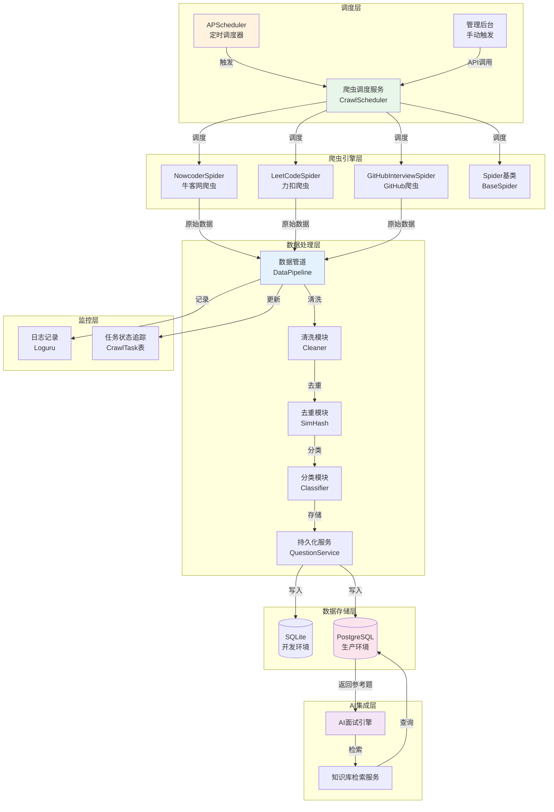
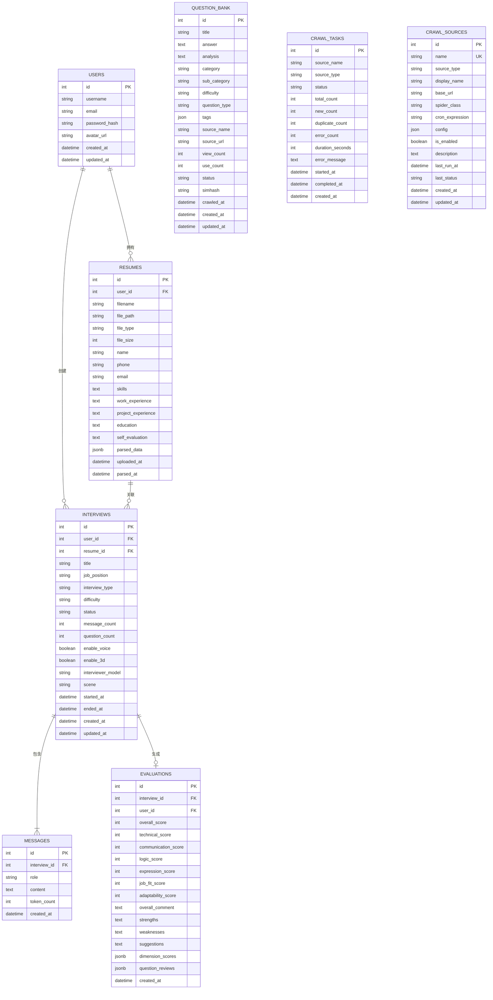
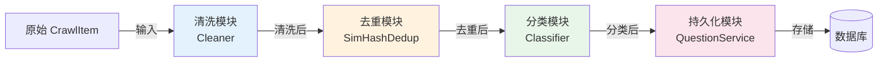

# AI 模拟面试系统 — 定时爬虫 + 面试知识库技术架构升级方案

> **文档版本**: v3.0
> **编写日期**: 2025年7月
> **文档状态**: 架构设计阶段
> **目标读者**: 开发团队、技术负责人、产品经理
> **升级范围**: 新增定时爬虫服务 + 面试知识库模块 + AI 集成增强

---

## 目录

1. [爬虫系统架构设计](#1-爬虫系统架构设计)
2. [数据库设计](#2-数据库设计)
3. [爬虫 Spider 设计](#3-爬虫spider设计)
4. [数据管道 Pipeline](#4-数据管道-pipeline)
5. [AI 集成方案](#5-ai-集成方案)
6. [API 接口设计](#6-api-接口设计)
7. [定时任务方案](#7-定时任务方案)
8. [前端更新](#8-前端更新)
9. [项目结构更新](#9-项目结构更新)
10. [合规与风险](#10-合规与风险)

---

## 1. 爬虫系统架构设计

### 1.1 架构概述

爬虫子系统作为 AI 模拟面试系统的数据支撑层，负责从互联网自动采集最新面试题目，经过去重、清洗、分类后存入面试知识库，供 AI 面试官生成问题时参考引用。整个爬虫模块采用**插件化架构**，每个数据源对应独立的 Spider 实现，通过统一的调度器协调执行，确保系统具备良好的可扩展性和可维护性。

### 1.2 架构图



### 1.3 技术选型

| 组件 | 选型 | 理由 |
|------|------|------|
| **爬虫框架** | Scrapy | Python 生态最成熟的爬虫框架，内置异步处理、中间件、管道机制，支持扩展和自定义，社区文档丰富 |
| **定时调度** | APScheduler | Python 标准定时任务库，支持 Cron 表达式、间隔触发、日期触发三种模式，与 FastAPI 生命周期事件集成方便 |
| **HTML 解析** | BeautifulSoup4 + lxml | bs4 提供灵活的 DOM 遍历 API，lxml 作为底层解析器速度是 html.parser 的 3-5 倍，两者结合兼顾开发效率和解析性能 |
| **去重算法** | SimHash + MinHash | SimHash 用于快速近似去重（海明距离 < 3 判定重复），MinHash 作为辅助进行 Jaccard 相似度计算，两者结合兼顾速度和精度 |
| **自动分类** | LLM (GPT-3.5/DeepSeek-V3) + 关键词匹配 | 先用关键词规则进行快速初步分类，对不确定的样本再用 LLM 辅助分类，平衡成本和准确率 |
| **数据存储** | SQLite (开发) / PostgreSQL (生产) | 与现有系统保持一致，无需引入新的数据库依赖，PostgreSQL 的 JSONB 字段适合存储标签等半结构化数据 |
| **HTTP 客户端** | httpx + aiohttp | httpx 用于同步场景（Scrapy 默认），aiohttp 用于需要高并发异步抓取的 API 类型爬虫 |
| **任务队列** | APScheduler 内存队列 | 初期使用内存队列足够，后续如需分布式可迁移到 Celery + Redis |

**备选方案对比**：

| 方案 | 优点 | 缺点 | 适用场景 |
|------|------|------|----------|
| **Scrapy** | 异步高效、管道成熟、中间件丰富、内置去重和重试 | 学习曲线较陡、重量级 | 大规模定向爬虫、需要复杂处理流程 |
| **requests + bs4** | 简单轻量、易上手、调试方便 | 同步阻塞、无内置管道、需自行处理并发 | 小型脚本、快速原型 |
| **Playwright** | 支持 JavaScript 渲染、可模拟真实用户行为 | 资源消耗大、启动慢、依赖浏览器 | 重度动态页面、需要登录态的 SPA |

**最终选型理由**：
- 主体采用 **Scrapy** 框架处理大规模列表页+详情页爬取场景（牛客网、GitHub）
- **Playwright** 作为可选组件处理需要渲染的动态页面（预留扩展接口）
- 力扣等提供 API 的数据源直接使用 **httpx** 调用接口，不经过 Scrapy
- 初期不引入 Celery，使用 APScheduler 的内存调度降低系统复杂度

### 1.4 爬虫调度设计

调度器采用 APScheduler 的 `BackgroundScheduler`，在 FastAPI 应用启动时初始化，在应用关闭时优雅停止。每个爬虫来源在数据库的 `crawl_sources` 表中维护配置，支持通过管理后台动态修改调度参数。

```python
# backend/app/crawlers/scheduler.py
from apscheduler.schedulers.background import BackgroundScheduler
from apscheduler.triggers.cron import CronTrigger
from datetime import datetime
from typing import Dict, Any, Optional
import asyncio
import importlib
import logging

from app.database import SessionLocal
from app.models import CrawlSource, CrawlTask

logger = logging.getLogger(__name__)

# 调度配置示意
SCHEDULE_CONFIG: Dict[str, Dict[str, Any]] = {
    "nowcoder": {
        "spider": "NowcoderSpider",
        "cron": "0 2 * * *",      # 每天凌晨 2:00
        "enabled": True,
        "max_pages": 10,
        "request_delay": (1, 3),   # 随机延迟 1-3 秒
    },
    "leetcode": {
        "spider": "LeetCodeSpider",
        "cron": "30 2 * * *",     # 每天凌晨 2:30
        "enabled": True,
        "categories": ["algorithms", "database", "concurrency"],
    },
    "github_interview": {
        "spider": "GitHubInterviewSpider",
        "cron": "0 3 * * *",      # 每天凌晨 3:00
        "enabled": True,
        "max_repos": 20,
        "min_stars": 500,
        "topics": ["interview-questions", "interview-practice"],
    },
}


class CrawlScheduler:
    """
    爬虫调度器 - 统一管理所有爬虫的定时任务
    
    功能:
    1. 基于 APScheduler 的 Cron 触发
    2. 支持从数据库加载动态配置
    3. 支持管理后台手动触发
    4. 任务状态追踪和持久化
    """
    
    def __init__(self):
        self.scheduler = BackgroundScheduler(
            job_defaults={
                "coalesce": True,           # 错过执行时合并
                "max_instances": 1,         # 同一任务同时只能有一个实例
                "misfire_grace_time": 3600, # 1小时内的错过允许补偿执行
            }
        )
        self._initialized = False
    
    def init_scheduler(self):
        """初始化调度器 - 应用启动时调用"""
        if self._initialized:
            return
        
        db = SessionLocal()
        try:
            sources = db.query(CrawlSource).filter(
                CrawlSource.is_enabled == True
            ).all()
            
            for source in sources:
                self._add_job(source)
            
            self.scheduler.start()
            self._initialized = True
            logger.info(f"爬虫调度器已启动，已注册 {len(sources)} 个定时任务")
            
        finally:
            db.close()
    
    def _add_job(self, source: CrawlSource):
        """为单个来源添加定时任务"""
        job_id = f"crawl_{source.name}"
        
        # 如果已存在则先移除
        if self.scheduler.get_job(job_id):
            self.scheduler.remove_job(job_id)
        
        self.scheduler.add_job(
            func=self._run_spider_job,
            trigger=CronTrigger.from_crontab(source.cron_expression),
            id=job_id,
            name=f"爬虫-{source.name}",
            args=[source.name],
            replace_existing=True,
        )
        logger.info(f"已注册定时任务: {source.name} (cron: {source.cron_expression})")
    
    def _run_spider_job(self, source_name: str):
        """执行爬虫任务的包装函数（在独立线程中运行）"""
        logger.info(f"开始执行爬虫任务: {source_name}")
        try:
            # 在新的 event loop 中运行异步爬虫
            asyncio.new_event_loop().run_until_complete(
                self._execute_spider(source_name)
            )
        except Exception as e:
            logger.error(f"爬虫任务执行失败 [{source_name}]: {str(e)}")
    
    async def _execute_spider(self, source_name: str):
        """实际执行爬虫逻辑"""
        # 动态导入 Spider 类
        spider_module = importlib.import_module(f"app.crawlers.spiders.{source_name}")
        spider_class = getattr(spider_module, SCHEDULE_CONFIG[source_name]["spider"])
        
        spider = spider_class()
        await spider.run()
    
    def trigger_manual(self, source_name: str) -> int:
        """
        手动触发指定来源的爬虫
        
        Returns:
            任务 ID
        """
        db = SessionLocal()
        try:
            # 创建任务记录
            task = CrawlTask(
                source_name=source_name,
                status="running",
                started_at=datetime.utcnow(),
            )
            db.add(task)
            db.commit()
            db.refresh(task)
            
            # 立即执行（不阻塞）
            self.scheduler.add_job(
                func=self._run_spider_job,
                trigger="date",  # 立即执行
                args=[source_name],
                id=f"manual_{source_name}_{task.id}",
                replace_existing=False,
            )
            return task.id
            
        finally:
            db.close()
    
    def shutdown(self):
        """优雅关闭调度器 - 应用停止时调用"""
        if self._initialized:
            self.scheduler.shutdown(wait=True)
            self._initialized = False
            logger.info("爬虫调度器已关闭")


# 全局调度器实例
crawl_scheduler = CrawlScheduler()
```

### 1.5 反爬策略

| 策略 | 实现方式 | 配置参数 |
|------|----------|----------|
| **请求间隔** | 随机延迟 1-5 秒，避免固定频率 | `request_delay: (1, 5)` |
| **User-Agent 轮换** | 预设 20 个主流浏览器 UA 随机选择 | `rotate_ua: true` |
| **代理 IP 池** | 可选配置，支持 HTTP/HTTPS/SOCKS5 代理 | `proxy_pool: [...]` |
| **请求重试** | 失败重试 3 次，指数退避（1s → 2s → 4s） | `retry_times: 3` |
| **限速控制** | 每个域名每秒最多 1 个请求（AutoThrottle） | `download_delay: 1` |
| **合规检测** | 爬取前检查目标网站 robots.txt，遵守 Disallow 规则 | `respect_robots: true` |
| **Cookie 管理** | 需要登录态的爬虫使用独立 CookieJar，定期刷新 | `cookie_refresh_interval: 3600` |
| **请求指纹去重** | Scrapy 内置 RFPDupeFilter，基于请求 URL+参数去重 | 内置默认开启 |

```python
# 反爬配置示例
DOWNLOAD_DELAY = 1          # 基础延迟 1 秒
RANDOMIZE_DOWNLOAD_DELAY = 2  # 叠加 0-2 秒随机延迟
CONCURRENT_REQUESTS_PER_DOMAIN = 1  # 单域名并发数
RETRY_TIMES = 3
RETRY_BACKOFF = True        # 指数退避

# User-Agent 池
USER_AGENT_LIST = [
    "Mozilla/5.0 (Windows NT 10.0; Win64; x64) AppleWebKit/537.36 Chrome/120.0.0.0 Safari/537.36",
    "Mozilla/5.0 (Macintosh; Intel Mac OS X 10_15_7) AppleWebKit/537.36 Chrome/119.0.0.0 Safari/537.36",
    "Mozilla/5.0 (X11; Linux x86_64) AppleWebKit/537.36 Chrome/118.0.0.0 Safari/537.36",
    # ... 更多 UA
]

# 启用中间件
SPIDER_MIDDLEWARES = {
    'app.crawlers.middlewares.RotateUserAgentMiddleware': 400,
    'app.crawlers.middlewares.ProxyPoolMiddleware': 420,
    'app.crawlers.middlewares.RetryExponentialBackoff': 500,
}
```

---

## 2. 数据库设计

### 2.1 新增表结构

#### 2.1.1 question_bank — 题库表

```sql
CREATE TABLE question_bank (
    id SERIAL PRIMARY KEY,
    title VARCHAR(500) NOT NULL,           -- 题目内容/标题
    answer TEXT,                           -- 参考答案
    analysis TEXT,                         -- 解析/思路说明
    category VARCHAR(50) NOT NULL,         -- 岗位分类: frontend/backend/algorithm/product/...
    sub_category VARCHAR(50),              -- 子分类: react/java/system_design/...
    difficulty VARCHAR(20) NOT NULL DEFAULT 'intermediate',  -- 难度: beginner/intermediate/advanced
    question_type VARCHAR(30) NOT NULL DEFAULT 'technical',  -- 题型: technical/behavioral/situational/algorithm
    tags JSON DEFAULT '[]',                -- 标签数组: ["redis", "高并发", "分布式"]
    source_name VARCHAR(50) NOT NULL,      -- 来源名称: nowcoder/leetcode/github
    source_url VARCHAR(500),               -- 来源原始 URL
    view_count INTEGER NOT NULL DEFAULT 0, -- 被查看次数
    use_count INTEGER NOT NULL DEFAULT 0,  -- 被 AI 引用次数
    status VARCHAR(20) NOT NULL DEFAULT 'pending',  -- 状态: pending/approved/rejected
    simhash VARCHAR(64),                   -- SimHash 指纹，用于快速去重
    crawled_at TIMESTAMPTZ DEFAULT NOW(),  -- 采集时间
    created_at TIMESTAMPTZ DEFAULT NOW(),
    updated_at TIMESTAMPTZ DEFAULT NOW()
);

-- 索引设计
CREATE INDEX idx_qb_category ON question_bank(category);
CREATE INDEX idx_qb_sub_category ON question_bank(sub_category);
CREATE INDEX idx_qb_difficulty ON question_bank(difficulty);
CREATE INDEX idx_qb_question_type ON question_bank(question_type);
CREATE INDEX idx_qb_status ON question_bank(status);
CREATE INDEX idx_qb_source_name ON question_bank(source_name);
CREATE INDEX idx_qb_use_count ON question_bank(use_count DESC);
CREATE INDEX idx_qb_crawled_at ON question_bank(crawled_at DESC);
-- GIN 索引用于 JSON 标签搜索（PostgreSQL）
CREATE INDEX idx_qb_tags ON question_bank USING GIN(tags) WHERE tags IS NOT NULL;
```

**字段说明**：

| 字段 | 类型 | 说明 |
|------|------|------|
| `id` | SERIAL PK | 自增主键 |
| `title` | VARCHAR(500) | 题目内容或标题，核心字段，建立全文搜索索引 |
| `answer` | TEXT | 参考答案，可为空（部分来源不提供答案） |
| `analysis` | TEXT | 题目解析、解题思路、考点说明 |
| `category` | VARCHAR(50) | 岗位分类，决定题目属于哪个面试方向 |
| `sub_category` | VARCHAR(50) | 子分类，更细粒度的技术栈分类 |
| `difficulty` | VARCHAR(20) | 难度等级，AI 生成问题时根据候选人水平选择对应难度 |
| `question_type` | VARCHAR(30) | 题型分类，behavioral（行为面试）/ technical（技术）/ situational（场景）/ algorithm（算法） |
| `tags` | JSON | 技术标签数组，如 `["redis", "缓存", "高并发"]`，支持多维度检索 |
| `source_name` | VARCHAR(50) | 数据来源标识，用于追溯和统计 |
| `source_url` | VARCHAR(500) | 原始来源链接，满足合规引用要求 |
| `view_count` | INTEGER | 用户查看次数，用于热门排序 |
| `use_count` | INTEGER | AI 引用次数，用于评估题目质量和热度 |
| `status` | VARCHAR(20) | 审核状态：pending（待审）、approved（通过）、rejected（拒绝） |
| `simhash` | VARCHAR(64) | SimHash 指纹值，用于去重时快速比较 |

#### 2.1.2 crawl_tasks — 采集任务表

```sql
CREATE TABLE crawl_tasks (
    id SERIAL PRIMARY KEY,
    source_name VARCHAR(50) NOT NULL,       -- 来源名称
    source_type VARCHAR(30) NOT NULL,       -- 类型: web/api/rss/github
    status VARCHAR(20) NOT NULL DEFAULT 'pending',  -- 状态: pending/running/success/failed
    total_count INTEGER NOT NULL DEFAULT 0, -- 爬取总数
    new_count INTEGER NOT NULL DEFAULT 0,   -- 新增数（去重后）
    duplicate_count INTEGER NOT NULL DEFAULT 0,  -- 重复数
    error_count INTEGER NOT NULL DEFAULT 0, -- 错误数
    duration_seconds INTEGER,               -- 耗时（秒）
    error_message TEXT,                     -- 错误信息
    started_at TIMESTAMPTZ,                 -- 开始时间
    completed_at TIMESTAMPTZ,               -- 完成时间
    created_at TIMESTAMPTZ DEFAULT NOW()
);

CREATE INDEX idx_ct_source_name ON crawl_tasks(source_name);
CREATE INDEX idx_ct_status ON crawl_tasks(status);
CREATE INDEX idx_ct_created_at ON crawl_tasks(created_at DESC);
```

#### 2.1.3 crawl_sources — 采集来源配置表

```sql
CREATE TABLE crawl_sources (
    id SERIAL PRIMARY KEY,
    name VARCHAR(50) NOT NULL UNIQUE,      -- 来源名称: nowcoder/leetcode/github
    source_type VARCHAR(30) NOT NULL,      -- 类型: web/api/rss/github
    display_name VARCHAR(100) NOT NULL,    -- 展示名称: "牛客网"
    base_url VARCHAR(500) NOT NULL,        -- 基础 URL
    spider_class VARCHAR(100) NOT NULL,    -- Spider 类全名
    cron_expression VARCHAR(50) NOT NULL DEFAULT '0 2 * * *',  -- Cron 表达式
    config JSON DEFAULT '{}',              -- 额外配置: max_pages, headers, selectors 等
    is_enabled BOOLEAN NOT NULL DEFAULT TRUE,  -- 是否启用
    description TEXT,                      -- 描述说明
    last_run_at TIMESTAMPTZ,               -- 上次执行时间
    last_status VARCHAR(20),               -- 上次状态
    created_at TIMESTAMPTZ DEFAULT NOW(),
    updated_at TIMESTAMPTZ DEFAULT NOW()
);

-- 初始化数据
INSERT INTO crawl_sources (name, source_type, display_name, base_url, spider_class, cron_expression, config, description) VALUES
('nowcoder', 'web', '牛客网面经', 'https://www.nowcoder.com', 'app.crawlers.spiders.nowcoder.NowcoderSpider', '0 2 * * *', '{"max_pages": 10, "request_delay": [1, 3]}', '牛客网面试经验板块'),
('leetcode', 'api', '力扣题库', 'https://leetcode.cn', 'app.crawlers.spiders.leetcode.LeetCodeSpider', '30 2 * * *', '{"categories": ["algorithms", "database"]}', '力扣中国站公开题库'),
('github_interview', 'github', 'GitHub面试题仓库', 'https://github.com', 'app.crawlers.spiders.github.GitHubInterviewSpider', '0 3 * * *', '{"max_repos": 20, "min_stars": 500}', 'GitHub 高星面试题仓库');
```

### 2.2 更新后的 ER 图



### 2.3 SQLAlchemy 模型定义

```python
# backend/app/models.py (追加)

class QuestionBank(Base):
    """题库表 - 存储爬取的面试题目"""
    __tablename__ = "question_bank"
    
    id = Column(Integer, primary_key=True, index=True)
    title = Column(String(500), nullable=False)
    answer = Column(Text, nullable=True)
    analysis = Column(Text, nullable=True)
    category = Column(String(50), nullable=False, index=True)
    sub_category = Column(String(50), nullable=True, index=True)
    difficulty = Column(String(20), nullable=False, default="intermediate")
    question_type = Column(String(30), nullable=False, default="technical")
    tags = Column(JSON, default=list)
    source_name = Column(String(50), nullable=False, index=True)
    source_url = Column(String(500), nullable=True)
    view_count = Column(Integer, default=0)
    use_count = Column(Integer, default=0)
    status = Column(String(20), nullable=False, default="pending")
    simhash = Column(String(64), nullable=True, index=True)
    crawled_at = Column(DateTime, default=datetime.now)
    created_at = Column(DateTime, default=datetime.now)
    updated_at = Column(DateTime, default=datetime.now, onupdate=datetime.now)
    
    __table_args__ = (
        Index("idx_qb_category_difficulty", "category", "difficulty"),
        Index("idx_qb_status_crawled", "status", "crawled_at"),
    )


class CrawlTask(Base):
    """采集任务表 - 追踪每次采集任务的执行情况"""
    __tablename__ = "crawl_tasks"
    
    id = Column(Integer, primary_key=True, index=True)
    source_name = Column(String(50), nullable=False)
    source_type = Column(String(30), nullable=False)
    status = Column(String(20), nullable=False, default="pending")
    total_count = Column(Integer, default=0)
    new_count = Column(Integer, default=0)
    duplicate_count = Column(Integer, default=0)
    error_count = Column(Integer, default=0)
    duration_seconds = Column(Integer, nullable=True)
    error_message = Column(Text, nullable=True)
    started_at = Column(DateTime, nullable=True)
    completed_at = Column(DateTime, nullable=True)
    created_at = Column(DateTime, default=datetime.now)


class CrawlSource(Base):
    """采集来源配置表 - 管理爬虫来源配置"""
    __tablename__ = "crawl_sources"
    
    id = Column(Integer, primary_key=True, index=True)
    name = Column(String(50), nullable=False, unique=True)
    source_type = Column(String(30), nullable=False)
    display_name = Column(String(100), nullable=False)
    base_url = Column(String(500), nullable=False)
    spider_class = Column(String(100), nullable=False)
    cron_expression = Column(String(50), nullable=False, default="0 2 * * *")
    config = Column(JSON, default=dict)
    is_enabled = Column(Boolean, default=True)
    description = Column(Text, nullable=True)
    last_run_at = Column(DateTime, nullable=True)
    last_status = Column(String(20), nullable=True)
    created_at = Column(DateTime, default=datetime.now)
    updated_at = Column(DateTime, default=datetime.now, onupdate=datetime.now)
```

---

## 3. 爬虫 Spider 设计

### 3.1 爬虫基类 BaseSpider

```python
# backend/app/crawlers/spiders/base.py
import asyncio
import random
import time
from abc import ABC, abstractmethod
from typing import List, Dict, Any, Optional, AsyncGenerator
from dataclasses import dataclass, field
from datetime import datetime
import logging

import httpx
from bs4 import BeautifulSoup

from app.database import SessionLocal
from app.models import CrawlTask, QuestionBank, CrawlSource
from app.crawlers.pipelines import DataPipeline

logger = logging.getLogger(__name__)


@dataclass
class CrawlItem:
    """爬取数据项 - 统一的爬虫输出格式"""
    title: str
    answer: str = ""
    analysis: str = ""
    category: str = ""
    sub_category: str = ""
    difficulty: str = "intermediate"
    question_type: str = "technical"
    tags: List[str] = field(default_factory=list)
    source_url: str = ""
    extra: Dict[str, Any] = field(default_factory=dict)


@dataclass
class CrawlResult:
    """爬虫执行结果"""
    total_count: int = 0
    new_count: int = 0
    duplicate_count: int = 0
    error_count: int = 0
    items: List[Dict[str, Any]] = field(default_factory=list)
    error_message: str = ""


class BaseSpider(ABC):
    """
    爬虫基类 - 所有具体爬虫的抽象基类
    
    子类需实现:
    - parse(): 解析逻辑，生成 CrawlItem 序列
    - run(): 爬虫主流程（可选覆盖，默认流程已提供）
    """
    
    name: str = ""                    # 爬虫名称标识
    source_type: str = "web"          # web/api/rss/github
    base_url: str = ""                # 目标网站基础 URL
    request_delay: tuple = (1, 3)     # 请求间隔范围 (秒)
    max_retries: int = 3              # 最大重试次数
    max_pages: int = 10               # 最大爬取页数
    
    # HTTP 客户端配置
    headers: Dict[str, str] = field(default_factory=lambda: {
        "User-Agent": "Mozilla/5.0 (Windows NT 10.0; Win64; x64) AppleWebKit/537.36",
        "Accept": "text/html,application/xhtml+xml,application/xml;q=0.9,*/*;q=0.8",
        "Accept-Language": "zh-CN,zh;q=0.9,en;q=0.8",
    })
    
    def __init__(self):
        self.client: Optional[httpx.AsyncClient] = None
        self.pipeline = DataPipeline()
        self.task_id: Optional[int] = None
        self.result = CrawlResult()
    
    async def __aenter__(self):
        """异步上下文管理器入口"""
        limits = httpx.Limits(max_connections=10, max_keepalive_connections=5)
        timeout = httpx.Timeout(30.0, connect=10.0)
        self.client = httpx.AsyncClient(
            headers=self.headers,
            limits=limits,
            timeout=timeout,
            follow_redirects=True,
        )
        return self
    
    async def __aexit__(self, exc_type, exc_val, exc_tb):
        """异步上下文管理器出口"""
        if self.client:
            await self.client.aclose()
    
    async def fetch(self, url: str, retries: int = 0, **kwargs) -> Optional[str]:
        """
        发送 HTTP GET 请求并返回文本内容
        
        Args:
            url: 请求 URL
            retries: 当前重试次数
            **kwargs: 额外请求参数
            
        Returns:
            响应文本，失败返回 None
        """
        try:
            # 随机延迟
            delay = random.uniform(*self.request_delay)
            await asyncio.sleep(delay)
            
            response = await self.client.get(url, **kwargs)
            response.raise_for_status()
            return response.text
            
        except httpx.HTTPStatusError as e:
            if retries < self.max_retries and e.response.status_code >= 500:
                wait_time = 2 ** retries  # 指数退避
                logger.warning(f"请求失败 [{url}]，{wait_time}s 后重试 ({retries+1}/{self.max_retries})")
                await asyncio.sleep(wait_time)
                return await self.fetch(url, retries + 1, **kwargs)
            logger.error(f"HTTP 错误 [{url}]: {e.response.status_code}")
            self.result.error_count += 1
            return None
            
        except Exception as e:
            logger.error(f"请求异常 [{url}]: {str(e)}")
            self.result.error_count += 1
            return None
    
    async def fetch_json(self, url: str, **kwargs) -> Optional[Dict]:
        """发送请求并返回 JSON 数据"""
        text = await self.fetch(url, **kwargs)
        if not text:
            return None
        try:
            import json
            return json.loads(text)
        except json.JSONDecodeError:
            logger.error(f"JSON 解析失败: {url}")
            return None
    
    def parse_html(self, html: str) -> BeautifulSoup:
        """解析 HTML 为 BeautifulSoup 对象"""
        return BeautifulSoup(html, "lxml")
    
    @abstractmethod
    async def parse(self) -> AsyncGenerator[CrawlItem, None]:
        """
        解析逻辑 - 子类必须实现
        
        Yields:
            CrawlItem 数据项
        """
        raise NotImplementedError
    
    async def run(self) -> CrawlResult:
        """
        爬虫主流程 - 默认实现，子类可覆盖
        
        Returns:
            CrawlResult 执行结果
        """
        start_time = time.time()
        
        # 创建任务记录
        db = SessionLocal()
        try:
            task = CrawlTask(
                source_name=self.name,
                source_type=self.source_type,
                status="running",
                started_at=datetime.now(),
            )
            db.add(task)
            db.commit()
            db.refresh(task)
            self.task_id = task.id
        finally:
            db.close()
        
        try:
            async with self:
                # 执行解析
                async for item in self.parse():
                    self.result.total_count += 1
                    
                    # 数据管道处理（清洗/去重/分类/存储）
                    success = await self.pipeline.process(item, self.name)
                    if success:
                        self.result.new_count += 1
                    else:
                        self.result.duplicate_count += 1
            
            self.result.error_message = ""
            
        except Exception as e:
            logger.exception(f"爬虫 [{self.name}] 执行异常")
            self.result.error_message = str(e)
            
        finally:
            # 更新任务记录
            duration = int(time.time() - start_time)
            db = SessionLocal()
            try:
                task = db.query(CrawlTask).filter(CrawlTask.id == self.task_id).first()
                if task:
                    task.status = "success" if not self.result.error_message else "failed"
                    task.total_count = self.result.total_count
                    task.new_count = self.result.new_count
                    task.duplicate_count = self.result.duplicate_count
                    task.error_count = self.result.error_count
                    task.duration_seconds = duration
                    task.error_message = self.result.error_message
                    task.completed_at = datetime.now()
                    db.commit()
                    
                # 更新来源配置表
                source = db.query(CrawlSource).filter(CrawlSource.name == self.name).first()
                if source:
                    source.last_run_at = datetime.now()
                    source.last_status = task.status if task else "unknown"
                    db.commit()
            finally:
                db.close()
        
        logger.info(
            f"爬虫 [{self.name}] 执行完成: "
            f"总计={self.result.total_count}, "
            f"新增={self.result.new_count}, "
            f"重复={self.result.duplicate_count}, "
            f"错误={self.result.error_count}, "
            f"耗时={duration}s"
        )
        
        return self.result
```

### 3.2 NowcoderSpider（牛客网面经爬虫）

```python
# backend/app/crawlers/spiders/nowcoder.py
import asyncio
import re
from typing import AsyncGenerator
from urllib.parse import urljoin, quote
import logging

from app.crawlers.spiders.base import BaseSpider, CrawlItem

logger = logging.getLogger(__name__)


class NowcoderSpider(BaseSpider):
    """
    牛客网面经爬虫
    
    爬取目标: 牛客网面经分享板块
    数据源类型: Web 页面
    策略:
    1. 从面经列表页提取面经链接
    2. 逐个访问面经详情页
    3. 从正文中提取面试题目（基于规则匹配和段落分析）
    """
    
    name = "nowcoder"
    source_type = "web"
    base_url = "https://www.nowcoder.com"
    request_delay = (2, 5)   # 牛客网反爬较严，增加延迟
    max_pages = 10
    
    # 面经列表页 URL 模板
    LIST_URL_TEMPLATE = "https://www.nowcoder.com/discuss?type=2&order=time&page={page}"
    
    # 题目识别正则
    QUESTION_PATTERNS = [
        re.compile(r'[\d]+[\.、]\s*(.{10,200})'),           # 1. xxx 或 1、xxx
        re.compile(r'[Qq][\d]*[\.:\s]*(.{10,200})'),        # Q1: xxx
        re.compile(r'[问題](.{10,200})'),                    # 问题：xxx
        re.compile(r'面试官[问：:](.{10,200})'),             # 面试官问：xxx
    ]
    
    # 岗位关键词映射
    JOB_KEYWORDS = {
        "前端": ("frontend", ["react", "vue", "javascript", "css", "html"]),
        "后端": ("backend", ["java", "python", "go", "spring", "mysql"]),
        "算法": ("algorithm", ["leetcode", "动态规划", "排序", "二叉树"]),
        "客户端": ("mobile", ["ios", "android", "flutter", "react native"]),
        "测试": ("qa", ["自动化测试", "selenium", "pytest", "测试用例"]),
        "产品": ("product", ["需求分析", "prd", "用户调研", "原型设计"]),
        "运维": ("devops", ["docker", "kubernetes", "ci/cd", "linux"]),
        "数据": ("data", ["sql", "数据分析", "hive", "spark"]),
    }
    
    async def parse(self) -> AsyncGenerator[CrawlItem, None]:
        """解析牛客网面经列表和详情"""
        for page in range(1, self.max_pages + 1):
            list_url = self.LIST_URL_TEMPLATE.format(page=page)
            logger.info(f"正在解析列表页: {list_url}")
            
            html = await self.fetch(list_url)
            if not html:
                continue
            
            soup = self.parse_html(html)
            
            # 提取面经链接 (根据实际页面结构选择器调整)
            discuss_links = soup.select("a[href^='/discuss/']")
            
            for link in discuss_links[:20]:  # 每页最多处理 20 条
                href = link.get("href", "")
                if not href or href == "/discuss":
                    continue
                
                detail_url = urljoin(self.base_url, href)
                
                # 解析详情页
                async for item in self.parse_interview_detail(detail_url):
                    yield item
    
    async def parse_interview_detail(self, url: str) -> AsyncGenerator[CrawlItem, None]:
        """解析面经详情页，提取面试题"""
        html = await self.fetch(url)
        if not html:
            return
        
        soup = self.parse_html(html)
        
        # 提取标题和公司/岗位信息
        title_elem = soup.select_one("h1.title, .post-title, h1")
        title_text = title_elem.get_text(strip=True) if title_elem else ""
        
        # 提取正文内容
        content_elem = soup.select_one(".post-topic-des, .topic-main, .content")
        if not content_elem:
            return
        
        content_text = content_elem.get_text(separator='\n', strip=True)
        
        # 识别岗位分类
        category, sub_category = self.detect_job_category(title_text + content_text)
        
        # 从正文中提取面试题
        questions = self.extract_questions(content_text)
        
        for q_text in questions:
            item = CrawlItem(
                title=q_text[:500],
                analysis="",
                category=category,
                sub_category=sub_category,
                difficulty="intermediate",  # 牛客网面经通常不标注难度
                question_type="technical",
                source_url=url,
            )
            yield item
    
    def extract_questions(self, text: str) -> list:
        """从面经正文中提取面试题"""
        questions = []
        lines = text.split('\n')
        
        for line in lines:
            line = line.strip()
            if len(line) < 10 or len(line) > 300:
                continue
            
            # 匹配题目模式
            for pattern in self.QUESTION_PATTERNS:
                match = pattern.search(line)
                if match:
                    question_text = match.group(1).strip()
                    if 10 <= len(question_text) <= 300:
                        questions.append(question_text)
                        break
        
        # 去重
        return list(dict.fromkeys(questions))
    
    def detect_job_category(self, text: str) -> tuple:
        """根据文本内容检测岗位分类"""
        text_lower = text.lower()
        
        for keyword, (category, sub_keywords) in self.JOB_KEYWORDS.items():
            if keyword in text_lower:
                # 进一步识别子分类
                for sub_kw in sub_keywords:
                    if sub_kw in text_lower:
                        return category, sub_kw
                return category, ""
        
        return "general", ""
```

### 3.3 LeetCodeSpider（力扣题库爬虫）

```python
# backend/app/crawlers/spiders/leetcode.py
import asyncio
from typing import AsyncGenerator, Dict, Any
from urllib.parse import urljoin
import logging

from app.crawlers.spiders.base import BaseSpider, CrawlItem

logger = logging.getLogger(__name__)


class LeetCodeSpider(BaseSpider):
    """
    力扣中国站爬虫
    
    爬取目标: 力扣公开题库
    数据源类型: GraphQL API
    策略:
    1. 调用力扣 GraphQL 接口获取题目列表
    2. 逐个获取题目详情（描述、难度、标签）
    3. 将算法题转换为面试题格式
    """
    
    name = "leetcode"
    source_type = "api"
    base_url = "https://leetcode.cn"
    request_delay = (1, 2)  # API 请求间隔较短
    
    # 力扣 GraphQL 端点
    GRAPHQL_URL = "https://leetcode.cn/graphql"
    
    # 难度映射
    DIFFICULTY_MAP = {
        "Easy": "beginner",
        "Medium": "intermediate",
        "Hard": "advanced",
    }
    
    async def parse(self) -> AsyncGenerator[CrawlItem, None]:
        """通过 GraphQL API 获取力扣题目"""
        
        # 1. 获取题目列表
        problems = await self.fetch_problem_list()
        logger.info(f"获取到 {len(problems)} 道力扣题目")
        
        # 2. 逐个获取详情
        for problem in problems[:100]:  # 每次最多处理 100 题
            slug = problem.get("titleSlug")
            if not slug:
                continue
            
            detail = await self.fetch_problem_detail(slug)
            if not detail:
                continue
            
            # 构建 CrawlItem
            item = CrawlItem(
                title=f"[算法] {detail.get('title', '')}",
                answer=detail.get("content", ""),
                analysis=self.extract_analysis(detail.get("content", "")),
                category="algorithm",
                sub_category=problem.get("topicTags", [{}])[0].get("name", ""),
                difficulty=self.DIFFICULTY_MAP.get(
                    problem.get("difficulty", "Medium"), "intermediate"
                ),
                question_type="algorithm",
                tags=[tag.get("name", "") for tag in problem.get("topicTags", [])],
                source_url=f"https://leetcode.cn/problems/{slug}/",
            )
            yield item
    
    async def fetch_problem_list(self) -> list:
        """获取题目列表"""
        query = {
            "query": """
                query problemsetQuestionList {
                    problemsetQuestionList: questionList(
                        categorySlug: "algorithms",
                        filters: {},
                        limit: 100,
                        skip: 0
                    ) {
                        questions: data {
                            questionFrontendId
                            title
                            titleSlug
                            difficulty
                            topicTags { name slug }
                        }
                    }
                }
            """,
            "variables": {}
        }
        
        try:
            resp = await self.client.post(self.GRAPHQL_URL, json=query)
            resp.raise_for_status()
            data = resp.json()
            return data.get("data", {}).get("problemsetQuestionList", {}).get("questions", [])
        except Exception as e:
            logger.error(f"获取力扣题目列表失败: {e}")
            return []
    
    async def fetch_problem_detail(self, slug: str) -> Dict[str, Any]:
        """获取题目详情"""
        query = {
            "query": """
                query questionData($titleSlug: String!) {
                    question(titleSlug: $titleSlug) {
                        questionId
                        title
                        content
                        difficulty
                        topicTags { name slug }
                    }
                }
            """,
            "variables": {"titleSlug": slug}
        }
        
        try:
            resp = await self.client.post(self.GRAPHQL_URL, json=query)
            resp.raise_for_status()
            data = resp.json()
            return data.get("data", {}).get("question", {})
        except Exception as e:
            logger.error(f"获取力扣题目详情失败 [{slug}]: {e}")
            return {}
    
    def extract_analysis(self, content: str) -> str:
        """从题目描述中提取思路/分析部分"""
        # 简单处理：取前 200 字作为分析摘要
        text = content.replace("<p>", "").replace("</p>", "\n")
        text = text.replace("<code>", "`").replace("</code>", "`")
        return text[:500]
```

### 3.4 GitHubInterviewSpider（GitHub 面试题仓库爬虫）

```python
# backend/app/crawlers/spiders/github.py
import asyncio
import re
import base64
from typing import AsyncGenerator, List, Dict, Any
from urllib.parse import quote
import logging

from app.crawlers.spiders.base import BaseSpider, CrawlItem

logger = logging.getLogger(__name__)


class GitHubInterviewSpider(BaseSpider):
    """
    GitHub 面试题仓库爬虫
    
    爬取目标: GitHub 上 star 数高的面试题仓库
    数据源类型: GitHub API
    策略:
    1. 搜索 interview-questions 相关仓库
    2. 获取仓库中的 Markdown 文件
    3. 解析 Markdown 格式的面试题
    """
    
    name = "github_interview"
    source_type = "github"
    base_url = "https://api.github.com"
    request_delay = (1, 2)
    max_repos = 20
    min_stars = 500
    
    # 搜索关键词
    SEARCH_QUERIES = [
        "interview-questions",
        "frontend-interview-questions",
        "backend-interview-questions",
        "algorithm-interview",
    ]
    
    # 目标文件路径模式
    FILE_PATTERNS = [
        re.compile(r'(?i)readme\.md$'),
        re.compile(r'(?i)interview.*\.md$'),
        re.compile(r'(?i)questions.*\.md$'),
    ]
    
    async def parse(self) -> AsyncGenerator[CrawlItem, None]:
        """搜索并解析 GitHub 面试题仓库"""
        
        # 1. 搜索仓库
        repos = await self.search_repos()
        logger.info(f"找到 {len(repos)} 个候选仓库")
        
        # 2. 遍历仓库获取文件
        for repo in repos:
            owner = repo["owner"]["login"]
            name = repo["name"]
            
            # 获取仓库文件列表
            contents = await self.get_repo_contents(owner, name)
            
            for file_info in contents:
                filename = file_info.get("name", "")
                
                # 匹配 Markdown 文件
                if not any(pattern.search(filename) for pattern in self.FILE_PATTERNS):
                    continue
                
                # 获取文件内容
                content = await self.get_file_content(file_info.get("download_url", ""))
                if not content:
                    continue
                
                # 解析 Markdown 中的面试题
                async for item in self.parse_markdown_questions(content, repo):
                    yield item
    
    async def search_repos(self) -> list:
        """搜索 GitHub 面试题仓库"""
        all_repos = []
        
        for query in self.SEARCH_QUERIES:
            url = f"{self.base_url}/search/repositories"
            params = {
                "q": f"{query} stars:>{self.min_stars}",
                "sort": "stars",
                "order": "desc",
                "per_page": self.max_repos // len(self.SEARCH_QUERIES),
            }
            
            try:
                resp = await self.client.get(url, params=params)
                resp.raise_for_status()
                data = resp.json()
                items = data.get("items", [])
                all_repos.extend(items)
                logger.info(f"搜索 '{query}' 找到 {len(items)} 个仓库")
                
            except Exception as e:
                logger.error(f"搜索 GitHub 仓库失败 [{query}]: {e}")
                continue
        
        # 按 star 数排序并去重
        seen = set()
        unique_repos = []
        for repo in sorted(all_repos, key=lambda x: x.get("stargazers_count", 0), reverse=True):
            repo_id = repo.get("id")
            if repo_id not in seen:
                seen.add(repo_id)
                unique_repos.append(repo)
        
        return unique_repos[:self.max_repos]
    
    async def get_repo_contents(self, owner: str, repo: str, path: str = "") -> list:
        """获取仓库目录内容"""
        url = f"{self.base_url}/repos/{owner}/{repo}/contents/{path}"
        
        try:
            resp = await self.client.get(url)
            resp.raise_for_status()
            data = resp.json()
            return data if isinstance(data, list) else []
        except Exception as e:
            logger.error(f"获取仓库内容失败 [{owner}/{repo}]: {e}")
            return []
    
    async def get_file_content(self, download_url: str) -> str:
        """获取文件原始内容"""
        try:
            resp = await self.client.get(download_url)
            resp.raise_for_status()
            return resp.text
        except Exception as e:
            logger.error(f"获取文件内容失败: {e}")
            return ""
    
    async def parse_markdown_questions(
        self, content: str, repo: Dict
    ) -> AsyncGenerator[CrawlItem, None]:
        """解析 Markdown 内容中的面试题"""
        
        # 按标题分割
        # 匹配 ## 或 ### 开头的段落作为题目
        pattern = re.compile(r'#{2,3}\s+(.+?)\n(.*?)(?=#{2,3}|\Z)', re.DOTALL)
        matches = pattern.findall(content)
        
        repo_url = repo.get("html_url", "")
        repo_name = repo.get("name", "")
        
        for title, body in matches:
            title = title.strip()
            body = body.strip()
            
            if len(title) < 5:
                continue
            
            # 判断是题目还是分类标题
            if len(body) < 20 and "##" not in body:
                continue
            
            # 检测分类
            category, sub_category = self.detect_category_from_repo(repo_name)
            
            item = CrawlItem(
                title=title[:500],
                answer=body[:2000],  # 截断过长答案
                analysis="",
                category=category,
                sub_category=sub_category,
                difficulty="intermediate",
                question_type="technical",
                tags=[repo_name],
                source_url=repo_url,
            )
            yield item
    
    def detect_category_from_repo(self, repo_name: str) -> tuple:
        """根据仓库名检测分类"""
        name_lower = repo_name.lower()
        
        if "frontend" in name_lower or "front-end" in name_lower:
            return "frontend", ""
        elif "backend" in name_lower or "back-end" in name_lower:
            return "backend", ""
        elif "algorithm" in name_lower or "leetcode" in name_lower:
            return "algorithm", ""
        elif "python" in name_lower:
            return "backend", "python"
        elif "java" in name_lower:
            return "backend", "java"
        elif "javascript" in name_lower or "js" in name_lower:
            return "frontend", "javascript"
        elif "system-design" in name_lower or "system_design" in name_lower:
            return "backend", "system_design"
        else:
            return "general", ""
```

---

## 4. 数据管道 Pipeline

### 4.1 整体流程



### 4.2 数据清洗模块

```python
# backend/app/crawlers/pipelines.py
import re
import html
import hashlib
from typing import Optional, Dict, Any, List, Tuple
from datetime import datetime
import logging

import httpx
from sqlalchemy.orm import Session

from app.database import SessionLocal
from app.models import QuestionBank
from app.crawlers.spiders.base import CrawlItem
from app.crawlers.dedup import SimHashDedup
from app.crawlers.classifier import QuestionClassifier

logger = logging.getLogger(__name__)


class Cleaner:
    """数据清洗器 - 处理原始爬取数据"""
    
    # 需要移除的 HTML 标签
    ALLOWED_TAGS = {"code", "pre", "strong", "em"}
    
    # 需要过滤的无意义内容
    NOISE_PATTERNS = [
        re.compile(r'<script.*?</script>', re.DOTALL | re.IGNORECASE),
        re.compile(r'<style.*?</style>', re.DOTALL | re.IGNORECASE),
        re.compile(r'<!--.*?-->', re.DOTALL),
        re.compile(r'\[.*?\]\(.*?\)'),  # Markdown 链接
        re.compile(r'!\[.*?\]\(.*?\)'),  # Markdown 图片
        re.compile(r'#{1,6}\s+'),         # Markdown 标题标记
    ]
    
    @classmethod
    def clean(cls, item: CrawlItem) -> CrawlItem:
        """
        清洗单个 CrawlItem
        
        流程:
        1. 去除 HTML 标签和特殊字符
        2. 规范化空白字符
        3. 过滤过短或过长的内容
        4. 转义 HTML 实体
        """
        # 清洗标题
        item.title = cls._clean_text(item.title, max_length=500)
        
        # 清洗答案
        if item.answer:
            item.answer = cls._clean_text(item.answer, max_length=5000)
        
        # 清洗解析
        if item.analysis:
            item.analysis = cls._clean_text(item.analysis, max_length=2000)
        
        # 清理标签
        item.tags = [cls._clean_text(t, max_length=30) for t in item.tags if t]
        item.tags = list(dict.fromkeys(item.tags))  # 去重保持顺序
        
        return item
    
    @classmethod
    def _clean_text(cls, text: str, max_length: int = 1000) -> str:
        """清洗单个文本字段"""
        if not text:
            return ""
        
        # 解码 HTML 实体
        text = html.unescape(text)
        
        # 移除 noise 模式
        for pattern in cls.NOISE_PATTERNS:
            text = pattern.sub('', text)
        
        # 移除剩余 HTML 标签（保留白名单内的）
        # 简单实现：移除所有 <...>
        text = re.sub(r'<[^>]+>', '', text)
        
        # 规范化空白
        text = re.sub(r'\s+', ' ', text)
        text = text.strip()
        
        # 截断
        if len(text) > max_length:
            text = text[:max_length] + "..."
        
        return text
    
    @classmethod
    def is_valid(cls, item: CrawlItem) -> bool:
        """验证清洗后的数据是否有效"""
        # 标题不能为空且长度在合理范围内
        if not item.title or len(item.title) < 5 or len(item.title) > 500:
            return False
        
        # 过滤明显的垃圾内容
        spam_keywords = ["广告", "招聘", "加微信", "QQ群", "扫码"]
        title_lower = item.title.lower()
        for kw in spam_keywords:
            if kw in title_lower:
                return False
        
        return True


class DataPipeline:
    """
    数据管道 - 串联清洗、去重、分类、存储全流程
    """
    
    def __init__(self):
        self.cleaner = Cleaner()
        self.dedup = SimHashDedup()
        self.classifier = QuestionClassifier()
    
    async def process(self, item: CrawlItem, source_name: str) -> bool:
        """
        处理单个 CrawlItem
        
        Args:
            item: 爬取的数据项
            source_name: 来源名称
            
        Returns:
            True 表示成功入库（新数据），False 表示重复或无效
        """
        try:
            # 1. 清洗
            item = self.cleaner.clean(item)
            
            # 2. 验证
            if not self.cleaner.is_valid(item):
                logger.debug(f"数据无效，跳过: {item.title[:50]}")
                return False
            
            # 3. 计算 SimHash
            simhash = self.dedup.compute_hash(item.title)
            
            # 4. 去重检查
            db = SessionLocal()
            try:
                is_dup = await self.dedup.is_duplicate(db, simhash, item.title)
                if is_dup:
                    logger.debug(f"重复数据，跳过: {item.title[:50]}")
                    return False
            finally:
                db.close()
            
            # 5. 自动分类（如果未指定）
            if not item.category or item.category == "general":
                category, sub_category, tags = self.classifier.classify(item.title)
                item.category = category
                item.sub_category = sub_category or item.sub_category
                item.tags = list(set(item.tags + tags))
            
            # 6. 难度评估（如果未指定）
            if not item.difficulty or item.difficulty == "intermediate":
                item.difficulty = self.classifier.estimate_difficulty(
                    item.title, item.answer
                )
            
            # 7. 持久化存储
            db = SessionLocal()
            try:
                question = QuestionBank(
                    title=item.title,
                    answer=item.answer,
                    analysis=item.analysis,
                    category=item.category,
                    sub_category=item.sub_category,
                    difficulty=item.difficulty,
                    question_type=item.question_type,
                    tags=item.tags,
                    source_name=source_name,
                    source_url=item.source_url,
                    status="approved",  # 爬虫数据默认通过，管理后台可复审
                    simhash=simhash,
                    crawled_at=datetime.now(),
                )
                db.add(question)
                db.commit()
                logger.debug(f"新题目入库: {item.title[:50]}")
                return True
                
            finally:
                db.close()
                
        except Exception as e:
            logger.error(f"Pipeline 处理失败: {str(e)}")
            return False
```

### 4.3 去重模块（SimHash）

```python
# backend/app/crawlers/dedup.py
import re
import hashlib
from typing import Optional

from sqlalchemy.orm import Session
from sqlalchemy import func

from app.models import QuestionBank


class SimHashDedup:
    """
    SimHash 去重模块
    
    原理:
    1. 将文本分词并加权哈希
    2. 合并得到 64 位 SimHash 指纹
    3. 海明距离 < 3 视为重复
    
    优点: 计算快、存储小、适合大规模去重
    """
    
    # 海明距离阈值
    HAMMING_THRESHOLD = 3
    
    # 分词窗口大小
    NGRAM_SIZE = 4
    
    def compute_hash(self, text: str) -> str:
        """
        计算文本的 SimHash 值
        
        Args:
            text: 输入文本
            
        Returns:
            64 位 SimHash 的 16 进制字符串
        """
        # 简单特征提取：按字符 n-gram
        features = self._get_features(text)
        
        # 计算加权哈希
        vector = [0] * 64
        
        for feature, weight in features:
            feature_hash = int(hashlib.md5(feature.encode()).hexdigest(), 16)
            
            for i in range(64):
                bit = (feature_hash >> i) & 1
                if bit == 1:
                    vector[i] += weight
                else:
                    vector[i] -= weight
        
        # 生成指纹
        fingerprint = 0
        for i in range(64):
            if vector[i] > 0:
                fingerprint |= (1 << i)
        
        return format(fingerprint, '016x')
    
    def _get_features(self, text: str) -> list:
        """提取文本特征和权重"""
        # 清洗文本
        text = re.sub(r'[^\u4e00-\u9fa5a-zA-Z0-9]', '', text.lower())
        
        features = []
        
        # 字符 n-gram
        for i in range(len(text) - self.NGRAM_SIZE + 1):
            ngram = text[i:i + self.NGRAM_SIZE]
            # 简单权重：首部和尾部的特征权重更高
            weight = 2.0 if i < 10 or i > len(text) - 10 else 1.0
            features.append((ngram, weight))
        
        return features
    
    def hamming_distance(self, hash1: str, hash2: str) -> int:
        """计算两个 SimHash 的海明距离"""
        x = int(hash1, 16) ^ int(hash2, 16)
        distance = 0
        while x:
            distance += 1
            x &= x - 1
        return distance
    
    async def is_duplicate(self, db: Session, simhash: str, text: str) -> bool:
        """
        检查是否重复
        
        策略:
        1. 精确匹配: 相同 simhash
        2. 近似匹配: 海明距离 < 阈值
        3. 子串匹配: 标题包含关系
        """
        # 精确匹配
        exact = db.query(QuestionBank).filter(
            QuestionBank.simhash == simhash
        ).first()
        if exact:
            return True
        
        # 近似匹配（检查最近 1000 条）
        recent = db.query(QuestionBank).order_by(
            QuestionBank.crawled_at.desc()
        ).limit(1000).all()
        
        for q in recent:
            if q.simhash and self.hamming_distance(simhash, q.simhash) < self.HAMMING_THRESHOLD:
                return True
        
        # 子串匹配（简单实现）
        text_clean = re.sub(r'\s+', '', text.lower())
        for q in recent[:100]:  # 只检查最近的 100 条
            q_clean = re.sub(r'\s+', '', q.title.lower())
            if text_clean in q_clean or q_clean in text_clean:
                if len(text_clean) > 15 and len(q_clean) > 15:
                    return True
        
        return False
```

### 4.4 自动分类模块

```python
# backend/app/crawlers/classifier.py
import re
from typing import Tuple, List
from dataclasses import dataclass


@dataclass
class CategoryRule:
    """分类规则"""
    category: str
    sub_category: str = ""
    keywords: Tuple[str, ...] = ()
    weight: int = 1


class QuestionClassifier:
    """
    面试题自动分类器
    
    采用两级分类策略:
    1. 关键词规则匹配（快速、低成本）
    2. LLM 辅助分类（精确、高成本，仅用于规则未覆盖的样本）
    """
    
    # 分类规则库
    RULES = [
        # 前端
        CategoryRule("frontend", "react", ("react", "hooks", "jsx", "virtual dom", "useeffect", "组件"), 3),
        CategoryRule("frontend", "vue", ("vue", "composition api", "pinia", "v-model", "响应式"), 3),
        CategoryRule("frontend", "javascript", ("javascript", "js", "es6", "promise", "闭包", "原型链", "异步"), 2),
        CategoryRule("frontend", "css", ("css", "flexbox", "grid", "响应式", "盒模型", "选择器", "bfc"), 3),
        CategoryRule("frontend", "html", ("html", "dom", "语义化", "canvas", "web storage"), 2),
        CategoryRule("frontend", "engineering", ("webpack", "vite", "babel", "eslint", "前端工程化", "构建"), 2),
        
        # 后端
        CategoryRule("backend", "java", ("java", "spring", "jvm", "多线程", "集合", "ioc", "aop", "gc"), 3),
        CategoryRule("backend", "python", ("python", "django", "flask", "fastapi", "gil", "装饰器", "生成器"), 3),
        CategoryRule("backend", "go", ("golang", "goroutine", "channel", "go模块", "defer"), 3),
        CategoryRule("backend", "database", ("mysql", "redis", "postgresql", "索引", "事务", "锁", "sql优化"), 2),
        CategoryRule("backend", "system_design", ("系统设计", "微服务", "分布式", "高并发", "负载均衡", "消息队列", "kafka", "rabbitmq"), 3),
        
        # 算法
        CategoryRule("algorithm", "data_structure", ("链表", "二叉树", "栈", "队列", "哈希表", "堆", "图"), 2),
        CategoryRule("algorithm", "sorting", ("排序", "快排", "归并排序", "堆排序", "topk"), 2),
        CategoryRule("algorithm", "dynamic_programming", ("动态规划", "dp", "最长公共子序列", "背包问题"), 3),
        CategoryRule("algorithm", "greedy", ("贪心", "贪心算法"), 2),
        
        # 移动端
        CategoryRule("mobile", "ios", ("ios", "swift", "objective-c", "uikit"), 3),
        CategoryRule("mobile", "android", ("android", "kotlin", "handler", "activity", "四大组件"), 3),
        CategoryRule("mobile", "cross_platform", ("flutter", "react native", "uniapp", "跨平台"), 3),
        
        # 运维/云原生
        CategoryRule("devops", "docker", ("docker", "容器", "镜像"), 2),
        CategoryRule("devops", "kubernetes", ("kubernetes", "k8s", "pod", "service", "deployment"), 3),
        CategoryRule("devops", "cicd", ("ci/cd", "jenkins", "gitlab ci", "devops", "自动化部署"), 2),
        
        # 测试
        CategoryRule("qa", "automation", ("自动化测试", "selenium", "cypress", "pytest", "unittest"), 3),
        CategoryRule("qa", "performance", ("性能测试", "jmeter", "loadrunner", "压测"), 3),
        
        # 产品
        CategoryRule("product", "product_design", ("产品设计", "prd", "原型", "需求文档"), 2),
        CategoryRule("product", "data_analysis", ("数据分析", "埋点", "ab测试", "漏斗分析"), 2),
        
        # 行为面试
        CategoryRule("behavioral", "", ("团队合作", "冲突解决", "压力管理", "职业规划", "优缺点", "加班看法"), 3),
    ]
    
    # 难度关键词
    DIFFICULTY_PATTERNS = {
        "beginner": ["基础", "入门", "初级", "什么是", "简述", "介绍一下", "概念"],
        "advanced": ["深入", "原理", "源码", "优化", "设计", "架构", "分布式", "高并发", "海量数据"],
    }
    
    def classify(self, title: str) -> Tuple[str, str, List[str]]:
        """
        基于规则的分类
        
        Args:
            title: 题目文本
            
        Returns:
            (category, sub_category, extra_tags)
        """
        title_lower = title.lower()
        scores = {}
        
        for rule in self.RULES:
            score = 0
            matched_tags = []
            
            for keyword in rule.keywords:
                if keyword.lower() in title_lower:
                    score += rule.weight
                    matched_tags.append(keyword)
            
            if score > 0:
                key = (rule.category, rule.sub_category)
                scores[key] = scores.get(key, 0) + score
        
        if not scores:
            return "general", "", []
        
        # 取最高分
        best = max(scores.items(), key=lambda x: x[1])
        category, sub_category = best[0]
        
        # 提取额外标签
        extra_tags = []
        for rule in self.RULES:
            if rule.category == category:
                for kw in rule.keywords:
                    if kw.lower() in title_lower and kw not in extra_tags:
                        extra_tags.append(kw)
        
        return category, sub_category, extra_tags[:5]  # 最多 5 个标签
    
    def estimate_difficulty(self, title: str, answer: str = "") -> str:
        """
        基于内容估算难度
        
        规则:
        - 包含高级关键词 → advanced
        - 包含初级关键词 → beginner
        - 默认 intermediate
        """
        text = (title + " " + answer).lower()
        
        advanced_score = sum(1 for kw in self.DIFFICULTY_PATTERNS["advanced"] if kw in text)
        beginner_score = sum(1 for kw in self.DIFFICULTY_PATTERNS["beginner"] if kw in text)
        
        if advanced_score > beginner_score:
            return "advanced"
        elif beginner_score > advanced_score:
            return "beginner"
        
        # 根据答案长度辅助判断
        if answer:
            if len(answer) > 1000:
                return "advanced"
            elif len(answer) < 200:
                return "beginner"
        
        return "intermediate"
    
    async def classify_with_llm(self, title: str, answer: str = "") -> dict:
        """
        LLM 辅助分类（用于规则未覆盖或置信度低的情况）
        
        Returns:
            {
                "category": str,
                "sub_category": str,
                "difficulty": str,
                "tags": [str],
                "confidence": float
            }
        """
        from app.services.ai_service import get_ai_service
        
        ai = get_ai_service()
        
        prompt = f"""请对以下面试题进行分类，只输出 JSON 格式：

题目: {title}
{'答案: ' + answer[:500] if answer else ''}

要求:
- category 从 [frontend, backend, algorithm, mobile, devops, qa, product, data, behavioral, general] 中选择
- sub_category 为具体技术栈（如 react, java, mysql 等）
- difficulty 从 [beginner, intermediate, advanced] 中选择
- tags 为 3-5 个技术标签
- confidence 为置信度 0-1

输出格式:
{{"category": "", "sub_category": "", "difficulty": "", "tags": [], "confidence": 0.0}}"""

        try:
            response = await ai.chat_completion(
                messages=[{"role": "user", "content": prompt}],
                stream=False,
                max_tokens=300
            )
            content = response["choices"][0]["message"]["content"]
            
            import json
            result = json.loads(content.strip())
            return result
            
        except Exception:
            # LLM 失败时回退到规则分类
            cat, sub, tags = self.classify(title)
            diff = self.estimate_difficulty(title, answer)
            return {
                "category": cat,
                "sub_category": sub,
                "difficulty": diff,
                "tags": tags,
                "confidence": 0.5,
            }
```

---

## 5. AI 集成方案

### 5.1 知识库检索服务

```python
# backend/app/services/question_service.py
from typing import List, Optional, Dict, Any
from datetime import datetime
from sqlalchemy.orm import Session
from sqlalchemy import func, or_, and_, text
import random
import logging

from app.models import QuestionBank, Interview

logger = logging.getLogger(__name__)


class QuestionService:
    """
    题库检索服务 - 为 AI 面试引擎提供参考题目
    """
    
    # 岗位映射表：将用户选择的岗位映射到题库分类
    JOB_CATEGORY_MAP = {
        "前端开发": "frontend",
        "前端工程师": "frontend",
        "react": "frontend",
        "vue": "frontend",
        "javascript": "frontend",
        "后端开发": "backend",
        "后端工程师": "backend",
        "java": "backend",
        "python": "backend",
        "go": "backend",
        "算法工程师": "algorithm",
        "移动端开发": "mobile",
        "ios": "mobile",
        "android": "mobile",
        "测试工程师": "qa",
        "产品经理": "product",
        "运维工程师": "devops",
    }
    
    @staticmethod
    def get_category_by_job(job_position: str) -> str:
        """根据岗位名称获取分类"""
        job_lower = job_position.lower()
        for key, category in QuestionService.JOB_CATEGORY_MAP.items():
            if key.lower() in job_lower:
                return category
        return "general"
    
    @staticmethod
    async def search_questions(
        db: Session,
        job_position: str,
        interview_type: str = "technical",
        difficulty: Optional[str] = None,
        limit: int = 15,
        include_behavioral: bool = True,
    ) -> List[Dict[str, Any]]:
        """
        根据面试上下文检索相关参考题目
        
        策略:
        1. 按岗位分类精确匹配
        2. 按题型过滤
        3. 优先高引用次数（热门题）
        4. 随机抽样增加多样性
        5. 混合一定比例行为面试题（可选）
        
        Args:
            db: 数据库会话
            job_position: 目标岗位名称
            interview_type: 面试类型
            difficulty: 难度过滤
            limit: 返回数量
            include_behavioral: 是否包含行为面试题
            
        Returns:
            参考题目列表
        """
        category = QuestionService.get_category_by_job(job_position)
        
        query = db.query(QuestionBank).filter(
            QuestionBank.status == "approved",
            QuestionBank.category == category
        )
        
        # 难度过滤
        if difficulty:
            query = query.filter(QuestionBank.difficulty == difficulty)
        
        # 按引用次数降序 + 随机补充
        hot_questions = query.order_by(
            QuestionBank.use_count.desc()
        ).limit(limit * 2).all()
        
        # 随机选择，确保多样性
        selected = random.sample(
            hot_questions,
            min(limit, len(hot_questions))
        ) if hot_questions else []
        
        # 如需行为面试题，混合 20%
        behavioral_questions = []
        if include_behavioral and interview_type in ["behavioral", "comprehensive"]:
            behavioral = db.query(QuestionBank).filter(
                QuestionBank.status == "approved",
                QuestionBank.question_type == "behavioral"
            ).order_by(
                QuestionBank.use_count.desc()
            ).limit(limit // 5).all()
            behavioral_questions = random.sample(
                behavioral, min(limit // 5, len(behavioral))
            ) if behavioral else []
        
        # 合并去重
        all_questions = list(dict.fromkeys(selected + behavioral_questions))
        
        # 更新引用次数
        for q in all_questions:
            q.use_count += 1
        db.commit()
        
        return [
            {
                "id": q.id,
                "title": q.title,
                "category": q.category,
                "sub_category": q.sub_category,
                "difficulty": q.difficulty,
                "question_type": q.question_type,
                "tags": q.tags or [],
                "answer_preview": (q.answer or "")[:200] if q.answer else "",
            }
            for q in all_questions
        ]
    
    @staticmethod
    async def get_questions_by_tags(
        db: Session,
        tags: List[str],
        limit: int = 10
    ) -> List[Dict[str, Any]]:
        """根据标签搜索题目"""
        if not tags:
            return []
        
        # PostgreSQL JSON 标签匹配
        conditions = [QuestionBank.tags.contains([tag]) for tag in tags]
        
        questions = db.query(QuestionBank).filter(
            QuestionBank.status == "approved",
            or_(*conditions)
        ).order_by(
            QuestionBank.use_count.desc()
        ).limit(limit).all()
        
        return [
            {
                "id": q.id,
                "title": q.title,
                "category": q.category,
                "difficulty": q.difficulty,
                "tags": q.tags or [],
            }
            for q in questions
        ]


# 全局服务实例
_question_service = None

def get_question_service() -> QuestionService:
    """获取 QuestionService 单例"""
    global _question_service
    if _question_service is None:
        _question_service = QuestionService()
    return _question_service
```

### 5.2 AI Service 集成知识库

```python
# backend/app/services/ai_service.py — 修改增强

# 在原有的 ai_service.py 中追加以下函数

async def build_interview_system_prompt(
    interview_type: str,
    job_position: str,
    difficulty: str,
    resume_summary: str,
    reference_questions: Optional[List[Dict]] = None,
) -> str:
    """
    构建面试 System Prompt，注入知识库参考题目
    
    Args:
        interview_type: 面试类型
        job_position: 目标岗位
        difficulty: 难度等级
        resume_summary: 简历摘要
        reference_questions: 参考题目列表（来自知识库）
    """
    
    base_prompt = f"""你是一位资深的技术面试官，拥有10年以上互联网大厂面试经验。你正在进行一场{interview_type}面试。

【面试背景】
目标职位: {job_position}
难度等级: {difficulty}

【候选人简历信息】
{resume_summary}

【面试规则】
1. 每次只问一个问题，问题要简洁明确
2. 问题要有针对性和深度，体现你的专业性
3. 根据候选人的回答灵活追问
4. 语气专业但友好，像真实的面试官
5. 每个问题只问一个核心点，避免复合问题"""

    # 注入知识库参考题目
    if reference_questions:
        questions_text = "\n".join([
            f"{i+1}. [{q.get('difficulty', '')}] {q['title']}"
            for i, q in enumerate(reference_questions[:10])
        ])
        
        knowledge_prompt = f"""

【参考题库】
以下是该岗位的真实面试题（仅供参考风格和内容方向，请灵活运用，不要直接照搬）：
{questions_text}

你可以参考以上题目的难度和考察方向，结合候选人简历设计问题。
但请不要直接照读这些题目，而是根据面试进程和候选人回答灵活调整。"""
        
        base_prompt += knowledge_prompt
    
    # 追加问题轮换策略
    base_prompt += """

【提问策略】
- 第1-2轮: 自我介绍 + 基础确认（开场破冰）
- 第3-5轮: 项目经验深挖 + 技术基础考察 + 场景设计题
- 第6-8轮: 技术深度追问 + 系统设计题 + 开放性问题
- 最后: 候选人反问环节准备收尾

【输出要求】
只输出面试问题本身，不要添加任何额外说明文字。"""

    return base_prompt


async def generate_interview_response_with_knowledge(
    db,
    interview_id: int,
    system_content: str,
    messages: List[Dict[str, str]],
    job_position: str = "",
    difficulty: str = "intermediate",
) -> AsyncGenerator[str, None]:
    """
    带知识库增强的面试对话生成
    
    在原有 generate_interview_response 基础上，增加了知识库检索环节
    """
    from app.services.question_service import QuestionService
    
    ai = get_ai_service()
    
    # 1. 从知识库检索参考题目
    reference_questions = []
    try:
        reference_questions = await QuestionService.search_questions(
            db=db,
            job_position=job_position,
            difficulty=difficulty,
            limit=10,
        )
    except Exception as e:
        logger.warning(f"知识库检索失败，将不使用参考题目: {e}")
    
    # 2. 构建增强版 System Prompt
    enhanced_system = system_content
    if reference_questions and "【参考题库】" not in system_content:
        questions_text = "\n".join([
            f"{i+1}. [{q.get('difficulty', '')}] {q['title']}"
            for i, q in enumerate(reference_questions)
        ])
        enhanced_system += f"""

【参考题库】（供你参考风格和内容方向）
{questions_text}"""
    
    # 3. 调用流式生成
    full_messages = [{"role": "system", "content": enhanced_system}]
    
    for msg in messages:
        if msg["role"] in ["user", "assistant"]:
            full_messages.append(msg)
    
    try:
        async for chunk in ai.chat_stream(full_messages, max_tokens=800):
            yield chunk
    except Exception as e:
        yield f"\n[面试官响应异常，请稍后重试。错误: {str(e)}]"
```

### 5.3 Prompt 集成效果对比

| 维度 | 集成前 | 集成后（知识库增强） |
|------|--------|---------------------|
| **问题来源** | 纯 LLM 生成，基于预训练知识 | LLM 生成 + 真实题库参考 |
| **问题真实性** | 可能过于通用或偏离实际 | 贴近真实面试场景 |
| **岗位匹配度** | 依赖 LLM 对岗位的理解 | 基于分类检索精确匹配 |
| **问题多样性** | 容易重复相似的考察点 | 多源聚合，覆盖更全面 |
| **难度控制** | 依赖 temperature 参数 | 基于难度标签精确筛选 |
| **时效性** | 受限于模型训练数据截止 | 每日爬取最新题目 |

---

## 6. API 接口设计

### 6.1 题库相关接口

| 接口 | 方法 | 认证 | 说明 |
|------|------|------|------|
| `/api/v1/questions` | GET | 否 | 题库列表（分页/筛选） |
| `/api/v1/questions/{id}` | GET | 否 | 题目详情 |
| `/api/v1/questions/search` | GET | 否 | 搜索题目 |
| `/api/v1/questions/{id}` | PUT | 管理员 | 编辑题目 |
| `/api/v1/questions/{id}` | DELETE | 管理员 | 删除题目 |
| `/api/v1/questions/{id}/approve` | POST | 管理员 | 审核通过 |
| `/api/v1/questions/{id}/reject` | POST | 管理员 | 审核拒绝 |
| `/api/v1/questions/stats` | GET | 否 | 题库统计 |

```python
# backend/app/routers/questions.py
from fastapi import APIRouter, Depends, HTTPException, Query
from sqlalchemy.orm import Session
from typing import List, Optional
from pydantic import BaseModel, Field

from app.database import get_db
from app.models import QuestionBank
from app.core.security import get_current_admin_user

router = APIRouter(prefix="/api/v1/questions", tags=["题库"])


class QuestionListResponse(BaseModel):
    """题目列表响应"""
    id: int
    title: str
    category: str
    sub_category: Optional[str]
    difficulty: str
    question_type: str
    tags: list
    view_count: int
    use_count: int
    source_name: str
    created_at: Optional[str]


class QuestionDetailResponse(QuestionListResponse):
    """题目详情响应"""
    answer: Optional[str]
    analysis: Optional[str]
    source_url: Optional[str]


@router.get("", response_model=dict)
async def list_questions(
    db: Session = Depends(get_db),
    page: int = Query(1, ge=1),
    page_size: int = Query(20, ge=1, le=100),
    category: Optional[str] = None,
    difficulty: Optional[str] = None,
    question_type: Optional[str] = None,
    status: str = "approved",
):
    """
    获取题库列表
    
    Query 参数:
    - category: 岗位分类过滤
    - difficulty: 难度过滤 (beginner/intermediate/advanced)
    - question_type: 题型过滤 (technical/behavioral/situational/algorithm)
    - status: 状态过滤 (默认 approved)
    """
    query = db.query(QuestionBank)
    
    if category:
        query = query.filter(QuestionBank.category == category)
    if difficulty:
        query = query.filter(QuestionBank.difficulty == difficulty)
    if question_type:
        query = query.filter(QuestionBank.question_type == question_type)
    
    query = query.filter(QuestionBank.status == status)
    
    total = query.count()
    items = query.order_by(QuestionBank.use_count.desc()).offset(
        (page - 1) * page_size
    ).limit(page_size).all()
    
    return {
        "code": 200,
        "data": {
            "items": [
                {
                    "id": q.id,
                    "title": q.title,
                    "category": q.category,
                    "sub_category": q.sub_category,
                    "difficulty": q.difficulty,
                    "question_type": q.question_type,
                    "tags": q.tags or [],
                    "view_count": q.view_count,
                    "use_count": q.use_count,
                    "source_name": q.source_name,
                    "created_at": q.created_at.isoformat() if q.created_at else None,
                }
                for q in items
            ],
            "total": total,
            "page": page,
            "page_size": page_size,
        }
    }


@router.get("/search", response_model=dict)
async def search_questions(
    q: str = Query(..., min_length=1, max_length=100, description="搜索关键词"),
    db: Session = Depends(get_db),
    limit: int = Query(20, ge=1, le=50),
):
    """搜索题目（标题模糊匹配 + 标签匹配）"""
    # PostgreSQL ILIKE 模糊搜索（生产环境建议接入全文搜索如 pg_trgm 或 Elasticsearch）
    questions = db.query(QuestionBank).filter(
        QuestionBank.status == "approved",
        QuestionBank.title.ilike(f"%{q}%")
    ).limit(limit).all()
    
    return {
        "code": 200,
        "data": [
            {
                "id": q.id,
                "title": q.title,
                "category": q.category,
                "difficulty": q.difficulty,
                "tags": q.tags or [],
                "source_name": q.source_name,
            }
            for q in questions
        ],
        "total": len(questions),
    }


@router.get("/{question_id}", response_model=dict)
async def get_question_detail(
    question_id: int,
    db: Session = Depends(get_db),
):
    """获取题目详情（同时增加 view_count）"""
    question = db.query(QuestionBank).filter(
        QuestionBank.id == question_id,
        QuestionBank.status == "approved"
    ).first()
    
    if not question:
        raise HTTPException(status_code=404, detail="题目不存在")
    
    # 增加查看次数
    question.view_count += 1
    db.commit()
    
    return {
        "code": 200,
        "data": {
            "id": question.id,
            "title": question.title,
            "answer": question.answer,
            "analysis": question.analysis,
            "category": question.category,
            "sub_category": question.sub_category,
            "difficulty": question.difficulty,
            "question_type": question.question_type,
            "tags": question.tags or [],
            "source_name": question.source_name,
            "source_url": question.source_url,
            "view_count": question.view_count,
            "use_count": question.use_count,
            "created_at": question.created_at.isoformat() if question.created_at else None,
        }
    }


@router.get("/stats", response_model=dict)
async def get_question_stats(
    db: Session = Depends(get_db),
):
    """获取题库统计信息"""
    from sqlalchemy import func
    
    total = db.query(QuestionBank).filter(QuestionBank.status == "approved").count()
    
    # 按分类统计
    category_stats = db.query(
        QuestionBank.category,
        func.count(QuestionBank.id).label("count")
    ).filter(
        QuestionBank.status == "approved"
    ).group_by(QuestionBank.category).all()
    
    # 按难度统计
    difficulty_stats = db.query(
        QuestionBank.difficulty,
        func.count(QuestionBank.id).label("count")
    ).filter(
        QuestionBank.status == "approved"
    ).group_by(QuestionBank.difficulty).all()
    
    return {
        "code": 200,
        "data": {
            "total": total,
            "by_category": {c: n for c, n in category_stats},
            "by_difficulty": {d: n for d, n in difficulty_stats},
        }
    }


# 管理员接口
@router.put("/{question_id}", response_model=dict)
async def update_question(
    question_id: int,
    title: Optional[str] = None,
    answer: Optional[str] = None,
    analysis: Optional[str] = None,
    category: Optional[str] = None,
    difficulty: Optional[str] = None,
    status: Optional[str] = None,
    db: Session = Depends(get_db),
    admin=Depends(get_current_admin_user),
):
    """编辑题目（管理员）"""
    question = db.query(QuestionBank).filter(QuestionBank.id == question_id).first()
    if not question:
        raise HTTPException(status_code=404, detail="题目不存在")
    
    if title: question.title = title
    if answer: question.answer = answer
    if analysis: question.analysis = analysis
    if category: question.category = category
    if difficulty: question.difficulty = difficulty
    if status: question.status = status
    
    db.commit()
    return {"code": 200, "message": "更新成功"}


@router.delete("/{question_id}", response_model=dict)
async def delete_question(
    question_id: int,
    db: Session = Depends(get_db),
    admin=Depends(get_current_admin_user),
):
    """删除题目（管理员）"""
    question = db.query(QuestionBank).filter(QuestionBank.id == question_id).first()
    if not question:
        raise HTTPException(status_code=404, detail="题目不存在")
    
    db.delete(question)
    db.commit()
    return {"code": 200, "message": "删除成功"}


@router.post("/{question_id}/approve", response_model=dict)
async def approve_question(
    question_id: int,
    db: Session = Depends(get_db),
    admin=Depends(get_current_admin_user),
):
    """审核通过题目"""
    question = db.query(QuestionBank).filter(QuestionBank.id == question_id).first()
    if not question:
        raise HTTPException(status_code=404, detail="题目不存在")
    
    question.status = "approved"
    db.commit()
    return {"code": 200, "message": "审核通过"}


@router.post("/{question_id}/reject", response_model=dict)
async def reject_question(
    question_id: int,
    db: Session = Depends(get_db),
    admin=Depends(get_current_admin_user),
):
    """审核拒绝题目"""
    question = db.query(QuestionBank).filter(QuestionBank.id == question_id).first()
    if not question:
        raise HTTPException(status_code=404, detail="题目不存在")
    
    question.status = "rejected"
    db.commit()
    return {"code": 200, "message": "审核已拒绝"}
```

### 6.2 采集管理接口

| 接口 | 方法 | 认证 | 说明 |
|------|------|------|------|
| `/api/v1/admin/crawl/tasks` | GET | 管理员 | 采集任务列表 |
| `/api/v1/admin/crawl/tasks/{id}/run` | POST | 管理员 | 手动触发采集 |
| `/api/v1/admin/crawl/sources` | GET | 管理员 | 来源配置列表 |
| `/api/v1/admin/crawl/sources` | POST | 管理员 | 新增来源 |
| `/api/v1/admin/crawl/sources/{id}` | PUT | 管理员 | 编辑来源 |
| `/api/v1/admin/crawl/sources/{id}` | DELETE | 管理员 | 删除来源 |

```python
# backend/app/routers/crawl.py
from fastapi import APIRouter, Depends, HTTPException, BackgroundTasks
from sqlalchemy.orm import Session
from typing import Optional, List
from pydantic import BaseModel, Field
from datetime import datetime

from app.database import get_db
from app.models import CrawlTask, CrawlSource
from app.core.security import get_current_admin_user
from app.crawlers.scheduler import crawl_scheduler

router = APIRouter(prefix="/api/v1/admin/crawl", tags=["采集管理"])


class CrawlSourceCreate(BaseModel):
    """新增采集来源请求"""
    name: str = Field(..., min_length=1, max_length=50)
    source_type: str = Field(..., pattern="^(web|api|rss|github)$")
    display_name: str = Field(..., min_length=1, max_length=100)
    base_url: str = Field(..., max_length=500)
    spider_class: str = Field(..., max_length=100)
    cron_expression: str = Field(default="0 2 * * *")
    config: dict = Field(default_factory=dict)
    description: Optional[str] = None


@router.get("/tasks", response_model=dict)
async def list_crawl_tasks(
    db: Session = Depends(get_db),
    page: int = 1,
    page_size: int = 20,
    source_name: Optional[str] = None,
    status: Optional[str] = None,
    admin=Depends(get_current_admin_user),
):
    """获取采集任务列表"""
    query = db.query(CrawlTask)
    
    if source_name:
        query = query.filter(CrawlTask.source_name == source_name)
    if status:
        query = query.filter(CrawlTask.status == status)
    
    total = query.count()
    items = query.order_by(CrawlTask.created_at.desc()).offset(
        (page - 1) * page_size
    ).limit(page_size).all()
    
    return {
        "code": 200,
        "data": {
            "items": [
                {
                    "id": t.id,
                    "source_name": t.source_name,
                    "source_type": t.source_type,
                    "status": t.status,
                    "total_count": t.total_count,
                    "new_count": t.new_count,
                    "duplicate_count": t.duplicate_count,
                    "error_count": t.error_count,
                    "duration_seconds": t.duration_seconds,
                    "error_message": t.error_message,
                    "started_at": t.started_at.isoformat() if t.started_at else None,
                    "completed_at": t.completed_at.isoformat() if t.completed_at else None,
                }
                for t in items
            ],
            "total": total,
            "page": page,
            "page_size": page_size,
        }
    }


@router.post("/tasks/{source_name}/run", response_model=dict)
async def manual_run_crawl(
    source_name: str,
    background_tasks: BackgroundTasks,
    admin=Depends(get_current_admin_user),
):
    """手动触发指定来源的爬虫"""
    task_id = crawl_scheduler.trigger_manual(source_name)
    return {
        "code": 200,
        "message": f"爬虫任务已触发: {source_name}",
        "data": {"task_id": task_id}
    }


@router.get("/sources", response_model=dict)
async def list_crawl_sources(
    db: Session = Depends(get_db),
    admin=Depends(get_current_admin_user),
):
    """获取采集来源配置列表"""
    sources = db.query(CrawlSource).all()
    return {
        "code": 200,
        "data": [
            {
                "id": s.id,
                "name": s.name,
                "source_type": s.source_type,
                "display_name": s.display_name,
                "base_url": s.base_url,
                "spider_class": s.spider_class,
                "cron_expression": s.cron_expression,
                "config": s.config,
                "is_enabled": s.is_enabled,
                "description": s.description,
                "last_run_at": s.last_run_at.isoformat() if s.last_run_at else None,
                "last_status": s.last_status,
            }
            for s in sources
        ]
    }


@router.post("/sources", response_model=dict)
async def create_crawl_source(
    data: CrawlSourceCreate,
    db: Session = Depends(get_db),
    admin=Depends(get_current_admin_user),
):
    """新增采集来源"""
    # 检查名称是否已存在
    existing = db.query(CrawlSource).filter(CrawlSource.name == data.name).first()
    if existing:
        raise HTTPException(status_code=400, detail="来源名称已存在")
    
    source = CrawlSource(
        name=data.name,
        source_type=data.source_type,
        display_name=data.display_name,
        base_url=data.base_url,
        spider_class=data.spider_class,
        cron_expression=data.cron_expression,
        config=data.config,
        description=data.description,
    )
    db.add(source)
    db.commit()
    
    return {"code": 200, "message": "来源已创建", "data": {"id": source.id}}


@router.put("/sources/{source_id}", response_model=dict)
async def update_crawl_source(
    source_id: int,
    data: CrawlSourceCreate,
    db: Session = Depends(get_db),
    admin=Depends(get_current_admin_user),
):
    """编辑采集来源"""
    source = db.query(CrawlSource).filter(CrawlSource.id == source_id).first()
    if not source:
        raise HTTPException(status_code=404, detail="来源不存在")
    
    source.display_name = data.display_name
    source.base_url = data.base_url
    source.spider_class = data.spider_class
    source.cron_expression = data.cron_expression
    source.config = data.config
    source.description = data.description
    
    db.commit()
    return {"code": 200, "message": "来源已更新"}


@router.delete("/sources/{source_id}", response_model=dict)
async def delete_crawl_source(
    source_id: int,
    db: Session = Depends(get_db),
    admin=Depends(get_current_admin_user),
):
    """删除采集来源"""
    source = db.query(CrawlSource).filter(CrawlSource.id == source_id).first()
    if not source:
        raise HTTPException(status_code=404, detail="来源不存在")
    
    db.delete(source)
    db.commit()
    return {"code": 200, "message": "来源已删除"}
```

---

## 7. 定时任务方案

### 7.1 APScheduler 集成配置

```python
# backend/app/crawlers/scheduler.py — 集成到 FastAPI 生命周期

from contextlib import asynccontextmanager
from fastapi import FastAPI


@asynccontextmanager
async def lifespan(app: FastAPI):
    """
    FastAPI 生命周期管理
    
    启动: 初始化爬虫调度器
    关闭: 优雅关闭调度器
    """
    # 启动
    crawl_scheduler.init_scheduler()
    yield
    # 关闭
    crawl_scheduler.shutdown()


# 在 main.py 中使用
# app = FastAPI(lifespan=lifespan)
```

### 7.2 定时任务配置

```yaml
# backend/app/crawlers/config.yaml
# 爬虫调度配置文件

schedules:
  nowcoder:
    spider: "NowcoderSpider"
    cron: "0 2 * * *"      # 每天凌晨 2:00
    enabled: true
    max_pages: 10
    request_delay: [2, 5]
    retry_policy:
      max_retries: 3
      backoff: exponential
    
  leetcode:
    spider: "LeetCodeSpider"
    cron: "30 2 * * *"     # 每天凌晨 2:30
    enabled: true
    categories: ["algorithms", "database", "concurrency"]
    request_delay: [1, 2]
    
  github_interview:
    spider: "GitHubInterviewSpider"
    cron: "0 3 * * 0"      # 每周日凌晨 3:00（低频）
    enabled: true
    max_repos: 20
    min_stars: 500
    request_delay: [1, 3]

# 全局配置
global:
  respect_robots: true
  max_concurrent_per_domain: 1
  default_timeout: 30
  user_agent_rotate: true
  log_level: INFO
```

### 7.3 手动触发与监控

```python
# backend/app/crawlers/scheduler.py — 追加监控方法

class CrawlMonitor:
    """爬虫监控器 - 提供任务状态查询和告警"""
    
    @staticmethod
    def get_recent_tasks(db: Session, hours: int = 24) -> List[Dict]:
        """获取最近 N 小时的任务执行情况"""
        from datetime import datetime, timedelta
        
        since = datetime.utcnow() - timedelta(hours=hours)
        tasks = db.query(CrawlTask).filter(
            CrawlTask.created_at >= since
        ).order_by(CrawlTask.created_at.desc()).all()
        
        return [
            {
                "source": t.source_name,
                "status": t.status,
                "total": t.total_count,
                "new": t.new_count,
                "duplicate": t.duplicate_count,
                "errors": t.error_count,
                "duration": t.duration_seconds,
            }
            for t in tasks
        ]
    
    @staticmethod
    def check_health(db: Session) -> Dict:
        """
        健康检查
        
        检查项:
        1. 是否有超过 24 小时未执行的任务
        2. 最近任务失败率是否过高
        3. 新增题目数是否异常
        """
        from datetime import datetime, timedelta
        
        since = datetime.utcnow() - timedelta(hours=24)
        
        recent_tasks = db.query(CrawlTask).filter(
            CrawlTask.created_at >= since
        ).all()
        
        failed_tasks = [t for t in recent_tasks if t.status == "failed"]
        failure_rate = len(failed_tasks) / len(recent_tasks) if recent_tasks else 0
        
        # 来源健康状态
        sources = db.query(CrawlSource).filter(CrawlSource.is_enabled == True).all()
        source_health = []
        
        for source in sources:
            last_run = source.last_run_at
            if last_run:
                hours_since = (datetime.utcnow() - last_run).total_seconds() / 3600
                overdue = hours_since > 26  # 超过 26 小时未执行视为异常
            else:
                overdue = True
            
            source_health.append({
                "name": source.name,
                "last_run": last_run.isoformat() if last_run else None,
                "last_status": source.last_status,
                "overdue": overdue,
            })
        
        return {
            "status": "healthy" if failure_rate < 0.3 else "warning",
            "failure_rate": round(failure_rate, 2),
            "recent_tasks": len(recent_tasks),
            "failed_tasks": len(failed_tasks),
            "sources": source_health,
        }
```

---

## 8. 前端更新

### 8.1 新增页面

| 页面 | 路由 | 权限 | 说明 |
|------|------|------|------|
| 题库浏览 | `/question-bank` | 公开 | 用户浏览面试题，支持分类/难度筛选 |
| 题目详情 | `/question-bank/:id` | 公开 | 题目详情页，展示题目+答案+解析 |
| 题库管理 | `/admin/questions` | 管理员 | 题目审核、编辑、删除 |
| 采集任务 | `/admin/crawl` | 管理员 | 查看采集日志、手动触发、配置来源 |

### 8.2 新增组件

```typescript
// frontend/src/pages/QuestionBank.tsx
// 题库浏览页面

import { useState, useEffect } from 'react';
import { useSearchParams } from 'react-router-dom';
import { questionApi } from '@/api/question';
import { QuestionList } from '@/components/question/QuestionList';
import { QuestionFilter } from '@/components/question/QuestionFilter';
import { QuestionStats } from '@/components/question/QuestionStats';

export function QuestionBankPage() {
  const [questions, setQuestions] = useState([]);
  const [loading, setLoading] = useState(false);
  const [searchParams, setSearchParams] = useSearchParams();
  
  const category = searchParams.get('category') || '';
  const difficulty = searchParams.get('difficulty') || '';
  const page = parseInt(searchParams.get('page') || '1');
  
  useEffect(() => {
    loadQuestions();
  }, [category, difficulty, page]);
  
  const loadQuestions = async () => {
    setLoading(true);
    try {
      const res = await questionApi.list({ category, difficulty, page });
      setQuestions(res.data.items);
    } finally {
      setLoading(false);
    }
  };
  
  return (
    <div className="container mx-auto px-4 py-8">
      <h1 className="text-3xl font-bold mb-6">面试题库</h1>
      
      <QuestionStats />
      
      <QuestionFilter
        category={category}
        difficulty={difficulty}
        onChange={(key, value) => {
          const params = new URLSearchParams(searchParams);
          if (value) params.set(key, value);
          else params.delete(key);
          params.set('page', '1');
          setSearchParams(params);
        }}
      />
      
      <QuestionList
        questions={questions}
        loading={loading}
        page={page}
        onPageChange={(p) => {
          const params = new URLSearchParams(searchParams);
          params.set('page', String(p));
          setSearchParams(params);
        }}
      />
    </div>
  );
}
```

```typescript
// frontend/src/components/question/QuestionCard.tsx
// 题目卡片组件

import { Card, CardHeader, CardContent } from '@/components/ui/card';
import { Badge } from '@/components/ui/badge';
import { Link } from 'react-router-dom';

interface QuestionCardProps {
  question: {
    id: number;
    title: string;
    category: string;
    sub_category?: string;
    difficulty: string;
    question_type: string;
    tags: string[];
    view_count: number;
    use_count: number;
    source_name: string;
  };
}

const difficultyColor = {
  beginner: 'bg-green-100 text-green-800',
  intermediate: 'bg-yellow-100 text-yellow-800',
  advanced: 'bg-red-100 text-red-800',
};

const categoryLabel: Record<string, string> = {
  frontend: '前端',
  backend: '后端',
  algorithm: '算法',
  mobile: '移动端',
  devops: '运维',
  qa: '测试',
  product: '产品',
  behavioral: '行为面试',
};

export function QuestionCard({ question }: QuestionCardProps) {
  return (
    <Card className="hover:shadow-md transition-shadow">
      <CardHeader className="pb-2">
        <div className="flex items-start justify-between">
          <Link
            to={`/question-bank/${question.id}`}
            className="text-lg font-medium hover:text-blue-600 line-clamp-2 flex-1"
          >
            {question.title}
          </Link>
          <Badge className={difficultyColor[question.difficulty] || ''}>
            {question.difficulty === 'beginner' ? '简单' :
             question.difficulty === 'intermediate' ? '中等' : '困难'}
          </Badge>
        </div>
      </CardHeader>
      <CardContent>
        <div className="flex items-center gap-2 text-sm text-gray-500 mb-2">
          <Badge variant="outline">
            {categoryLabel[question.category] || question.category}
          </Badge>
          {question.sub_category && (
            <Badge variant="outline">{question.sub_category}</Badge>
          )}
          <span className="ml-auto">来源: {question.source_name}</span>
        </div>
        <div className="flex flex-wrap gap-1 mt-2">
          {question.tags.slice(0, 5).map((tag) => (
            <span key={tag} className="text-xs bg-gray-100 px-2 py-0.5 rounded">
              {tag}
            </span>
          ))}
        </div>
        <div className="flex gap-4 mt-3 text-xs text-gray-400">
          <span>查看 {question.view_count}</span>
          <span>引用 {question.use_count}</span>
        </div>
      </CardContent>
    </Card>
  );
}
```

```typescript
// frontend/src/pages/admin/CrawlManage.tsx
// 采集管理页面（管理员）

import { useState, useEffect } from 'react';
import { crawlApi } from '@/api/crawl';
import { CrawlTaskList } from '@/components/crawl/CrawlTaskList';
import { CrawlSourceConfig } from '@/components/crawl/CrawlSourceConfig';
import { QuestionStats } from '@/components/crawl/QuestionStats';
import { Button } from '@/components/ui/button';
import { Card, CardHeader, CardContent } from '@/components/ui/card';
import { Play, Settings, RefreshCw } from 'lucide-react';

export function CrawlManagePage() {
  const [tasks, setTasks] = useState([]);
  const [sources, setSources] = useState([]);
  const [loading, setLoading] = useState(false);
  const [activeTab, setActiveTab] = useState<'tasks' | 'sources'>('tasks');
  
  useEffect(() => {
    loadData();
  }, []);
  
  const loadData = async () => {
    setLoading(true);
    try {
      const [tasksRes, sourcesRes] = await Promise.all([
        crawlApi.listTasks(),
        crawlApi.listSources(),
      ]);
      setTasks(tasksRes.data.items || []);
      setSources(sourcesRes.data || []);
    } finally {
      setLoading(false);
    }
  };
  
  const handleManualRun = async (sourceName: string) => {
    await crawlApi.runTask(sourceName);
    // 刷新任务列表
    setTimeout(loadData, 2000);
  };
  
  return (
    <div className="container mx-auto px-4 py-8">
      <div className="flex items-center justify-between mb-6">
        <h1 className="text-3xl font-bold">采集管理</h1>
        <Button onClick={loadData} variant="outline" disabled={loading}>
          <RefreshCw className={`w-4 h-4 mr-2 ${loading ? 'animate-spin' : ''}`} />
          刷新
        </Button>
      </div>
      
      <QuestionStats />
      
      <div className="flex gap-4 mb-6">
        <Button
          variant={activeTab === 'tasks' ? 'default' : 'outline'}
          onClick={() => setActiveTab('tasks')}
        >
          <Play className="w-4 h-4 mr-2" />
          任务列表
        </Button>
        <Button
          variant={activeTab === 'sources' ? 'default' : 'outline'}
          onClick={() => setActiveTab('sources')}
        >
          <Settings className="w-4 h-4 mr-2" />
          来源配置
        </Button>
      </div>
      
      {activeTab === 'tasks' && (
        <CrawlTaskList
          tasks={tasks}
          onManualRun={handleManualRun}
        />
      )}
      
      {activeTab === 'sources' && (
        <CrawlSourceConfig
          sources={sources}
          onRefresh={loadData}
        />
      )}
    </div>
  );
}
```

### 8.3 API 客户端扩展

```typescript
// frontend/src/api/question.ts
// 题库 API

import { apiClient } from './client';

export const questionApi = {
  list: (params: {
    page?: number;
    page_size?: number;
    category?: string;
    difficulty?: string;
    question_type?: string;
  }) => apiClient.get('/api/v1/questions', { params }),
  
  search: (q: string, limit?: number) =>
    apiClient.get('/api/v1/questions/search', { params: { q, limit } }),
  
  detail: (id: number) => apiClient.get(`/api/v1/questions/${id}`),
  
  stats: () => apiClient.get('/api/v1/questions/stats'),
  
  // 管理员接口
  update: (id: number, data: Partial<QuestionUpdateDTO>) =>
    apiClient.put(`/api/v1/questions/${id}`, data),
  
  delete: (id: number) => apiClient.delete(`/api/v1/questions/${id}`),
  
  approve: (id: number) => apiClient.post(`/api/v1/questions/${id}/approve`),
  
  reject: (id: number) => apiClient.post(`/api/v1/questions/${id}/reject`),
};

// frontend/src/api/crawl.ts
// 采集管理 API

export const crawlApi = {
  listTasks: (params?: { page?: number; source_name?: string; status?: string }) =>
    apiClient.get('/api/v1/admin/crawl/tasks', { params }),
  
  runTask: (sourceName: string) =>
    apiClient.post(`/api/v1/admin/crawl/tasks/${sourceName}/run`),
  
  listSources: () => apiClient.get('/api/v1/admin/crawl/sources'),
  
  createSource: (data: CrawlSourceDTO) =>
    apiClient.post('/api/v1/admin/crawl/sources', data),
  
  updateSource: (id: number, data: CrawlSourceDTO) =>
    apiClient.put(`/api/v1/admin/crawl/sources/${id}`, data),
  
  deleteSource: (id: number) =>
    apiClient.delete(`/api/v1/admin/crawl/sources/${id}`),
};
```

---

## 9. 项目结构更新

### 9.1 完整目录结构

```
ai-interview-system/
├── docker-compose.yml
├── .env.example
├── README.md
├── frontend/                          # 前端项目
│   ├── Dockerfile
│   ├── nginx.conf
│   ├── package.json
│   ├── vite.config.ts
│   └── src/
│       ├── main.tsx
│       ├── App.tsx
│       ├── api/
│       │   ├── client.ts              # API 客户端基座
│       │   ├── auth.ts
│       │   ├── resume.ts
│       │   ├── interview.ts
│       │   ├── evaluation.ts
│       │   ├── question.ts           # 题库 API（新增）
│       │   └── crawl.ts             # 采集管理 API（新增）
│       ├── components/
│       │   ├── ui/                    # shadcn/ui 基础组件
│       │   ├── layout/
│       │   ├── resume/
│       │   ├── interview/
│       │   ├── evaluation/
│       │   ├── question/             # 题库组件（新增）
│       │   │   ├── QuestionList.tsx  # 题目列表
│       │   │   ├── QuestionCard.tsx  # 题目卡片
│       │   │   ├── QuestionDetail.tsx # 题目详情弹窗
│       │   │   ├── QuestionFilter.tsx # 筛选栏
│       │   │   └── QuestionStats.tsx # 统计卡片
│       │   └── crawl/                # 采集管理组件（新增）
│       │       ├── CrawlTaskList.tsx # 任务列表
│       │       ├── CrawlTaskItem.tsx # 任务项
│       │       ├── CrawlSourceConfig.tsx # 来源配置表单
│       │       └── CrawlStats.tsx    # 采集统计
│       ├── pages/
│       │   ├── Home.tsx
│       │   ├── Auth.tsx
│       │   ├── Resume.tsx
│       │   ├── InterviewSetup.tsx
│       │   ├── InterviewRoom.tsx
│       │   ├── History.tsx
│       │   ├── InterviewReport.tsx
│       │   ├── QuestionBank.tsx      # 题库浏览（新增）
│       │   ├── QuestionDetail.tsx    # 题目详情（新增）
│       │   └── admin/
│       │       ├── QuestionManage.tsx # 题库管理（新增）
│       │       └── CrawlManage.tsx   # 采集管理（新增）
│       ├── stores/
│       │   ├── authStore.ts
│       │   ├── interviewStore.ts
│       │   ├── resumeStore.ts
│       │   ├── voiceStore.ts
│       │   └── questionStore.ts     # 题库状态管理（新增）
│       ├── types/
│       │   └── index.ts
│       └── lib/
│           └── utils.ts
│
├── backend/                           # 后端项目
│   ├── Dockerfile
│   ├── requirements.txt               # 新增依赖（见下）
│   ├── alembic.ini
│   ├── main.py                        # FastAPI 入口（更新 lifespan）
│   ├── alembic/
│   │   └── versions/                  # 数据库迁移脚本（新增）
│   │       ├── 006_add_question_bank.py
│   │       ├── 007_add_crawl_tasks.py
│   │       └── 008_add_crawl_sources.py
│   └── app/
│       ├── __init__.py
│       ├── config.py                  # 配置管理（追加爬虫配置）
│       ├── database.py
│       ├── models.py                  # 追加 QuestionBank/CrawlTask/CrawlSource
│       ├── schemas.py                 # 追加 Question/ Crawl 相关 Schema
│       ├── main.py                    # FastAPI 应用（注册新路由）
│       ├── routers/
│       │   ├── auth.py
│       │   ├── resumes.py
│       │   ├── interviews.py
│       │   ├── questions.py           # 题库 API 路由（新增）
│       │   └── crawl.py              # 采集管理 API 路由（新增）
│       ├── services/
│       │   ├── ai_service.py          # 修改：集成知识库检索
│       │   ├── crawl_service.py       # 爬虫调度服务（新增）
│       │   ├── question_service.py    # 题库检索服务（新增）
│       │   └── evaluation_service.py
│       ├── crawlers/                  # 爬虫模块（新增）
│       │   ├── __init__.py
│       │   ├── scheduler.py           # APScheduler 定时调度器
│       │   ├── pipelines.py           # 数据管道（清洗/去重/分类/存储）
│       │   ├── dedup.py              # SimHash 去重模块
│       │   ├── classifier.py         # 自动分类模块
│       │   ├── middlewares.py        # Scrapy 中间件（UA轮换/代理/重试）
│       │   └── spiders/
│       │       ├── __init__.py
│       │       ├── base.py           # 爬虫基类
│       │       ├── nowcoder.py       # 牛客网爬虫
│       │       ├── leetcode.py       # 力扣爬虫
│       │       └── github.py         # GitHub 爬虫
│       ├── core/
│       │   ├── security.py           # 追加管理员权限校验
│       │   ├── exceptions.py
│       │   └── dependencies.py
│       └── prompts/
│           ├── resume_parse.txt
│           ├── interview_question.txt
│           ├── interview_system.txt
│           └── evaluation.txt
│
├── monitoring/
│   ├── prometheus.yml
│   └── grafana-dashboard.json
└── docs/
    ├── architecture.md
    ├── api-spec.md
    └── deployment-guide.md
```

### 9.2 依赖更新

```txt
# backend/requirements.txt — 追加依赖

# === 爬虫相关 ===
scrapy>=2.11.0           # 爬虫框架
beautifulsoup4>=4.12.0    # HTML 解析
lxml>=5.0.0              # XML/HTML 解析器
httpx>=0.27.0            # 异步 HTTP 客户端（已有，确保版本）
apscheduler>=3.10.0      # 定时任务调度
fake-useragent>=1.4.0    # User-Agent 轮换

# === 数据处理 ===
python-dateutil>=2.8.0   # 日期解析

# === 数据库存储（已有）===
sqlalchemy>=2.0.0
alembic>=1.13.0

# === AI 服务（已有）===
openai>=1.0.0
```

---

## 10. 合规与风险

### 10.1 风险矩阵

| 风险 | 等级 | 可能性 | 影响 | 应对策略 |
|------|------|--------|------|----------|
| **反爬封 IP** | 中 | 高 | 中 | 请求间隔 1-5 秒随机延迟、User-Agent 轮换、可选代理池、失败后自动重试 |
| **目标网站结构变更** | 中 | 中 | 高 | 监控页面结构变化、XPath/选择器配置化、快速修复机制、多源互补 |
| **数据版权争议** | 中 | 低 | 高 | 标注原始来源和 URL、仅用于 AI 参考不直接商用、遵守 robots.txt、只采集公开可见内容 |
| **采集任务失败** | 低 | 中 | 低 | 3 次重试 + 指数退避、任务状态持久化、失败告警通知、不影响主服务运行 |
| **存储数据膨胀** | 低 | 中 | 低 | SimHash 严格去重、定期清理 rejected 状态数据、保留 approved 数据 6 个月 |
| **爬虫影响主服务性能** | 低 | 低 | 中 | 爬虫在后台线程执行、独立数据库连接池、限速控制、低峰期调度 |
| **API Key 泄露** | 低 | 低 | 高 | GitHub API Key 环境变量管理、不硬编码、最小权限原则 |

### 10.2 合规策略

| 策略 | 实现 |
|------|------|
| **robots.txt 遵守** | 每个 Spider 启动时先检查目标网站的 robots.txt，遵守 Disallow 规则 |
| **请求频率限制** | 单域名每秒最多 1 个请求，避免对目标网站造成压力 |
| **来源标注** | 每道题目必须记录 `source_name` 和 `source_url`，展示时注明来源 |
| **数据使用范围** | 爬取数据仅用于 AI 面试官的参考生成，不直接对外展示完整内容 |
| **用户投诉响应** | 提供题目申诉入口，收到投诉后 24 小时内处理（下架或修改） |
| **定期审查** | 管理员每周审查一次爬虫数据源，确保合规性 |

### 10.3 故障处理预案

```python
# 爬虫异常处理预案

# 预案 1: 目标网站反爬升级
def handle_anti_crawl_upgrade(source_name: str):
    """
    1. 立即暂停该来源的定时任务
    2. 发送告警通知（邮件/企业微信）
    3. 人工分析反爬策略变化
    4. 更新爬虫代码或请求策略
    5. 手动测试通过后恢复调度
    """
    crawl_scheduler.scheduler.pause_job(f"crawl_{source_name}")
    send_alert(f"爬虫反爬告警: {source_name}")

# 预案 2: 数据存储异常
def handle_storage_failure():
    """
    1. 爬虫任务暂停写入，数据暂存内存队列（最多 1000 条）
    2. 重试数据库连接（间隔 30 秒，最多 10 次）
    3. 恢复后批量写入
    4. 超过阈值丢弃最旧数据
    """
    pass

# 预案 3: 定时任务堆积
def handle_task_backlog():
    """
    1. APScheduler 的 coalesce=True 自动合并错过任务
    2. 单任务 max_instances=1 防止并发堆积
    3. 超过 misfire_grace_time 的任务丢弃
    """
    pass
```

---

## 附录

### 附录 A：数据库迁移脚本

```python
# alembic/versions/006_add_question_bank.py
"""add question_bank table

Revision ID: 006
Revises: 005
Create Date: 2025-07-15
"""
from alembic import op
import sqlalchemy as sa

revision = '006'
down_revision = '005'

def upgrade():
    op.create_table(
        'question_bank',
        sa.Column('id', sa.Integer(), nullable=False),
        sa.Column('title', sa.String(500), nullable=False),
        sa.Column('answer', sa.Text(), nullable=True),
        sa.Column('analysis', sa.Text(), nullable=True),
        sa.Column('category', sa.String(50), nullable=False),
        sa.Column('sub_category', sa.String(50), nullable=True),
        sa.Column('difficulty', sa.String(20), nullable=False, server_default='intermediate'),
        sa.Column('question_type', sa.String(30), nullable=False, server_default='technical'),
        sa.Column('tags', sa.JSON(), nullable=True),
        sa.Column('source_name', sa.String(50), nullable=False),
        sa.Column('source_url', sa.String(500), nullable=True),
        sa.Column('view_count', sa.Integer(), server_default='0'),
        sa.Column('use_count', sa.Integer(), server_default='0'),
        sa.Column('status', sa.String(20), nullable=False, server_default='pending'),
        sa.Column('simhash', sa.String(64), nullable=True),
        sa.Column('crawled_at', sa.DateTime(), nullable=True),
        sa.Column('created_at', sa.DateTime(), server_default=sa.text('now()')),
        sa.Column('updated_at', sa.DateTime(), server_default=sa.text('now()')),
        sa.PrimaryKeyConstraint('id')
    )
    op.create_index('idx_qb_category', 'question_bank', ['category'])
    op.create_index('idx_qb_difficulty', 'question_bank', ['difficulty'])
    op.create_index('idx_qb_status', 'question_bank', ['status'])
    op.create_index('idx_qb_source_name', 'question_bank', ['source_name'])
    op.create_index('idx_qb_simhash', 'question_bank', ['simhash'])
    op.create_index('idx_qb_use_count', 'question_bank', ['use_count'])

def downgrade():
    op.drop_table('question_bank')
```

### 附录 B：API 端点速查表

| 分类 | 方法 | 路径 | 认证 | 说明 |
|------|------|------|------|------|
| 题库 | GET | `/api/v1/questions` | 否 | 题库列表 |
| 题库 | GET | `/api/v1/questions/{id}` | 否 | 题目详情 |
| 题库 | GET | `/api/v1/questions/search` | 否 | 搜索题目 |
| 题库 | PUT | `/api/v1/questions/{id}` | 管理员 | 编辑题目 |
| 题库 | DELETE | `/api/v1/questions/{id}` | 管理员 | 删除题目 |
| 题库 | POST | `/api/v1/questions/{id}/approve` | 管理员 | 审核通过 |
| 题库 | POST | `/api/v1/questions/{id}/reject` | 管理员 | 审核拒绝 |
| 题库 | GET | `/api/v1/questions/stats` | 否 | 题库统计 |
| 采集 | GET | `/api/v1/admin/crawl/tasks` | 管理员 | 任务列表 |
| 采集 | POST | `/api/v1/admin/crawl/tasks/{name}/run` | 管理员 | 手动触发 |
| 采集 | GET | `/api/v1/admin/crawl/sources` | 管理员 | 来源列表 |
| 采集 | POST | `/api/v1/admin/crawl/sources` | 管理员 | 新增来源 |
| 采集 | PUT | `/api/v1/admin/crawl/sources/{id}` | 管理员 | 编辑来源 |
| 采集 | DELETE | `/api/v1/admin/crawl/sources/{id}` | 管理员 | 删除来源 |

### 附录 C：技术选型版本号

| 技术 | 版本 | 说明 |
|------|------|------|
| Scrapy | 2.11+ | 爬虫框架 |
| APScheduler | 3.10+ | 定时调度 |
| BeautifulSoup4 | 4.12+ | HTML 解析 |
| lxml | 5.0+ | XML/HTML 底层解析 |
| fake-useragent | 1.4+ | UA 轮换 |
| httpx | 0.27+ | 异步 HTTP 客户端 |
| SQLAlchemy | 2.0+ | ORM（已有） |
| FastAPI | 0.115+ | 后端框架（已有） |
| PostgreSQL | 16 | 生产数据库（已有） |
| SQLite | 3.40+ | 开发数据库（已有） |

---

> **文档结束**
>
> 本文档为 AI 模拟面试系统的 **定时爬虫 + 面试知识库** 技术架构升级方案，涵盖从爬虫系统架构、数据库设计、Spider 实现、数据管道、AI 集成、API 接口、定时任务、前端更新到项目结构和合规风险的完整内容。开发团队应以此文档为基础进行详细设计和编码实现。
